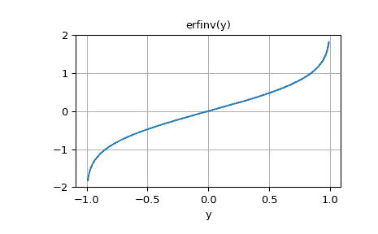

# `scipy.special.erfinv`

> 原文链接：[`docs.scipy.org/doc/scipy-1.12.0/reference/generated/scipy.special.erfinv.html#scipy.special.erfinv`](https://docs.scipy.org/doc/scipy-1.12.0/reference/generated/scipy.special.erfinv.html#scipy.special.erfinv)

```py
scipy.special.erfinv(y, out=None) = <ufunc 'erfinv'>
```

误差函数的逆函数。

计算误差函数的逆函数。

在复数域中，没有唯一的复数 w 满足 erf(w)=z。这表明真正的逆函数将是多值的。当域限制为实数，-1 < x < 1 时，有一个唯一的实数满足 erf(erfinv(x)) = x。

参数：

**y** ndarray

评估位置的参数。域：[-1, 1]

**out** ndarray, 可选

函数值的可选输出数组

返回：

**erfinv** 标量或 ndarray

y 的 erf 的逆函数，逐元素

参见

[`erf`](https://docs.scipy.org/doc/scipy-1.12.0/reference/generated/scipy.special.erf.html#scipy.special.erf "scipy.special.erf")

复数参数的误差函数

[`erfc`](https://docs.scipy.org/doc/scipy-1.12.0/reference/generated/scipy.special.erfc.html#scipy.special.erfc "scipy.special.erfc")

互补误差函数，`1 - erf(x)`

[`erfcinv`](https://docs.scipy.org/doc/scipy-1.12.0/reference/generated/scipy.special.erfcinv.html#scipy.special.erfcinv "scipy.special.erfcinv")

互补误差函数的逆函数

示例

```py
>>> import numpy as np
>>> import matplotlib.pyplot as plt
>>> from scipy.special import erfinv, erf 
```

```py
>>> erfinv(0.5)
0.4769362762044699 
```

```py
>>> y = np.linspace(-1.0, 1.0, num=9)
>>> x = erfinv(y)
>>> x
array([       -inf, -0.81341985, -0.47693628, -0.22531206,  0\.        ,
 0.22531206,  0.47693628,  0.81341985,         inf]) 
```

验证 `erf(erfinv(y))` 等于 `y`。

```py
>>> erf(x)
array([-1\.  , -0.75, -0.5 , -0.25,  0\.  ,  0.25,  0.5 ,  0.75,  1\.  ]) 
```

绘制函数：

```py
>>> y = np.linspace(-1, 1, 200)
>>> fig, ax = plt.subplots()
>>> ax.plot(y, erfinv(y))
>>> ax.grid(True)
>>> ax.set_xlabel('y')
>>> ax.set_title('erfinv(y)')
>>> plt.show() 
```


