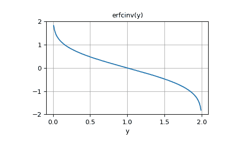

# `scipy.special.erfcinv`

> 原文链接：[`docs.scipy.org/doc/scipy-1.12.0/reference/generated/scipy.special.erfcinv.html#scipy.special.erfcinv`](https://docs.scipy.org/doc/scipy-1.12.0/reference/generated/scipy.special.erfcinv.html#scipy.special.erfcinv)

```py
scipy.special.erfcinv(y, out=None) = <ufunc 'erfcinv'>
```

补充误差函数的逆函数。

计算补充误差函数的逆函数。

在复数域中，不存在唯一复数 w 满足 erfc(w)=z。这表明真正的逆函数将是多值的。当定义域限制在实数，0 < x < 2 时，存在唯一的实数满足 erfc(erfcinv(x)) = erfcinv(erfc(x))。

它与误差函数的逆相关，通过 erfcinv(1-x) = erfinv(x)

参数：

**y** ndarray

评估的参数。定义域：[0, 2]

**out** ndarray，可选

函数值的可选输出数组

返回：

**erfcinv** 标量或者 ndarray

y 的 erfc 的逆函数，逐元素

参见

[`erf`](https://docs.scipy.org/doc/scipy-1.12.0/reference/generated/scipy.special.erf.html#scipy.special.erf "scipy.special.erf")

复数参数的误差函数

[`erfc`](https://docs.scipy.org/doc/scipy-1.12.0/reference/generated/scipy.special.erfc.html#scipy.special.erfc "scipy.special.erfc")

补充误差函数，`1 - erf(x)`

[`erfinv`](https://docs.scipy.org/doc/scipy-1.12.0/reference/generated/scipy.special.erfinv.html#scipy.special.erfinv "scipy.special.erfinv")

误差函数的逆函数

示例

```py
>>> import numpy as np
>>> import matplotlib.pyplot as plt
>>> from scipy.special import erfcinv 
```

```py
>>> erfcinv(0.5)
0.4769362762044699 
```

```py
>>> y = np.linspace(0.0, 2.0, num=11)
>>> erfcinv(y)
array([        inf,  0.9061938 ,  0.59511608,  0.37080716,  0.17914345,
 -0\.        , -0.17914345, -0.37080716, -0.59511608, -0.9061938 ,
 -inf]) 
```

绘制函数：

```py
>>> y = np.linspace(0, 2, 200)
>>> fig, ax = plt.subplots()
>>> ax.plot(y, erfcinv(y))
>>> ax.grid(True)
>>> ax.set_xlabel('y')
>>> ax.set_title('erfcinv(y)')
>>> plt.show() 
```


