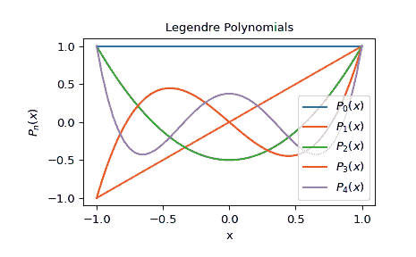

# `scipy.special.eval_legendre`

> 原文：[`docs.scipy.org/doc/scipy-1.12.0/reference/generated/scipy.special.eval_legendre.html#scipy.special.eval_legendre`](https://docs.scipy.org/doc/scipy-1.12.0/reference/generated/scipy.special.eval_legendre.html#scipy.special.eval_legendre)

```py
scipy.special.eval_legendre(n, x, out=None) = <ufunc 'eval_legendre'>
```

在某一点评估 Legendre 多项式。

可以通过 Gauss 超几何函数\({}_2F_1\)定义 Legendre 多项式为

\[P_n(x) = {}_2F_1(-n, n + 1; 1; (1 - x)/2).\]

当\(n\)是整数时，结果是一个阶数为\(n\)的多项式。详见[[AS]](#r19eac0109cc0-as)中的 22.5.49 节。

参数：

**n**array_like

多项式的次数。如果不是整数，则结果通过与 Gauss 超几何函数的关系确定。

**x**array_like

评估 Legendre 多项式的点

**out**ndarray，可选

可选输出数组的函数值

返回：

**P**scalar 或 ndarray

Legendre 多项式的值

另请参阅

`roots_legendre`

Legendre 多项式的根和积分权重

`legendre`

Legendre 多项式对象

`hyp2f1`

Gauss 超几何函数

[`numpy.polynomial.legendre.Legendre`](https://numpy.org/devdocs/reference/generated/numpy.polynomial.legendre.Legendre.html#numpy.polynomial.legendre.Legendre "(在 NumPy v2.0.dev0 中)")

Legendre 级数

参考文献

[AS]

Milton Abramowitz 和 Irene A. Stegun，eds. Handbook of Mathematical Functions with Formulas, Graphs, and Mathematical Tables. New York: Dover, 1972.

示例

```py
>>> import numpy as np
>>> from scipy.special import eval_legendre 
```

在 x = 0 处评估零阶 Legendre 多项式

```py
>>> eval_legendre(0, 0)
1.0 
```

在-1 到 1 之间评估一阶 Legendre 多项式

```py
>>> X = np.linspace(-1, 1, 5)  # Domain of Legendre polynomials
>>> eval_legendre(1, X)
array([-1\. , -0.5,  0\. ,  0.5,  1\. ]) 
```

评估阶数为 0 至 4 的 Legendre 多项式在 x = 0 处

```py
>>> N = range(0, 5)
>>> eval_legendre(N, 0)
array([ 1\.   ,  0\.   , -0.5  ,  0\.   ,  0.375]) 
```

绘制阶数为 0 至 4 的 Legendre 多项式

```py
>>> X = np.linspace(-1, 1) 
```

```py
>>> import matplotlib.pyplot as plt
>>> for n in range(0, 5):
...     y = eval_legendre(n, X)
...     plt.plot(X, y, label=r'$P_{}(x)$'.format(n)) 
```

```py
>>> plt.title("Legendre Polynomials")
>>> plt.xlabel("x")
>>> plt.ylabel(r'$P_n(x)$')
>>> plt.legend(loc='lower right')
>>> plt.show() 
```


