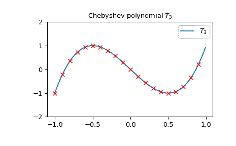
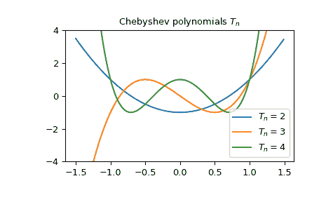

# `scipy.special.chebyt`

> 原文链接：[`docs.scipy.org/doc/scipy-1.12.0/reference/generated/scipy.special.chebyt.html#scipy.special.chebyt`](https://docs.scipy.org/doc/scipy-1.12.0/reference/generated/scipy.special.chebyt.html#scipy.special.chebyt)

```py
scipy.special.chebyt(n, monic=False)
```

第一类切比雪夫多项式。

定义为解

\[(1 - x²)\frac{d²}{dx²}T_n - x\frac{d}{dx}T_n + n²T_n = 0;\]

\(T_n\) 是一个 \(n\) 次多项式。

参数：

**n**int

多项式的次数。

**monic**bool, 可选

如果 *True*，将领先系数缩放为 1。默认为 *False*。

返回：

**T**orthopoly1d

第一类切比雪夫多项式。

另请参阅

`chebyu`

第二类切比雪夫多项式。

注释

多项式 \(T_n\) 在 \([-1, 1]\) 上与权重函数 \((1 - x²)^{-1/2}\) 正交。

参考文献

[AS]

Milton Abramowitz 和 Irene A. Stegun 编著。Handbook of Mathematical Functions with Formulas, Graphs, and Mathematical Tables. 纽约：Dover，1972。

示例

第一类切比雪夫多项式的阶数 \(n\) 可以通过特定的 \(n \times n\) 矩阵的行列式得到。例如，我们可以检查从以下 \(3 \times 3\) 矩阵的行列式得到的点恰好在 \(T_3\) 上：

```py
>>> import numpy as np
>>> import matplotlib.pyplot as plt
>>> from scipy.linalg import det
>>> from scipy.special import chebyt
>>> x = np.arange(-1.0, 1.0, 0.01)
>>> fig, ax = plt.subplots()
>>> ax.set_ylim(-2.0, 2.0)
>>> ax.set_title(r'Chebyshev polynomial $T_3$')
>>> ax.plot(x, chebyt(3)(x), label=rf'$T_3$')
>>> for p in np.arange(-1.0, 1.0, 0.1):
...     ax.plot(p,
...             det(np.array([[p, 1, 0], [1, 2*p, 1], [0, 1, 2*p]])),
...             'rx')
>>> plt.legend(loc='best')
>>> plt.show() 
```



它们也与雅各比多项式 \(P_n^{(-0.5, -0.5)}\) 有关系：

\[P_n^{(-0.5, -0.5)}(x) = \frac{1}{4^n} \binom{2n}{n} T_n(x)\]

让我们验证当 \(n = 3\) 时：

```py
>>> from scipy.special import binom
>>> from scipy.special import jacobi
>>> x = np.arange(-1.0, 1.0, 0.01)
>>> np.allclose(jacobi(3, -0.5, -0.5)(x),
...             1/64 * binom(6, 3) * chebyt(3)(x))
True 
```

我们可以绘制一些值的切比雪夫多项式 \(T_n\)：

```py
>>> x = np.arange(-1.5, 1.5, 0.01)
>>> fig, ax = plt.subplots()
>>> ax.set_ylim(-4.0, 4.0)
>>> ax.set_title(r'Chebyshev polynomials $T_n$')
>>> for n in np.arange(2,5):
...     ax.plot(x, chebyt(n)(x), label=rf'$T_n={n}$')
>>> plt.legend(loc='best')
>>> plt.show() 
```


