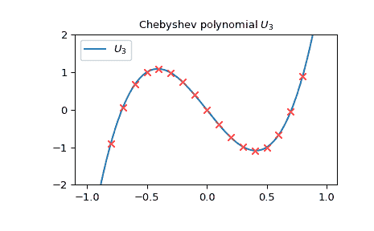
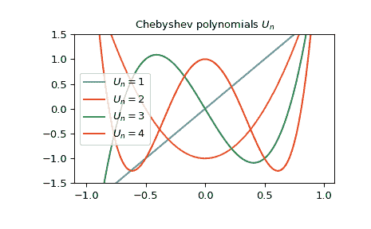

# `scipy.special.chebyu`

> 原文：[`docs.scipy.org/doc/scipy-1.12.0/reference/generated/scipy.special.chebyu.html#scipy.special.chebyu`](https://docs.scipy.org/doc/scipy-1.12.0/reference/generated/scipy.special.chebyu.html#scipy.special.chebyu)

```py
scipy.special.chebyu(n, monic=False)
```

第二类 Chebyshev 多项式。

定义为以下方程的解

\[(1 - x²)\frac{d²}{dx²}U_n - 3x\frac{d}{dx}U_n + n(n + 2)U_n = 0;\]

\(U_n\)是一个阶数为\(n\)的多项式。

参数：

**n**int

多项式的阶数。

**monic**bool，可选

如果*True*，将主导系数标度为 1。默认为*False*。

返回：

**U**orthopoly1d

第二类 Chebyshev 多项式。

另见

`chebyt`

第一类 Chebyshev 多项式。

注意

多项式\(U_n\)在\([-1, 1]\)上与权重函数\((1 - x²)^{1/2}\)正交。

参考文献

[AS]

Milton Abramowitz 和 Irene A. Stegun 编著。《数学函数、公式、图表和数学表》手册。纽约：多佛尔，1972 年。

示例

第二类 Chebyshev 多项式的阶数为\(n\)，可以通过特定的\(n \times n\)矩阵的行列式来获得。例如，我们可以检查从以下\(3 \times 3\)矩阵行列式获得的点恰好位于\(U_3\)上：

```py
>>> import numpy as np
>>> import matplotlib.pyplot as plt
>>> from scipy.linalg import det
>>> from scipy.special import chebyu
>>> x = np.arange(-1.0, 1.0, 0.01)
>>> fig, ax = plt.subplots()
>>> ax.set_ylim(-2.0, 2.0)
>>> ax.set_title(r'Chebyshev polynomial $U_3$')
>>> ax.plot(x, chebyu(3)(x), label=rf'$U_3$')
>>> for p in np.arange(-1.0, 1.0, 0.1):
...     ax.plot(p,
...             det(np.array([[2*p, 1, 0], [1, 2*p, 1], [0, 1, 2*p]])),
...             'rx')
>>> plt.legend(loc='best')
>>> plt.show() 
```



它们满足递推关系：

\[U_{2n-1}(x) = 2 T_n(x)U_{n-1}(x)\]

其中\(T_n\)是第一类 Chebyshev 多项式。让我们验证一下\(n = 2\)的情况：

```py
>>> from scipy.special import chebyt
>>> x = np.arange(-1.0, 1.0, 0.01)
>>> np.allclose(chebyu(3)(x), 2 * chebyt(2)(x) * chebyu(1)(x))
True 
```

我们可以绘制一些值得注意的 Chebyshev 多项式\(U_n\)：

```py
>>> x = np.arange(-1.0, 1.0, 0.01)
>>> fig, ax = plt.subplots()
>>> ax.set_ylim(-1.5, 1.5)
>>> ax.set_title(r'Chebyshev polynomials $U_n$')
>>> for n in np.arange(1,5):
...     ax.plot(x, chebyu(n)(x), label=rf'$U_n={n}$')
>>> plt.legend(loc='best')
>>> plt.show() 
```


