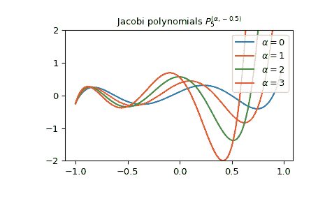

# `scipy.special.jacobi`

> 原文：[`docs.scipy.org/doc/scipy-1.12.0/reference/generated/scipy.special.jacobi.html#scipy.special.jacobi`](https://docs.scipy.org/doc/scipy-1.12.0/reference/generated/scipy.special.jacobi.html#scipy.special.jacobi)

```py
scipy.special.jacobi(n, alpha, beta, monic=False)
```

雅各比多项式。

定义为解决方案

\[(1 - x²)\frac{d²}{dx²}P_n^{(\alpha, \beta)} + (\beta - \alpha - (\alpha + \beta + 2)x) \frac{d}{dx}P_n^{(\alpha, \beta)} + n(n + \alpha + \beta + 1)P_n^{(\alpha, \beta)} = 0\]

对于 \(\alpha, \beta > -1\)；\(P_n^{(\alpha, \beta)}\) 是一个次数为 \(n\) 的多项式。

参数：

**n**int

多项式的次数。

**alpha**float

参数，必须大于 -1。

**beta**float

参数，必须大于 -1。

**monic**bool, optional

如果 *True*，将领导系数缩放为 1。默认为 *False*。

返回：

**P**orthopoly1d

雅各比多项式。

注意事项

对于固定的 \(\alpha, \beta\)，多项式 \(P_n^{(\alpha, \beta)}\) 在 \([-1, 1]\) 上以权函数 \((1 - x)^\alpha(1 + x)^\beta\) 正交。

参考文献

[AS]

Milton Abramowitz 和 Irene A. Stegun 编辑。Handbook of Mathematical Functions with Formulas, Graphs, and Mathematical Tables. New York: Dover, 1972.

示例

雅各比多项式满足递推关系：

\[P_n^{(\alpha, \beta-1)}(x) - P_n^{(\alpha-1, \beta)}(x) = P_{n-1}^{(\alpha, \beta)}(x)\]

例如，可以验证 \(\alpha = \beta = 2\) 且 \(n = 1\) 在区间 \([-1, 1]\) 上：

```py
>>> import numpy as np
>>> from scipy.special import jacobi
>>> x = np.arange(-1.0, 1.0, 0.01)
>>> np.allclose(jacobi(0, 2, 2)(x),
...             jacobi(1, 2, 1)(x) - jacobi(1, 1, 2)(x))
True 
```

不同 \(\alpha\) 值下雅各比多项式 \(P_5^{(\alpha, -0.5)}\) 的绘图：

```py
>>> import matplotlib.pyplot as plt
>>> x = np.arange(-1.0, 1.0, 0.01)
>>> fig, ax = plt.subplots()
>>> ax.set_ylim(-2.0, 2.0)
>>> ax.set_title(r'Jacobi polynomials $P_5^{(\alpha, -0.5)}$')
>>> for alpha in np.arange(0, 4, 1):
...     ax.plot(x, jacobi(5, alpha, -0.5)(x), label=rf'$\alpha={alpha}$')
>>> plt.legend(loc='best')
>>> plt.show() 
```


