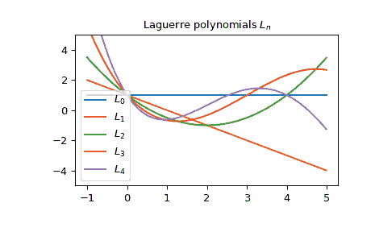

# `scipy.special.laguerre`

> 原文链接：[`docs.scipy.org/doc/scipy-1.12.0/reference/generated/scipy.special.laguerre.html#scipy.special.laguerre`](https://docs.scipy.org/doc/scipy-1.12.0/reference/generated/scipy.special.laguerre.html#scipy.special.laguerre)

```py
scipy.special.laguerre(n, monic=False)
```

拉盖尔多项式。

定义为以下方程的解：

\[x\frac{d²}{dx²}L_n + (1 - x)\frac{d}{dx}L_n + nL_n = 0;\]

\(L_n\) 是一个次数为 \(n\) 的多项式。

参数：

**n**int

多项式的次数。

**monic**bool，可选

如果 *True*，将主导系数缩放为 1。默认为 *False*。

返回：

**L**orthopoly1d

拉盖尔多项式。

参见

[`genlaguerre`](https://docs.scipy.org/doc/scipy-1.12.0/reference/generated/scipy.special.genlaguerre.html#scipy.special.genlaguerre "scipy.special.genlaguerre")

广义（关联）拉盖尔多项式。

注释

多项式 \(L_n\) 在 \([0, \infty)\) 上以权重函数 \(e^{-x}\) 正交。

参考文献

[AS]

Milton Abramowitz 和 Irene A. Stegun 编辑。Handbook of Mathematical Functions with Formulas, Graphs, and Mathematical Tables. 纽约：Dover, 1972。

示例

拉盖尔多项式 \(L_n\) 是广义拉盖尔多项式 \(L_n^{(\alpha)}\) 的特例，其中 \(\alpha = 0\)。让我们在区间 \([-1, 1]\) 上验证它：

```py
>>> import numpy as np
>>> from scipy.special import genlaguerre
>>> from scipy.special import laguerre
>>> x = np.arange(-1.0, 1.0, 0.01)
>>> np.allclose(genlaguerre(3, 0)(x), laguerre(3)(x))
True 
```

多项式 \(L_n\) 还满足递推关系：

\[(n + 1)L_{n+1}(x) = (2n +1 -x)L_n(x) - nL_{n-1}(x)\]

对于 \(n = 3\)，在 \([0, 1]\) 上可以轻松验证：

```py
>>> x = np.arange(0.0, 1.0, 0.01)
>>> np.allclose(4 * laguerre(4)(x),
...             (7 - x) * laguerre(3)(x) - 3 * laguerre(2)(x))
True 
```

这是前几个拉盖尔多项式 \(L_n\) 的图示：

```py
>>> import matplotlib.pyplot as plt
>>> x = np.arange(-1.0, 5.0, 0.01)
>>> fig, ax = plt.subplots()
>>> ax.set_ylim(-5.0, 5.0)
>>> ax.set_title(r'Laguerre polynomials $L_n$')
>>> for n in np.arange(0, 5):
...     ax.plot(x, laguerre(n)(x), label=rf'$L_{n}$')
>>> plt.legend(loc='best')
>>> plt.show() 
```


