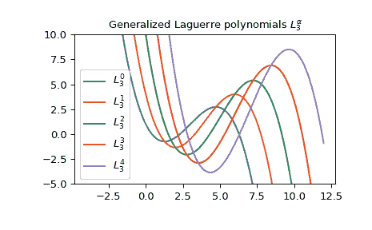

# `scipy.special.genlaguerre`

> 原文链接：[`docs.scipy.org/doc/scipy-1.12.0/reference/generated/scipy.special.genlaguerre.html#scipy.special.genlaguerre`](https://docs.scipy.org/doc/scipy-1.12.0/reference/generated/scipy.special.genlaguerre.html#scipy.special.genlaguerre)

```py
scipy.special.genlaguerre(n, alpha, monic=False)
```

广义（关联）拉盖尔多项式。

定义为以下方程的解

\[x\frac{d²}{dx²}L_n^{(\alpha)} + (\alpha + 1 - x)\frac{d}{dx}L_n^{(\alpha)} + nL_n^{(\alpha)} = 0,\]

其中 \(\alpha > -1\)；\(L_n^{(\alpha)}\) 是一个阶数为 \(n\) 的多项式。

参数：

**n**int

多项式的阶数。

**alpha**float

参数，必须大于 -1。

**monic**bool, 可选

如果 *True*，则将首项系数缩放为 1。默认为 *False*。

返回：

**L**orthopoly1d

广义拉盖尔多项式。

另请参阅

[`laguerre`](https://docs.scipy.org/doc/scipy-1.12.0/reference/generated/scipy.special.laguerre.html#scipy.special.laguerre "scipy.special.laguerre")

拉盖尔多项式。

[`hyp1f1`](https://docs.scipy.org/doc/scipy-1.12.0/reference/generated/scipy.special.hyp1f1.html#scipy.special.hyp1f1 "scipy.special.hyp1f1")

松矛超几何函数

注释

对于固定的 \(\alpha\)，多项式 \(L_n^{(\alpha)}\) 在 \([0, \infty)\) 上具有权重函数 \(e^{-x}x^\alpha\) 的正交性。

拉盖尔多项式是 \(\alpha = 0\) 的特殊情况。

References

[AS]

米尔顿·阿布拉莫维茨和艾琳·A·斯蒂根 编。《数学函数、公式、图表和数学表》。纽约：多佛，1972 年。

示例

广义拉盖尔多项式与松矛超几何函数 \({}_1F_1\) 密切相关：

> \[L_n^{(\alpha)} = \binom{n + \alpha}{n} {}_1F_1(-n, \alpha +1, x)\]

例如，对于 \(n = \alpha = 3\)，可以在区间 \([-1, 1]\) 内验证：

```py
>>> import numpy as np
>>> from scipy.special import binom
>>> from scipy.special import genlaguerre
>>> from scipy.special import hyp1f1
>>> x = np.arange(-1.0, 1.0, 0.01)
>>> np.allclose(genlaguerre(3, 3)(x), binom(6, 3) * hyp1f1(-3, 4, x))
True 
```

这是广义拉盖尔多项式 \(L_3^{(\alpha)}\) 的一些值的绘图：

```py
>>> import matplotlib.pyplot as plt
>>> x = np.arange(-4.0, 12.0, 0.01)
>>> fig, ax = plt.subplots()
>>> ax.set_ylim(-5.0, 10.0)
>>> ax.set_title(r'Generalized Laguerre polynomials $L_3^{\alpha}$')
>>> for alpha in np.arange(0, 5):
...     ax.plot(x, genlaguerre(3, alpha)(x), label=rf'$L_3^{(alpha)}$')
>>> plt.legend(loc='best')
>>> plt.show() 
```


