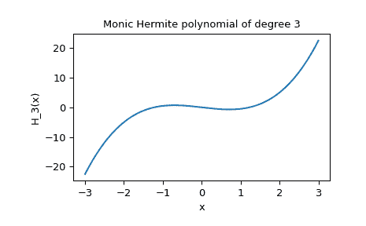

# `scipy.special.hermite`

> 原文链接：[`docs.scipy.org/doc/scipy-1.12.0/reference/generated/scipy.special.hermite.html#scipy.special.hermite`](https://docs.scipy.org/doc/scipy-1.12.0/reference/generated/scipy.special.hermite.html#scipy.special.hermite)

```py
scipy.special.hermite(n, monic=False)
```

物理学家的厄米多项式。

定义为

\[H_n(x) = (-1)^ne^{x²}\frac{d^n}{dx^n}e^{-x²};\]

\(H_n\) 是一个次数为 \(n\) 的多项式。

参数：

**n**int

多项式的次数。

**monic**bool，可选

如果 *True*，将主导系数缩放为 1。默认为 *False*。

返回：

**H**orthopoly1d

厄米多项式。

注释

多项式 \(H_n\) 在 \((-\infty, \infty)\) 上按权函数 \(e^{-x²}\) 正交。

示例

```py
>>> from scipy import special
>>> import matplotlib.pyplot as plt
>>> import numpy as np 
```

```py
>>> p_monic = special.hermite(3, monic=True)
>>> p_monic
poly1d([ 1\. ,  0\. , -1.5,  0\. ])
>>> p_monic(1)
-0.49999999999999983
>>> x = np.linspace(-3, 3, 400)
>>> y = p_monic(x)
>>> plt.plot(x, y)
>>> plt.title("Monic Hermite polynomial of degree 3")
>>> plt.xlabel("x")
>>> plt.ylabel("H_3(x)")
>>> plt.show() 
```


