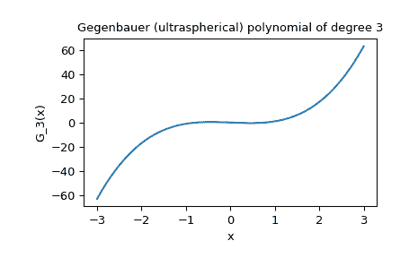

# `scipy.special.gegenbauer`

> 原文：[`docs.scipy.org/doc/scipy-1.12.0/reference/generated/scipy.special.gegenbauer.html#scipy.special.gegenbauer`](https://docs.scipy.org/doc/scipy-1.12.0/reference/generated/scipy.special.gegenbauer.html#scipy.special.gegenbauer)

```py
scipy.special.gegenbauer(n, alpha, monic=False)
```

超球面 (ultraspherical) 多项式。

定义为

\[(1 - x²)\frac{d²}{dx²}C_n^{(\alpha)} - (2\alpha + 1)x\frac{d}{dx}C_n^{(\alpha)} + n(n + 2\alpha)C_n^{(\alpha)} = 0\]

对于\(\alpha > -1/2\)；\(C_n^{(\alpha)}\) 是一个\(n\)次多项式。

参数：

**n**整数

多项式的次数。

**alpha**浮点数

参数，必须大于-0.5。

**monic**布尔值，可选

如果为*True*，将主导系数缩放为 1。默认为*False*。

返回：

**C**orthopoly1d

超球面多项式。

注意

多项式\(C_n^{(\alpha)}\) 在\([-1,1]\)上以权函数\((1 - x²)^{(\alpha - 1/2)}\)正交。

例子

```py
>>> import numpy as np
>>> from scipy import special
>>> import matplotlib.pyplot as plt 
```

我们可以使用`gegenbauer`函数初始化一个变量`p`作为一个超球面多项式，并在点`x = 1`处评估。

```py
>>> p = special.gegenbauer(3, 0.5, monic=False)
>>> p
poly1d([ 2.5,  0\. , -1.5,  0\. ])
>>> p(1)
1.0 
```

要在区间\((-3, 3)\)中的各点\(x\)评估`p`，只需将数组`x`传递给`p`如下：

```py
>>> x = np.linspace(-3, 3, 400)
>>> y = p(x) 
```

我们可以使用[`matplotlib.pyplot`](https://matplotlib.org/stable/api/pyplot_summary.html#module-matplotlib.pyplot "(在 Matplotlib v3.8.2 中)")来可视化`x, y`。

```py
>>> fig, ax = plt.subplots()
>>> ax.plot(x, y)
>>> ax.set_title("Gegenbauer (ultraspherical) polynomial of degree 3")
>>> ax.set_xlabel("x")
>>> ax.set_ylabel("G_3(x)")
>>> plt.show() 
```


