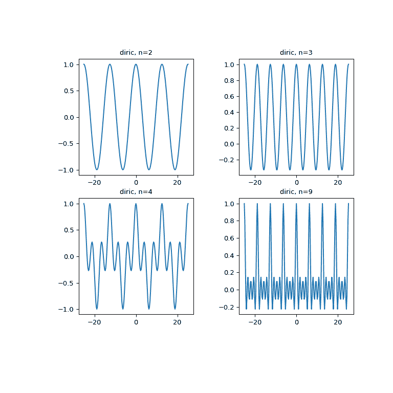

# `scipy.special.diric`

> 原始文本：[`docs.scipy.org/doc/scipy-1.12.0/reference/generated/scipy.special.diric.html#scipy.special.diric`](https://docs.scipy.org/doc/scipy-1.12.0/reference/generated/scipy.special.diric.html#scipy.special.diric)

```py
scipy.special.diric(x, n)
```

周期性 sinc 函数，也称为 Dirichlet 函数。

Dirichlet 函数的定义如下：

```py
diric(x, n) = sin(x * n/2) / (n * sin(x / 2)), 
```

其中 *n* 是一个正整数。

参数：

**x**array_like

输入数据

**n**int

定义周期性的整数。

返回：

**diric**ndarray

示例

```py
>>> import numpy as np
>>> from scipy import special
>>> import matplotlib.pyplot as plt 
```

```py
>>> x = np.linspace(-8*np.pi, 8*np.pi, num=201)
>>> plt.figure(figsize=(8, 8));
>>> for idx, n in enumerate([2, 3, 4, 9]):
...     plt.subplot(2, 2, idx+1)
...     plt.plot(x, special.diric(x, n))
...     plt.title('diric, n={}'.format(n))
>>> plt.show() 
```



以下示例演示了 `diric` 给出矩形脉冲的傅里叶系数的幅度（模去符号和缩放）。

抑制那些实际上为 0 的值的输出：

```py
>>> np.set_printoptions(suppress=True) 
```

使用 *k* 个 1 创建长度为 *m* 的信号 *x*：

```py
>>> m = 8
>>> k = 3
>>> x = np.zeros(m)
>>> x[:k] = 1 
```

使用 FFT 计算 *x* 的傅里叶变换，并检查系数的幅度：

```py
>>> np.abs(np.fft.fft(x))
array([ 3\.        ,  2.41421356,  1\.        ,  0.41421356,  1\.        ,
 0.41421356,  1\.        ,  2.41421356]) 
```

现在使用 `diric` 找到相同的值（符号上相同）。我们乘以 *k* 来考虑 [`numpy.fft.fft`](https://numpy.org/devdocs/reference/generated/numpy.fft.fft.html#numpy.fft.fft "(在 NumPy v2.0.dev0)") 和 `diric` 不同的缩放惯例：

```py
>>> theta = np.linspace(0, 2*np.pi, m, endpoint=False)
>>> k * special.diric(theta, k)
array([ 3\.        ,  2.41421356,  1\.        , -0.41421356, -1\.        ,
 -0.41421356,  1\.        ,  2.41421356]) 
```
