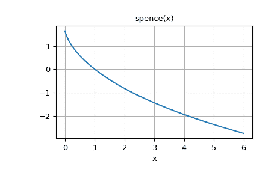

# `scipy.special.spence`

> 原文：[`docs.scipy.org/doc/scipy-1.12.0/reference/generated/scipy.special.spence.html#scipy.special.spence`](https://docs.scipy.org/doc/scipy-1.12.0/reference/generated/scipy.special.spence.html#scipy.special.spence)

```py
scipy.special.spence(z, out=None) = <ufunc 'spence'>
```

Spence 函数，也称为二阶对数函数。

它的定义如下

\[\int_1^z \frac{\log(t)}{1 - t}dt\]

对于复数 \(z\)，积分的路径避开对数的分支切割。Spence 函数在除了负实轴外的所有地方都是解析的。

参数：

**z**array_like

评估 Spence 函数的点

**out**ndarray，可选项

可选的输出数组以获取函数结果

返回：

**s**标量或 ndarray

计算得到的 Spence 函数值

注意事项

通过积分定义 Spence 函数的另一种约定如下：

\[-\int_0^z \frac{\log(1 - t)}{t}dt;\]

这是我们的 `spence(1 - z)`。

示例

```py
>>> import numpy as np
>>> from scipy.special import spence
>>> import matplotlib.pyplot as plt 
```

该函数定义适用于复数输入：

```py
>>> spence([1-1j, 1.5+2j, 3j, -10-5j])
array([-0.20561676+0.91596559j, -0.86766909-1.39560134j,
 -0.59422064-2.49129918j, -1.14044398+6.80075924j]) 
```

对于复数输入的分支切割，即负实轴，函数在具有正虚部的 `z` 上返回限制。例如，在以下情况下，请注意输出的虚部对于 `z = -2` 和 `z = -2 - 1e-8j` 的符号变化：

```py
>>> spence([-2 + 1e-8j, -2, -2 - 1e-8j])
array([2.32018041-3.45139229j, 2.32018042-3.4513923j ,
 2.32018041+3.45139229j]) 
```

函数在实数输入处的分支切割处返回 `nan`：

```py
>>> spence(-1.5)
nan 
```

验证一些特定值：`spence(0) = pi**2/6`，`spence(1) = 0` 和 `spence(2) = -pi**2/12`。

```py
>>> spence([0, 1, 2])
array([ 1.64493407,  0\.        , -0.82246703])
>>> np.pi**2/6, -np.pi**2/12
(1.6449340668482264, -0.8224670334241132) 
```

验证身份：

```py
spence(z) + spence(1 - z) = pi**2/6 - log(z)*log(1 - z) 
```

```py
>>> z = 3 + 4j
>>> spence(z) + spence(1 - z)
(-2.6523186143876067+1.8853470951513935j)
>>> np.pi**2/6 - np.log(z)*np.log(1 - z)
(-2.652318614387606+1.885347095151394j) 
```

绘制正实数输入的函数。

```py
>>> fig, ax = plt.subplots()
>>> x = np.linspace(0, 6, 400)
>>> ax.plot(x, spence(x))
>>> ax.grid()
>>> ax.set_xlabel('x')
>>> ax.set_title('spence(x)')
>>> plt.show() 
```


