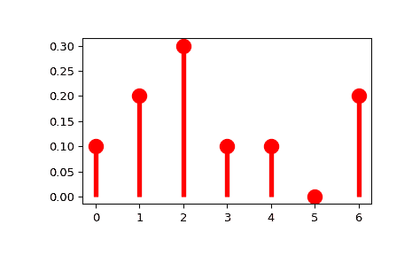

# `scipy.stats.rv_discrete`

> 原文链接：[`docs.scipy.org/doc/scipy-1.12.0/reference/generated/scipy.stats.rv_discrete.html#scipy.stats.rv_discrete`](https://docs.scipy.org/doc/scipy-1.12.0/reference/generated/scipy.stats.rv_discrete.html#scipy.stats.rv_discrete)

```py
class scipy.stats.rv_discrete(a=0, b=inf, name=None, badvalue=None, moment_tol=1e-08, values=None, inc=1, longname=None, shapes=None, seed=None)
```

一个通用的离散随机变量类，用于派生子类。

`rv_discrete` 是一个基类，用于构造特定的分布类和离散随机变量实例。它也可以用于根据支持点列表和对应概率构造任意分布。

参数：

**a**浮点数, 可选

分布的支持下限，默认为 0

**b**浮点数, 可选

分布的支持上限，默认为正无穷大

**moment_tol**浮点数, 可选

用于通用矩计算的容差。

**values**两个 array_like 元组, 可选

`(xk, pk)` 其中 `xk` 是整数，`pk` 是介于 0 和 1 之间的非零概率，满足 `sum(pk) = 1`。`xk` 和 `pk` 必须具有相同的形状，并且 `xk` 必须是唯一的。

**inc**整数, 可选

分布支持的增量。默认为 1\.（未测试其他值）

**badvalue**浮点数, 可选

结果数组中指示某些参数限制违规值的值，默认为 np.nan。

**name**字符串, 可选

实例的名称。此字符串用于构造分布的默认示例。

**longname**字符串, 可选

此字符串用作在子类没有自己的文档字符串时返回的文档字符串的第一行的一部分。注意：*longname* 仅用于向后兼容性，不要用于新的子类。

**shapes**字符串, 可选

分布的形状。例如，“m, n” 表示一个接受两个整数作为其所有方法的两个形状参数的分布。如果未提供，形状参数将从实例的私有方法 `_pmf` 和 `_cdf` 的签名中推断。

**seed**{None, int, [`numpy.random.Generator`](https://numpy.org/devdocs/reference/random/generator.html#numpy.random.Generator "(在 NumPy v2.0.dev0 中)"), [`numpy.random.RandomState`](https://numpy.org/devdocs/reference/random/legacy.html#numpy.random.RandomState "(在 NumPy v2.0.dev0 中)")}, 可选

如果 *seed* 为 None（或 *np.random*），则使用 [`numpy.random.RandomState`](https://numpy.org/devdocs/reference/random/legacy.html#numpy.random.RandomState "(在 NumPy v2.0.dev0 中)") 单例。如果 *seed* 是整数，则使用一个新的 `RandomState` 实例，并使用 *seed* 进行种子初始化。如果 *seed* 已经是 `Generator` 或 `RandomState` 实例，则直接使用该实例。

注：

这个类类似于 `rv_continuous`。是否有效的形状参数由 `_argcheck` 方法决定（默认为检查其参数是否严格为正）。主要区别如下。

+   分布的支持是一组整数。

+   与概率密度函数 `pdf`（及其对应的私有 `_pdf`）不同，这个类定义了*概率质量函数* `pmf`（及其对应的私有 `_pmf`）。

+   没有 `scale` 参数。

+   方法（例如 `_cdf`）的默认实现不适用于支持无下限的分布（即 `a=-np.inf`），因此必须进行覆盖。

要创建一个新的离散分布，我们需要执行以下操作：

```py
>>> from scipy.stats import rv_discrete
>>> class poisson_gen(rv_discrete):
...     "Poisson distribution"
...     def _pmf(self, k, mu):
...         return exp(-mu) * mu**k / factorial(k) 
```

并创建一个实例：

```py
>>> poisson = poisson_gen(name="poisson") 
```

请注意，上面我们定义了标准形式的泊松分布。通过在实例方法中提供 `loc` 参数，可以进行分布的偏移。例如，`poisson.pmf(x, mu, loc)` 将工作委托给 `poisson._pmf(x-loc, mu)`。

**从概率列表创建离散分布**

或者，您可以使用 `values` 关键字参数来构造定义在有限值集合 `xk` 上的任意离散随机变量 `Prob{X=xk} = pk`，方法是使用 `rv_discrete` 构造函数。

**Deepcopying / Pickling**

如果分布或冻结分布进行了深拷贝（序列化/反序列化等），则任何底层随机数生成器也将随之深拷贝。其含义是，如果分布在复制之前依赖于单例的 RandomState，则在复制后它将依赖于该随机状态的副本，并且 `np.random.seed` 将不再控制状态。

示例

自定义离散分布：

```py
>>> import numpy as np
>>> from scipy import stats
>>> xk = np.arange(7)
>>> pk = (0.1, 0.2, 0.3, 0.1, 0.1, 0.0, 0.2)
>>> custm = stats.rv_discrete(name='custm', values=(xk, pk))
>>>
>>> import matplotlib.pyplot as plt
>>> fig, ax = plt.subplots(1, 1)
>>> ax.plot(xk, custm.pmf(xk), 'ro', ms=12, mec='r')
>>> ax.vlines(xk, 0, custm.pmf(xk), colors='r', lw=4)
>>> plt.show() 
```



随机数生成：

```py
>>> R = custm.rvs(size=100) 
```

属性：

`random_state`

获取或设置用于生成随机变量的生成器对象。

方法

| `rvs`(*args, **kwargs) | 给定类型的随机变量。 |
| --- | --- |
| `pmf`(k, *args, **kwds) | 给定随机变量在 k 处的概率质量函数。 |
| `logpmf`(k, *args, **kwds) | 给定随机变量在 k 处的概率质量函数的对数。 |
| `cdf`(k, *args, **kwds) | 给定随机变量的累积分布函数。 |
| `logcdf`(k, *args, **kwds) | 给定随机变量在 k 处的累积分布函数的对数。 |
| `sf`(k, *args, **kwds) | 给定随机变量在 k 处的生存函数（1 - `cdf`）。 |
| `logsf`(k, *args, **kwds) | 给定随机变量的生存函数的对数。 |
| `ppf`(q, *args, **kwds) | 给定随机变量在 q 处的百分点函数（`cdf`的逆函数）。 |
| `isf`(q, *args, **kwds) | 给定随机变量在 q 处的逆生存函数（`sf`的逆函数）。 |
| `moment`(order, *args, **kwds) | 指定阶数的分布的非中心矩。 |
| `stats` | 给定随机变量的一些统计量。 |
| `entropy` | 随机变量的微分熵。 |
| `expect`([func, args, loc, lb, ub, ...]) | 对于离散分布，通过数值求和计算函数关于分布的期望值。 |
| `median` | 分布的中位数。 |
| `mean` | 分布的均值。 |
| `std` | 分布的标准差。 |
| `var` | 分布的方差。 |
| `interval`(confidence, *args, **kwds) | 等面积置信区间，围绕中位数。 |
| `__call__`(*args, **kwds) | 对给定参数冻结分布。 |
| `support`(*args, **kwargs) | 分布的支持范围。 |
