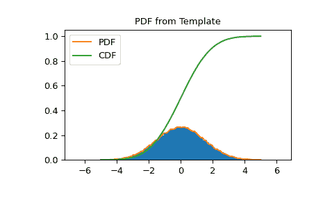

# `scipy.stats.rv_histogram`

> 原文：[`docs.scipy.org/doc/scipy-1.12.0/reference/generated/scipy.stats.rv_histogram.html#scipy.stats.rv_histogram`](https://docs.scipy.org/doc/scipy-1.12.0/reference/generated/scipy.stats.rv_histogram.html#scipy.stats.rv_histogram)

```py
class scipy.stats.rv_histogram(histogram, *args, density=None, **kwargs)
```

生成由直方图给定的分布。这对于从分箱数据样本生成模板分布非常有用。

作为`rv_continuous`类的子类，`rv_histogram`从中继承了一系列通用方法（请参阅`rv_continuous`以获取完整列表），并根据提供的分箱数据样本的特性实现了这些方法。

参数：

**histogram**array_like 的元组

包含两个 array_like 对象的元组。第一个包含 n 个箱的内容，第二个包含（n+1）个箱边界。特别地，接受[`numpy.histogram`](https://numpy.org/devdocs/reference/generated/numpy.histogram.html#numpy.histogram "(在 NumPy v2.0.dev0 中)")的返回值。

**density**bool，可选

如果为 False，则假定直方图与每个箱中的计数成比例；否则，假定其与密度成比例。对于常数箱宽度，这两者是等效的，但在箱宽度变化时区分是重要的（见注释）。如果为 None（默认），则为向后兼容性设置`density=True`，但如果箱宽度可变，则发出警告。显式设置*density*以消除警告。

1.10.0 版本中的新功能。

笔记

当直方图具有不等的箱宽度时，统计学上有区分，即与每个箱中的计数成比例的直方图和与每个箱上的概率密度成比例的直方图。如果用其默认的`density=False`调用[`numpy.histogram`](https://numpy.org/devdocs/reference/generated/numpy.histogram.html#numpy.histogram "(在 NumPy v2.0.dev0 中)")，则生成的直方图是每个箱中的计数，因此应将`density=False`传递给`rv_histogram`。如果用`density=True`调用[`numpy.histogram`](https://numpy.org/devdocs/reference/generated/numpy.histogram.html#numpy.histogram "(在 NumPy v2.0.dev0 中)")，则生成的直方图是以概率密度为单位的，因此应将`density=True`传递给`rv_histogram`。为了避免警告，在输入直方图具有不等箱宽度时，始终显式传递`density`。

除了 loc 和 scale 之外，没有额外的形状参数。 pdf 被定义为从提供的直方图的分段函数。 cdf 是 pdf 的线性插值。

0.19.0 版本中的新功能。

示例

从 numpy 直方图创建一个 scipy.stats 分布

```py
>>> import scipy.stats
>>> import numpy as np
>>> data = scipy.stats.norm.rvs(size=100000, loc=0, scale=1.5,
...                             random_state=123)
>>> hist = np.histogram(data, bins=100)
>>> hist_dist = scipy.stats.rv_histogram(hist, density=False) 
```

表现得像一个普通的 scipy rv_continuous 分布

```py
>>> hist_dist.pdf(1.0)
0.20538577847618705
>>> hist_dist.cdf(2.0)
0.90818568543056499 
```

PDF 在直方图的最高（最低）箱子之上（之下）为零，由原始数据集的最大（最小）定义

```py
>>> hist_dist.pdf(np.max(data))
0.0
>>> hist_dist.cdf(np.max(data))
1.0
>>> hist_dist.pdf(np.min(data))
7.7591907244498314e-05
>>> hist_dist.cdf(np.min(data))
0.0 
```

PDF 和 CDF 遵循直方图

```py
>>> import matplotlib.pyplot as plt
>>> X = np.linspace(-5.0, 5.0, 100)
>>> fig, ax = plt.subplots()
>>> ax.set_title("PDF from Template")
>>> ax.hist(data, density=True, bins=100)
>>> ax.plot(X, hist_dist.pdf(X), label='PDF')
>>> ax.plot(X, hist_dist.cdf(X), label='CDF')
>>> ax.legend()
>>> fig.show() 
```



属性：

`random_state`

获取或设置用于生成随机变量的生成器对象。

方法：

| `__call__` | 固定给定参数的分布。 |
| --- | --- |
| `cdf` | 给定随机变量的累积分布函数。 |
| `entropy` | 随机变量的微分熵。 |
| `expect` | 使用数值积分计算分布函数对某个函数的期望值。 |
| `fit` | 从数据中返回形状（如果适用）、位置和尺度参数的估计。 |
| `fit_loc_scale` | 利用数据的第一和第二阶矩估计 loc 和 scale 参数。 |
| `freeze` | 固定给定参数的分布。 |
| `interval` | 中位数周围等面积的置信区间。 |
| `isf` | 给定随机变量的逆生存函数（给定 `sf` 的逆函数）在 q 处的值。 |
| `logcdf` | 给定随机变量 x 的累积分布函数的对数。 |
| `logpdf` | 给定随机变量 x 的概率密度函数的对数。 |
| `logsf` | 给定随机变量的生存函数的对数。 |
| [`mean`](https://docs.scipy.org/doc/scipy/reference/generated/scipy.stats.rv_histogram.html#scipy.stats.rv_histogram.mean "scipy.stats.rv_histogram.mean")(*args, **kwds) | 分布的均值。 |
| [`median`](https://docs.scipy.org/doc/scipy/reference/generated/scipy.stats.rv_histogram.html#scipy.stats.rv_histogram.median "scipy.stats.rv_histogram.median")(*args, **kwds) | 分布的中位数。 |
| [`moment`](https://docs.scipy.org/doc/scipy/reference/generated/scipy.stats.rv_histogram.html#scipy.stats.rv_histogram.moment "scipy.stats.rv_histogram.moment")(order, *args, **kwds) | 分布的非中心矩。 |
| [`nnlf`](https://docs.scipy.org/doc/scipy/reference/generated/scipy.stats.rv_histogram.html#scipy.stats.rv_histogram.nnlf "scipy.stats.rv_histogram.nnlf")(theta, x) | 负对数似然函数。 |
| [`pdf`](https://docs.scipy.org/doc/scipy/reference/generated/scipy.stats.rv_histogram.html#scipy.stats.rv_histogram.pdf "scipy.stats.rv_histogram.pdf")(x, *args, **kwds) | 给定随机变量在 x 处的概率密度函数。 |
| [`ppf`](https://docs.scipy.org/doc/scipy/reference/generated/scipy.stats.rv_histogram.html#scipy.stats.rv_histogram.ppf "scipy.stats.rv_histogram.ppf")(q, *args, **kwds) | 给定随机变量的百分点函数（[`cdf`](https://docs.scipy.org/doc/scipy/reference/generated/scipy.stats.rv_histogram.html#scipy.stats.rv_histogram.cdf "scipy.stats.rv_histogram.cdf") 的反函数），在 q 处的值。 |
| [`rvs`](https://docs.scipy.org/doc/scipy/reference/generated/scipy.stats.rv_histogram.html#scipy.stats.rv_histogram.rvs "scipy.stats.rv_histogram.rvs")(*args, **kwds) | 给定类型的随机变量。 |
| [`sf`](https://docs.scipy.org/doc/scipy/reference/generated/scipy.stats.rv_histogram.html#scipy.stats.rv_histogram.sf "scipy.stats.rv_histogram.sf")(x, *args, **kwds) | 给定随机变量的生存函数（1 - [`cdf`](https://docs.scipy.org/doc/scipy/reference/generated/scipy.stats.rv_histogram.html#scipy.stats.rv_histogram.cdf "scipy.stats.rv_histogram.cdf")）在 x 处的值。 |
| [`stats`](https://docs.scipy.org/doc/scipy/reference/generated/scipy.stats.rv_histogram.html#scipy.stats.rv_histogram.stats "scipy.stats.rv_histogram.stats")(*args, **kwds) | 给定随机变量的一些统计量。 |
| [`std`](https://docs.scipy.org/doc/scipy/reference/generated/scipy.stats.rv_histogram.html#scipy.stats.rv_histogram.std "scipy.stats.rv_histogram.std")(*args, **kwds) | 分布的标准差。 |
| [`support`](https://docs.scipy.org/doc/scipy/reference/generated/scipy.stats.rv_histogram.html#scipy.stats.rv_histogram.support "scipy.stats.rv_histogram.support")(*args, **kwargs) | 分布的支持区间。 |
| [`var`](https://docs.scipy.org/doc/scipy/reference/generated/scipy.stats.rv_histogram.html#scipy.stats.rv_histogram.var "scipy.stats.rv_histogram.var")(*args, **kwds) | 分布的方差。 |
