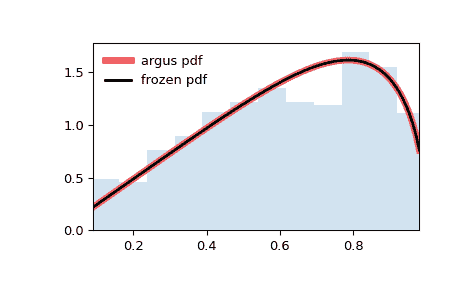

# `scipy.stats.argus`

> 原文：[`docs.scipy.org/doc/scipy-1.12.0/reference/generated/scipy.stats.argus.html#scipy.stats.argus`](https://docs.scipy.org/doc/scipy-1.12.0/reference/generated/scipy.stats.argus.html#scipy.stats.argus)

```py
scipy.stats.argus = <scipy.stats._continuous_distns.argus_gen object>
```

Argus 分布

作为 `rv_continuous` 类的一个实例，`argus` 对象继承了一组通用方法（请参阅下面的完整列表），并以此特定分布的详细信息补充它们。

注释

`argus` 的概率密度函数为：

\[f(x, \chi) = \frac{\chi³}{\sqrt{2\pi} \Psi(\chi)} x \sqrt{1-x²} \exp(-\chi² (1 - x²)/2)\]

对于 \(0 < x < 1\) 和 \(\chi > 0\)，其中

\[\Psi(\chi) = \Phi(\chi) - \chi \phi(\chi) - 1/2\]

其中 \(\Phi\) 和 \(\phi\) 分别是标准正态分布的 CDF 和 PDF。

`argus` 将 \(\chi\) 视为形状参数。

上述概率密度在“标准化”形式下定义。要移动和/或缩放分布，请使用 `loc` 和 `scale` 参数。具体而言，`argus.pdf(x, chi, loc, scale)` 等同于 `argus.pdf(y, chi) / scale`，其中 `y = (x - loc) / scale`。请注意，移动分布的位置并不使其成为“非中心”分布；某些分布的非中心推广可在单独的类中找到。

参考文献

[1]

“ARGUS 分布”，[`en.wikipedia.org/wiki/ARGUS_distribution`](https://en.wikipedia.org/wiki/ARGUS_distribution)

从版本 0.19.0 开始新增。

示例

```py
>>> import numpy as np
>>> from scipy.stats import argus
>>> import matplotlib.pyplot as plt
>>> fig, ax = plt.subplots(1, 1) 
```

计算前四阶矩：

```py
>>> chi = 1
>>> mean, var, skew, kurt = argus.stats(chi, moments='mvsk') 
```

显示概率密度函数 (`pdf`)：

```py
>>> x = np.linspace(argus.ppf(0.01, chi),
...                 argus.ppf(0.99, chi), 100)
>>> ax.plot(x, argus.pdf(x, chi),
...        'r-', lw=5, alpha=0.6, label='argus pdf') 
```

或者，可以调用（作为函数）分布对象以固定形状、位置和缩放参数。这将返回一个“冻结”的随机变量对象，保存给定的参数不变。

冻结分布并显示冻结的 `pdf`：

```py
>>> rv = argus(chi)
>>> ax.plot(x, rv.pdf(x), 'k-', lw=2, label='frozen pdf') 
```

检查 `cdf` 和 `ppf` 的准确性：

```py
>>> vals = argus.ppf([0.001, 0.5, 0.999], chi)
>>> np.allclose([0.001, 0.5, 0.999], argus.cdf(vals, chi))
True 
```

生成随机数：

```py
>>> r = argus.rvs(chi, size=1000) 
```

并比较直方图：

```py
>>> ax.hist(r, density=True, bins='auto', histtype='stepfilled', alpha=0.2)
>>> ax.set_xlim([x[0], x[-1]])
>>> ax.legend(loc='best', frameon=False)
>>> plt.show() 
```



方法

| **rvs(chi, loc=0, scale=1, size=1, random_state=None)** | 随机变量。 |
| --- | --- |
| **pdf(x, chi, loc=0, scale=1)** | 概率密度函数。 |
| **logpdf(x, chi, loc=0, scale=1)** | 概率密度函数的对数。 |
| **cdf(x, chi, loc=0, scale=1)** | 累积分布函数。 |
| **logcdf(x, chi, loc=0, scale=1)** | 累积分布函数的对数。 |
| **sf(x, chi, loc=0, scale=1)** | 生存函数（也定义为 `1 - cdf`，但 *sf* 有时更准确）。 |
| **logsf(x, chi, loc=0, scale=1)** | 生存函数的对数。 |
| **ppf(q, chi, loc=0, scale=1)** | 百分点函数（`cdf` 的反函数 — 百分位数）。 |
| **isf(q, chi, loc=0, scale=1)** | 逆生存函数（`sf` 的反函数）。 |
| **moment(order, chi, loc=0, scale=1)** | 指定阶数的非中心矩。 |
| **stats(chi, loc=0, scale=1, moments=’mv’)** | 均值（‘m’）、方差（‘v’）、偏度（‘s’）和/或峰度（‘k’）。 |
| **entropy(chi, loc=0, scale=1)** | 随机变量的（微分）熵。 |
| **fit(data)** | 通用数据的参数估计。详细文档请参见 [scipy.stats.rv_continuous.fit](https://docs.scipy.org/doc/scipy/reference/generated/scipy.stats.rv_continuous.fit.html#scipy.stats.rv_continuous.fit)。 |
| **expect(func, args=(chi,), loc=0, scale=1, lb=None, ub=None, conditional=False, **kwds)** | 函数期望值（一个参数）关于分布的。 |
| **median(chi, loc=0, scale=1)** | 分布的中位数。 |
| **mean(chi, loc=0, scale=1)** | 分布的均值。 |
| **var(chi, loc=0, scale=1)** | 分布的方差。 |
| **std(chi, loc=0, scale=1)** | 分布的标准差。 |
| **interval(confidence, chi, loc=0, scale=1)** | 置信区间，围绕中位数具有相等的面积。 |
