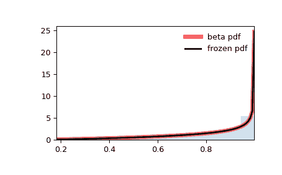

# `scipy.stats.beta`

> 原文链接：[`docs.scipy.org/doc/scipy-1.12.0/reference/generated/scipy.stats.beta.html#scipy.stats.beta`](https://docs.scipy.org/doc/scipy-1.12.0/reference/generated/scipy.stats.beta.html#scipy.stats.beta)

```py
scipy.stats.beta = <scipy.stats._continuous_distns.beta_gen object>
```

一个 beta 连续随机变量。

作为`rv_continuous`类的实例，`beta`对象继承了一组通用方法（下面详细列出），并且根据该特定分布补充了细节。

注意：

`beta` 的概率密度函数为：

\[f(x, a, b) = \frac{\Gamma(a+b) x^{a-1} (1-x)^{b-1}} {\Gamma(a) \Gamma(b)}\]

对于 \(0 <= x <= 1\), \(a > 0\), \(b > 0\)，其中 \(\Gamma\) 是 gamma 函数 (`scipy.special.gamma`)。

`beta` 接受\(a\)和\(b\)作为形状参数。

上述概率密度函数以“标准化”形式定义。使用 `loc` 和 `scale` 参数来进行移动和/或缩放分布。具体来说，`beta.pdf(x, a, b, loc, scale)` 与 `beta.pdf(y, a, b) / scale` 完全等价，其中 `y = (x - loc) / scale`。请注意，移动分布的位置并不会使其成为“非中心”分布；某些分布的非中心推广可以在单独的类中找到。

示例：

```py
>>> import numpy as np
>>> from scipy.stats import beta
>>> import matplotlib.pyplot as plt
>>> fig, ax = plt.subplots(1, 1) 
```

计算前四阶距：

```py
>>> a, b = 2.31, 0.627
>>> mean, var, skew, kurt = beta.stats(a, b, moments='mvsk') 
```

显示概率密度函数 (`pdf`)：

```py
>>> x = np.linspace(beta.ppf(0.01, a, b),
...                 beta.ppf(0.99, a, b), 100)
>>> ax.plot(x, beta.pdf(x, a, b),
...        'r-', lw=5, alpha=0.6, label='beta pdf') 
```

或者，可以通过调用分布对象（作为函数）来固定形状、位置和尺度参数。这会返回一个“冻结”的随机变量对象，其中包含给定的固定参数。

冻结分布并显示冻结的 `pdf`：

```py
>>> rv = beta(a, b)
>>> ax.plot(x, rv.pdf(x), 'k-', lw=2, label='frozen pdf') 
```

检查 `cdf` 和 `ppf` 的精度：

```py
>>> vals = beta.ppf([0.001, 0.5, 0.999], a, b)
>>> np.allclose([0.001, 0.5, 0.999], beta.cdf(vals, a, b))
True 
```

生成随机数：

```py
>>> r = beta.rvs(a, b, size=1000) 
```

并比较直方图：

```py
>>> ax.hist(r, density=True, bins='auto', histtype='stepfilled', alpha=0.2)
>>> ax.set_xlim([x[0], x[-1]])
>>> ax.legend(loc='best', frameon=False)
>>> plt.show() 
```



方法：

| **rvs(a, b, loc=0, scale=1, size=1, random_state=None)** | 随机变量。 |
| --- | --- |
| **pdf(x, a, b, loc=0, scale=1)** | 概率密度函数。 |
| **logpdf(x, a, b, loc=0, scale=1)** | 概率密度函数的对数。 |
| **cdf(x, a, b, loc=0, scale=1)** | 累积分布函数。 |
| **logcdf(x, a, b, loc=0, scale=1)** | 累积分布函数的对数。 |
| **sf(x, a, b, loc=0, scale=1)** | 生存函数（也被定义为 `1 - cdf`，但 *sf* 有时更精确）。 |
| **logsf(x, a, b, loc=0, scale=1)** | 生存函数的对数。 |
| **ppf(q, a, b, loc=0, scale=1)** | 百分位点函数（`cdf` 的逆函数 — 百分位数）。 |
| **isf(q, a, b, loc=0, scale=1)** | 逆生存函数（`sf` 的逆函数）。 |
| **moment(order, a, b, loc=0, scale=1)** | 指定阶的非中心矩。 |
| **stats(a, b, loc=0, scale=1, moments=’mv’)** | 均值（‘m’），方差（‘v’），偏度（‘s’），以及/或者峰度（‘k’）。 |
| **entropy(a, b, loc=0, scale=1)** | 随机变量的（微分）熵。 |
| **fit(data)** | 一般数据的参数估计。详细文档请参见 [scipy.stats.rv_continuous.fit](https://docs.scipy.org/doc/scipy/reference/generated/scipy.stats.rv_continuous.fit.html#scipy.stats.rv_continuous.fit)。 |
| **expect(func, args=(a, b), loc=0, scale=1, lb=None, ub=None, conditional=False, **kwds)** | 对分布的一个函数（一个参数的）的期望值。 |
| **median(a, b, loc=0, scale=1)** | 分布的中位数。 |
| **mean(a, b, loc=0, scale=1)** | 分布的均值。 |
| **var(a, b, loc=0, scale=1)** | 分布的方差。 |
| **std(a, b, loc=0, scale=1)** | 分布的标准差。 |
| **interval(confidence, a, b, loc=0, scale=1)** | 等概率置信区间的置信度。 |
