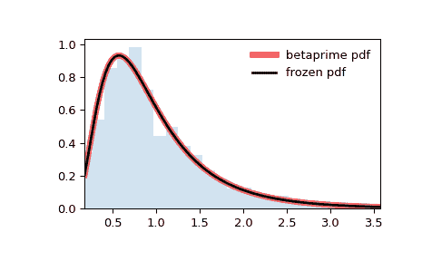

# `scipy.stats.betaprime`

> 原文链接：[`docs.scipy.org/doc/scipy-1.12.0/reference/generated/scipy.stats.betaprime.html#scipy.stats.betaprime`](https://docs.scipy.org/doc/scipy-1.12.0/reference/generated/scipy.stats.betaprime.html#scipy.stats.betaprime)

```py
scipy.stats.betaprime = <scipy.stats._continuous_distns.betaprime_gen object>
```

beta prime 连续随机变量。

作为`rv_continuous`类的实例，`betaprime`对象从中继承了一系列通用方法(下面列出了全部方法)，并使用特定于此特定分布的细节进行补充。

注释

`betaprime`的概率密度函数为:

\[f(x, a, b) = \frac{x^{a-1} (1+x)^{-a-b}}{\beta(a, b)}\]

当\(x >= 0\)，\(a > 0\)，\(b > 0\)时，其中\(\beta(a, b)\)是 beta 函数(参见`scipy.special.beta`)。

`betaprime`以`a`和`b`作为形状参数。

该分布与`beta`分布相关: 如果\(X\)服从参数为\(a, b\)的 beta 分布，则\(Y = X/(1-X)\)服从参数为\(a, b\)的 beta prime 分布([[1]](#rc2f0aea048b2-1))。

beta prime 分布是 F 分布的重新参数化版本。参数`a`和`b`以及`scale = s`的 beta prime 分布等效于参数`d1 = 2*a`，`d2 = 2*b`和`scale = (a/b)*s`的 F 分布。例如，

```py
>>> from scipy.stats import betaprime, f
>>> x = [1, 2, 5, 10]
>>> a = 12
>>> b = 5
>>> betaprime.pdf(x, a, b, scale=2)
array([0.00541179, 0.08331299, 0.14669185, 0.03150079])
>>> f.pdf(x, 2*a, 2*b, scale=(a/b)*2)
array([0.00541179, 0.08331299, 0.14669185, 0.03150079]) 
```

上述概率密度定义为“标准化”形式。要转换和/或缩放分布，请使用`loc`和`scale`参数。具体地，`betaprime.pdf(x, a, b, loc, scale)`与`y = (x - loc) / scale`和`betaprime.pdf(y, a, b) / scale`是等价的。注意，移动分布的位置并不会使其成为“非中心”分布; 一些分布的非中心广义化可在单独的类中找到。

参考资料

[1]

Beta prime 分布，维基百科，[`en.wikipedia.org/wiki/Beta_prime_distribution`](https://en.wikipedia.org/wiki/Beta_prime_distribution)

示例

```py
>>> import numpy as np
>>> from scipy.stats import betaprime
>>> import matplotlib.pyplot as plt
>>> fig, ax = plt.subplots(1, 1) 
```

计算前四个矩：

```py
>>> a, b = 5, 6
>>> mean, var, skew, kurt = betaprime.stats(a, b, moments='mvsk') 
```

显示概率密度函数(`pdf`)：

```py
>>> x = np.linspace(betaprime.ppf(0.01, a, b),
...                 betaprime.ppf(0.99, a, b), 100)
>>> ax.plot(x, betaprime.pdf(x, a, b),
...        'r-', lw=5, alpha=0.6, label='betaprime pdf') 
```

或者，可以调用分布对象（作为函数）来固定形状，位置和比例参数。 这将返回一个保存给定参数的“冻结”RV 对象。

冻结分布并显示冻结的`pdf`：

```py
>>> rv = betaprime(a, b)
>>> ax.plot(x, rv.pdf(x), 'k-', lw=2, label='frozen pdf') 
```

检查`cdf`和`ppf`的准确性：

```py
>>> vals = betaprime.ppf([0.001, 0.5, 0.999], a, b)
>>> np.allclose([0.001, 0.5, 0.999], betaprime.cdf(vals, a, b))
True 
```

生成随机数:

```py
>>> r = betaprime.rvs(a, b, size=1000) 
```

并比较直方图:

```py
>>> ax.hist(r, density=True, bins='auto', histtype='stepfilled', alpha=0.2)
>>> ax.set_xlim([x[0], x[-1]])
>>> ax.legend(loc='best', frameon=False)
>>> plt.show() 
```



方法

| **rvs(a, b, loc=0, scale=1, size=1, random_state=None)** | 随机变量。 |
| --- | --- |
| **pdf(x, a, b, loc=0, scale=1)** | 概率密度函数。 |
| **logpdf(x, a, b, loc=0, scale=1)** | 概率密度函数的对数。 |
| **cdf(x, a, b, loc=0, scale=1)** | 累积分布函数。 |
| **logcdf(x, a, b, loc=0, scale=1)** | 累积分布函数的对数。 |
| **sf(x, a, b, loc=0, scale=1)** | 生存函数（也定义为`1 - cdf`，但有时*sf*更精确）。 |
| **logsf(x, a, b, loc=0, scale=1)** | 生存函数的对数。 |
| **ppf(q, a, b, loc=0, scale=1)** | 百分位点函数（`cdf`的逆函数 — 百分位数）。 |
| **isf(q, a, b, loc=0, scale=1)** | 逆生存函数（`sf`的逆函数）。 |
| **moment(order, a, b, loc=0, scale=1)** | 指定阶数的非中心矩。 |
| **stats(a, b, loc=0, scale=1, moments=’mv’)** | 均值（‘m’）、方差（‘v’）、偏度（‘s’）、峰度（‘k’）。 |
| **entropy(a, b, loc=0, scale=1)** | 随机变量的（微分）熵。 |
| **fit(data)** | 通用数据的参数估计。详细文档请参见[scipy.stats.rv_continuous.fit](https://docs.scipy.org/doc/scipy/reference/generated/scipy.stats.rv_continuous.fit.html#scipy.stats.rv_continuous.fit)的关键字参数。 |
| **expect(func, args=(a, b), loc=0, scale=1, lb=None, ub=None, conditional=False, **kwds)** | 对于分布的一个参数函数的期望值。 |
| **median(a, b, loc=0, scale=1)** | 分布的中位数。 |
| **mean(a, b, loc=0, scale=1)** | 分布的均值。 |
| **var(a, b, loc=0, scale=1)** | 分布的方差。 |
| **std(a, b, loc=0, scale=1)** | 分布的标准偏差。 |
| **interval(confidence, a, b, loc=0, scale=1)** | 置信区间，围绕中位数有相等的面积。 |
