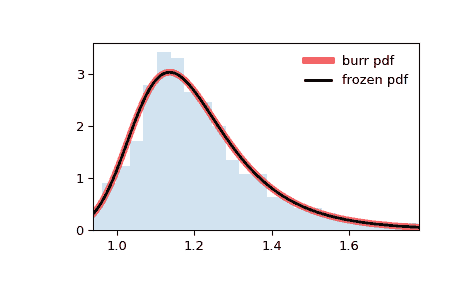

# `scipy.stats.burr`

> 原文链接：[`docs.scipy.org/doc/scipy-1.12.0/reference/generated/scipy.stats.burr.html#scipy.stats.burr`](https://docs.scipy.org/doc/scipy-1.12.0/reference/generated/scipy.stats.burr.html#scipy.stats.burr)

```py
scipy.stats.burr = <scipy.stats._continuous_distns.burr_gen object>
```

一个 Burr（Type III）连续随机变量。

作为 `rv_continuous` 类的一个实例，`burr` 对象从中继承了一系列通用方法（下面列出完整列表），并根据这一特定分布补充了细节。

另见

`fisk`

这是 `d=1` 的 `burr` 或 `burr12` 的特例。

`burr12`

Burr Type XII 分布

`mielke`

Mielke Beta-Kappa / Dagum 分布

注意

`burr` 的概率密度函数为：

\[f(x; c, d) = c d \frac{x^{-c - 1}} {{(1 + x^{-c})}^{d + 1}}\]

对于 \(x >= 0\) 和 \(c, d > 0\)。

`burr` 使用 `c` 和 `d` 作为形状参数，其中 \(c\) 和 \(d\)。

这是对应于 Burr 列表中第三个 CDF 的 PDF；具体来说，它是 Burr 论文中的方程（11）[[1]](#rc91cfc789af8-1)。该分布通常也被称为 Dagum 分布[[2]](#rc91cfc789af8-2)。如果参数 \(c < 1\)，则分布的均值不存在；如果 \(c < 2\)，则方差不存在[[2]](#rc91cfc789af8-2)。如果 \(c * d >= 1\)，则 PDF 在左端点 \(x = 0\) 处是有限的。

上述概率密度在“标准化”形式下定义。要移动和/或缩放分布，请使用 `loc` 和 `scale` 参数。具体而言，`burr.pdf(x, c, d, loc, scale)` 在 `y = (x - loc) / scale` 的情况下与 `burr.pdf(y, c, d) / scale` 是完全等价的。请注意，移动分布的位置不会使其成为“非中心”分布；一些分布的非中心泛化可以在其他类中找到。

参考文献

[1]

Burr, I. W. “累积频率函数”, 数学统计年鉴, 13(2), pp 215-232 (1942).

[2] (1,2)

[`en.wikipedia.org/wiki/Dagum_distribution`](https://en.wikipedia.org/wiki/Dagum_distribution)

[3]

Kleiber, Christian. “Dagum 分布指南。” 建模收入分布和洛伦兹曲线 pp 97-117 (2008).

示例

```py
>>> import numpy as np
>>> from scipy.stats import burr
>>> import matplotlib.pyplot as plt
>>> fig, ax = plt.subplots(1, 1) 
```

计算前四个时刻：

```py
>>> c, d = 10.5, 4.3
>>> mean, var, skew, kurt = burr.stats(c, d, moments='mvsk') 
```

显示概率密度函数 (`pdf`)：

```py
>>> x = np.linspace(burr.ppf(0.01, c, d),
...                 burr.ppf(0.99, c, d), 100)
>>> ax.plot(x, burr.pdf(x, c, d),
...        'r-', lw=5, alpha=0.6, label='burr pdf') 
```

或者，可以调用（作为函数）分布对象来固定形状、位置和尺度参数。这将返回一个“冻结”的 RV 对象，保持给定参数不变。

冻结分布并显示冻结的 `pdf`：

```py
>>> rv = burr(c, d)
>>> ax.plot(x, rv.pdf(x), 'k-', lw=2, label='frozen pdf') 
```

检查 `cdf` 和 `ppf` 的准确性：

```py
>>> vals = burr.ppf([0.001, 0.5, 0.999], c, d)
>>> np.allclose([0.001, 0.5, 0.999], burr.cdf(vals, c, d))
True 
```

生成随机数：

```py
>>> r = burr.rvs(c, d, size=1000) 
```

并比较直方图：

```py
>>> ax.hist(r, density=True, bins='auto', histtype='stepfilled', alpha=0.2)
>>> ax.set_xlim([x[0], x[-1]])
>>> ax.legend(loc='best', frameon=False)
>>> plt.show() 
```



方法

| **rvs(c, d, loc=0, scale=1, size=1, random_state=None)** | 随机变量。 |
| --- | --- |
| **pdf(x, c, d, loc=0, scale=1)** | 概率密度函数。 |
| **logpdf(x, c, d, loc=0, scale=1)** | 概率密度函数的对数。 |
| **cdf(x, c, d, loc=0, scale=1)** | 累积分布函数。 |
| **logcdf(x, c, d, loc=0, scale=1)** | 累积分布函数的对数。 |
| **sf(x, c, d, loc=0, scale=1)** | 生存函数（也定义为 `1 - cdf`，但 *sf* 有时更精确）。 |
| **logsf(x, c, d, loc=0, scale=1)** | 生存函数的对数。 |
| **ppf(q, c, d, loc=0, scale=1)** | 百分点函数（`cdf` 的逆函数 — 百分位数）。 |
| **isf(q, c, d, loc=0, scale=1)** | 逆生存函数（`sf` 的逆函数）。 |
| **moment(order, c, d, loc=0, scale=1)** | 指定阶数的非中心矩。 |
| **stats(c, d, loc=0, scale=1, moments=’mv’)** | 均值（‘m’）、方差（‘v’）、偏度（‘s’）、及/或峰度（‘k’）。 |
| **entropy(c, d, loc=0, scale=1)** | 随机变量的（微分）熵。 |
| **fit(data)** | 通用数据的参数估计。详见 [scipy.stats.rv_continuous.fit](https://docs.scipy.org/doc/scipy/reference/generated/scipy.stats.rv_continuous.fit.html#scipy.stats.rv_continuous.fit) 获取关键字参数的详细文档。 |
| **expect(func, args=(c, d), loc=0, scale=1, lb=None, ub=None, conditional=False, **kwds)** | 相对于分布的函数（一个参数）的期望值。 |
| **median(c, d, loc=0, scale=1)** | 分布的中位数。 |
| **mean(c, d, loc=0, scale=1)** | 分布的均值。 |
| **var(c, d, loc=0, scale=1)** | 分布的方差。 |
| **std(c, d, loc=0, scale=1)** | 分布的标准差。 |
| **interval(confidence, c, d, loc=0, scale=1)** | 置信区间，围绕中位数具有相等的区域。 |
