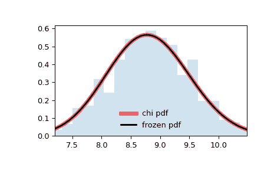

# `scipy.stats.chi`

> 原文链接：[`docs.scipy.org/doc/scipy-1.12.0/reference/generated/scipy.stats.chi.html#scipy.stats.chi`](https://docs.scipy.org/doc/scipy-1.12.0/reference/generated/scipy.stats.chi.html#scipy.stats.chi)

```py
scipy.stats.chi = <scipy.stats._continuous_distns.chi_gen object>
```

一个卡方连续随机变量。

作为 [`rv_continuous`](https://docs.scipy.org/doc/scipy-1.12.0/reference/generated/scipy.stats.rv_continuous.html#scipy.stats.rv_continuous "scipy.stats.rv_continuous") 类的一个实例，[`chi`](https://docs.scipy.org/doc/scipy-1.12.0/reference/generated/scipy.stats.chi.html#scipy.stats.chi) 对象从中继承了一组通用方法（完整列表见下文），并且使用本特定分布的细节完成它们。

注意

[`chi`](https://docs.scipy.org/doc/scipy-1.12.0/reference/generated/scipy.stats.chi.html#scipy.stats.chi) 的概率密度函数为：

\[f(x, k) = \frac{1}{2^{k/2-1} \Gamma \left( k/2 \right)} x^{k-1} \exp \left( -x²/2 \right)\]

对于 \(x \geq 0\) 和 \(k > 0\)（在实现中称为自由度 `df`）。\(\Gamma\) 是 gamma 函数（[`scipy.special.gamma`](https://docs.scipy.org/doc/scipy-1.12.0/reference/generated/scipy.special.gamma.html#scipy.special.gamma "scipy.special.gamma")）。

[`chi`](https://docs.scipy.org/doc/scipy-1.12.0/reference/generated/scipy.stats.chi.html#scipy.stats.chi)的特殊情况包括：

> +   `chi(1, loc, scale)`相当于[`halfnorm`](https://docs.scipy.org/doc/scipy-1.12.0/reference/generated/scipy.stats.halfnorm.html#scipy.stats.halfnorm "scipy.stats.halfnorm")
> +   
> +   `chi(2, 0, scale)`相当于[`rayleigh`](https://docs.scipy.org/doc/scipy-1.12.0/reference/generated/scipy.stats.rayleigh.html#scipy.stats.rayleigh "scipy.stats.rayleigh")
> +   
> +   `chi(3, 0, scale)`相当于[`maxwell`](https://docs.scipy.org/doc/scipy-1.12.0/reference/generated/scipy.stats.maxwell.html#scipy.stats.maxwell "scipy.stats.maxwell")

[`chi`](https://docs.scipy.org/doc/scipy-1.12.0/reference/generated/scipy.stats.chi.html#scipy.stats.chi) 将 `df` 作为形状参数。

上述概率密度在“标准化”形式下定义。使用 `loc` 和 `scale` 参数来移位和/或缩放分布。具体地说，`chi.pdf(x, df, loc, scale)` 与 `chi.pdf(y, df) / scale` 完全等效，其中 `y = (x - loc) / scale`。请注意，将分布的位置移动并不使其成为“非中心”分布；一些分布的非中心推广可以在单独的类中找到。

示例

```py
>>> import numpy as np
>>> from scipy.stats import chi
>>> import matplotlib.pyplot as plt
>>> fig, ax = plt.subplots(1, 1) 
```

计算前四个时刻：

```py
>>> df = 78
>>> mean, var, skew, kurt = chi.stats(df, moments='mvsk') 
```

显示概率密度函数（`pdf`）：

```py
>>> x = np.linspace(chi.ppf(0.01, df),
...                 chi.ppf(0.99, df), 100)
>>> ax.plot(x, chi.pdf(x, df),
...        'r-', lw=5, alpha=0.6, label='chi pdf') 
```

或者，可以像调用函数一样调用分布对象，以修正形状、位置和比例参数。这将返回一个“冻结”的 RV 对象，其中给定的参数被固定。

冻结分布并显示冻结的 `pdf`：

```py
>>> rv = chi(df)
>>> ax.plot(x, rv.pdf(x), 'k-', lw=2, label='frozen pdf') 
```

检查`cdf`和`ppf`的准确性：

```py
>>> vals = chi.ppf([0.001, 0.5, 0.999], df)
>>> np.allclose([0.001, 0.5, 0.999], chi.cdf(vals, df))
True 
```

生成随机数：

```py
>>> r = chi.rvs(df, size=1000) 
```

并比较直方图：

```py
>>> ax.hist(r, density=True, bins='auto', histtype='stepfilled', alpha=0.2)
>>> ax.set_xlim([x[0], x[-1]])
>>> ax.legend(loc='best', frameon=False)
>>> plt.show() 
```



方法

| **rvs(df, loc=0, scale=1, size=1, random_state=None)** | 随机变量。 |
| --- | --- |
| **pdf(x, df, loc=0, scale=1)** | 概率密度函数。 |
| **logpdf(x, df, loc=0, scale=1)** | 概率密度函数的对数。 |
| **cdf(x, df, loc=0, scale=1)** | 累积分布函数。 |
| **logcdf(x, df, loc=0, scale=1)** | 累积分布函数的对数。 |
| **sf(x, df, loc=0, scale=1)** | 生存函数（也定义为 `1 - cdf`，但 *sf* 有时更精确）。 |
| **logsf(x, df, loc=0, scale=1)** | 生存函数的对数。 |
| **ppf(q, df, loc=0, scale=1)** | 百分位点函数（`cdf`的逆 — 百分位数）。 |
| **isf(q, df, loc=0, scale=1)** | 逆生存函数（`sf`的逆）。 |
| **moment(order, df, loc=0, scale=1)** | 指定阶数的非中心矩。 |
| **stats(df, loc=0, scale=1, moments=’mv’)** | 均值（‘m’）、方差（‘v’）、偏度（‘s’）和/或峰度（‘k’）。 |
| **entropy(df, loc=0, scale=1)** | 随机变量的（微分）熵。 |
| **fit(data)** | 通用数据的参数估计。详细文档请参见[scipy.stats.rv_continuous.fit](https://docs.scipy.org/doc/scipy/reference/generated/scipy.stats.rv_continuous.fit.html#scipy.stats.rv_continuous.fit)。 |
| **expect(func, args=(df,), loc=0, scale=1, lb=None, ub=None, conditional=False, **kwds)** | 函数（一个参数的）对分布的期望值。 |
| **median(df, loc=0, scale=1)** | 分布的中位数。 |
| **mean(df, loc=0, scale=1)** | 分布的均值。 |
| **var(df, loc=0, scale=1)** | 分布的方差。 |
| **std(df, loc=0, scale=1)** | 分布的标准偏差。 |
| **interval(confidence, df, loc=0, scale=1)** | 置信区间，围绕中位数具有相等面积。 |
