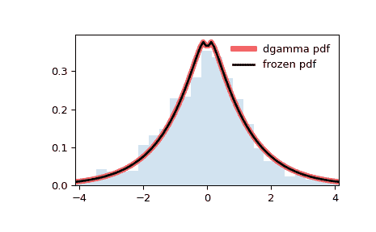

# `scipy.stats.dgamma`

> 原文链接：[`docs.scipy.org/doc/scipy-1.12.0/reference/generated/scipy.stats.dgamma.html#scipy.stats.dgamma`](https://docs.scipy.org/doc/scipy-1.12.0/reference/generated/scipy.stats.dgamma.html#scipy.stats.dgamma)

```py
scipy.stats.dgamma = <scipy.stats._continuous_distns.dgamma_gen object>
```

双伽马连续随机变量。

双伽马分布也称为反射伽马分布[[1]](#rdca4b96547f0-1)。

作为[`rv_continuous`](https://docs.scipy.org/doc/scipy-1.12.0/reference/generated/scipy.stats.rv_continuous.html#scipy.stats.rv_continuous "scipy.stats.rv_continuous")类的一个实例，[`dgamma`](https://docs.scipy.org/doc/scipy-1.12.0/reference/generated/scipy.stats.dgamma.html#scipy.stats.dgamma "scipy.stats.dgamma")对象继承了一组通用方法（请参见下面的完整列表），并使用此特定分布的详细信息完成了这些方法。

注意

[`dgamma`](https://docs.scipy.org/doc/scipy-1.12.0/reference/generated/scipy.stats.dgamma.html#scipy.stats.dgamma "scipy.stats.dgamma")的概率密度函数为：

\[f(x, a) = \frac{1}{2\Gamma(a)} |x|^{a-1} \exp(-|x|)\]

对于实数\(x\)和\(a > 0\)。 \(\Gamma\)是伽马函数（[`scipy.special.gamma`](https://docs.scipy.org/doc/scipy-1.12.0/reference/generated/scipy.special.gamma.html#scipy.special.gamma "scipy.special.gamma")）。

[`dgamma`](https://docs.scipy.org/doc/scipy-1.12.0/reference/generated/scipy.stats.dgamma.html#scipy.stats.dgamma "scipy.stats.dgamma")以\(a\)为形状参数。

上述概率密度以“标准化”形式定义。 要移动和/或缩放分布，请使用`loc`和`scale`参数。 具体来说，`dgamma.pdf(x, a, loc, scale)`与`dgamma.pdf(y, a) / scale`完全等价，其中`y = (x - loc) / scale`。 请注意，移动分布的位置不会使其成为“非中心”分布； 一些分布的非中心推广可在单独的类中获得。

参考文献

[[1]](#id1)

Johnson, Kotz, and Balakrishnan, “Continuous Univariate Distributions, Volume 1”, Second Edition, John Wiley and Sons (1994).

示例

```py
>>> import numpy as np
>>> from scipy.stats import dgamma
>>> import matplotlib.pyplot as plt
>>> fig, ax = plt.subplots(1, 1) 
```

计算前四个矩：

```py
>>> a = 1.1
>>> mean, var, skew, kurt = dgamma.stats(a, moments='mvsk') 
```

显示概率密度函数（`pdf`）：

```py
>>> x = np.linspace(dgamma.ppf(0.01, a),
...                 dgamma.ppf(0.99, a), 100)
>>> ax.plot(x, dgamma.pdf(x, a),
...        'r-', lw=5, alpha=0.6, label='dgamma pdf') 
```

或者，可以调用分布对象（作为函数），以固定形状、位置和比例参数。 这将返回一个“冻结”的 RV 对象，其中保持给定的参数固定。

冻结分布并显示冻结的`pdf`：

```py
>>> rv = dgamma(a)
>>> ax.plot(x, rv.pdf(x), 'k-', lw=2, label='frozen pdf') 
```

检查`cdf`和`ppf`的准确性：

```py
>>> vals = dgamma.ppf([0.001, 0.5, 0.999], a)
>>> np.allclose([0.001, 0.5, 0.999], dgamma.cdf(vals, a))
True 
```

生成随机数：

```py
>>> r = dgamma.rvs(a, size=1000) 
```

并比较直方图：

```py
>>> ax.hist(r, density=True, bins='auto', histtype='stepfilled', alpha=0.2)
>>> ax.set_xlim([x[0], x[-1]])
>>> ax.legend(loc='best', frameon=False)
>>> plt.show() 
```



方法

| **rvs(a, loc=0, scale=1, size=1, random_state=None)** | 随机变量。 |
| --- | --- |
| **pdf(x, a, loc=0, scale=1)** | 概率密度函数。 |
| **logpdf(x, a, loc=0, scale=1)** | 概率密度函数的对数。 |
| **cdf(x, a, loc=0, scale=1)** | 累积分布函数。 |
| **logcdf(x, a, loc=0, scale=1)** | 累积分布函数的对数。 |
| **sf(x, a, loc=0, scale=1)** | 生存函数（也被定义为`1 - cdf`，但*sf*有时更精确）。 |
| **logsf(x, a, loc=0, scale=1)** | 生存函数的对数。 |
| **ppf(q, a, loc=0, scale=1)** | 百分位点函数（`cdf`的反函数 — 百分位数）。 |
| **isf(q, a, loc=0, scale=1)** | 逆生存函数（`sf` 的逆函数）。 |
| **moment(order, a, loc=0, scale=1)** | 指定阶数的非中心矩。 |
| **stats(a, loc=0, scale=1, moments=’mv’)** | 均值（‘m’）、方差（‘v’）、偏度（‘s’）、峰度（‘k’）。 |
| **entropy(a, loc=0, scale=1)** | 随机变量的（微分）熵。 |
| **fit(data)** | 通用数据的参数估计值。详细文档请参阅 [scipy.stats.rv_continuous.fit](https://docs.scipy.org/doc/scipy/reference/generated/scipy.stats.rv_continuous.fit.html#scipy.stats.rv_continuous.fit)。 |
| **expect(func, args=(a,), loc=0, scale=1, lb=None, ub=None, conditional=False, **kwds)** | 对于分布的函数（一个参数）的期望值。 |
| **median(a, loc=0, scale=1)** | 分布的中位数。 |
| **mean(a, loc=0, scale=1)** | 分布的均值。 |
| **var(a, loc=0, scale=1)** | 分布的方差。 |
| **std(a, loc=0, scale=1)** | 分布的标准差。 |
| **interval(confidence, a, loc=0, scale=1)** | 中位数周围等面积的置信区间。 |
