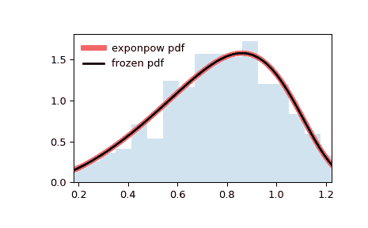

# `scipy.stats.exponpow`

> 原文链接：[`docs.scipy.org/doc/scipy-1.12.0/reference/generated/scipy.stats.exponpow.html#scipy.stats.exponpow`](https://docs.scipy.org/doc/scipy-1.12.0/reference/generated/scipy.stats.exponpow.html#scipy.stats.exponpow)

```py
scipy.stats.exponpow = <scipy.stats._continuous_distns.exponpow_gen object>
```

一个指数幂连续随机变量。

作为[`rv_continuous`](https://docs.scipy.org/doc/scipy-1.12.0/reference/generated/scipy.stats.rv_continuous.html#scipy.stats.rv_continuous "scipy.stats.rv_continuous")类的一个实例，[`exponpow`](https://docs.scipy.org/doc/scipy-1.12.0/reference/generated/scipy.stats.exponpow.html#scipy.stats.exponpow "scipy.stats.exponpow")对象继承了其中一系列通用方法（下面有完整列表），并使用特定于这个特定分布的细节完成它们。

注意

对于[`exponpow`](https://docs.scipy.org/doc/scipy-1.12.0/reference/generated/scipy.stats.exponpow.html#scipy.stats.exponpow "scipy.stats.exponpow")的概率密度函数为：

\[f(x, b) = b x^{b-1} \exp(1 + x^b - \exp(x^b))\]

对于\(x \ge 0\)，\(b > 0\)。注意，这是与指数幂分布不同的另一种分布，该分布也以“广义正态”或“广义高斯”而闻名。

[`exponpow`](https://docs.scipy.org/doc/scipy-1.12.0/reference/generated/scipy.stats.exponpow.html#scipy.stats.exponpow)将 `b` 作为形状参数。

上述概率密度以“标准化”形式定义。要移动和/或缩放分布，请使用 `loc` 和 `scale` 参数。具体而言，`exponpow.pdf(x, b, loc, scale)` 等同于 `exponpow.pdf(y, b) / scale`，其中 `y = (x - loc) / scale`。请注意，移动分布的位置并不会使其成为“非中心”分布；某些分布的非中心推广可在单独的类中找到。

参考文献

[`www.math.wm.edu/~leemis/chart/UDR/PDFs/Exponentialpower.pdf`](http://www.math.wm.edu/~leemis/chart/UDR/PDFs/Exponentialpower.pdf)

示例

```py
>>> import numpy as np
>>> from scipy.stats import exponpow
>>> import matplotlib.pyplot as plt
>>> fig, ax = plt.subplots(1, 1) 
```

计算前四个时刻：

```py
>>> b = 2.7
>>> mean, var, skew, kurt = exponpow.stats(b, moments='mvsk') 
```

显示概率密度函数 (`pdf`)：

```py
>>> x = np.linspace(exponpow.ppf(0.01, b),
...                 exponpow.ppf(0.99, b), 100)
>>> ax.plot(x, exponpow.pdf(x, b),
...        'r-', lw=5, alpha=0.6, label='exponpow pdf') 
```

或者，可以调用分布对象（作为函数）来固定形状、位置和比例参数。这会返回一个“冻结”RV 对象，其中给定的参数被固定。

冻结分布并显示冻结的 `pdf`：

```py
>>> rv = exponpow(b)
>>> ax.plot(x, rv.pdf(x), 'k-', lw=2, label='frozen pdf') 
```

检查 `cdf` 和 `ppf` 的准确性：

```py
>>> vals = exponpow.ppf([0.001, 0.5, 0.999], b)
>>> np.allclose([0.001, 0.5, 0.999], exponpow.cdf(vals, b))
True 
```

生成随机数：

```py
>>> r = exponpow.rvs(b, size=1000) 
```

并比较直方图：

```py
>>> ax.hist(r, density=True, bins='auto', histtype='stepfilled', alpha=0.2)
>>> ax.set_xlim([x[0], x[-1]])
>>> ax.legend(loc='best', frameon=False)
>>> plt.show() 
```



方法

| **rvs(b, loc=0, scale=1, size=1, random_state=None)** | 随机变量。 |
| --- | --- |
| **pdf(x, b, loc=0, scale=1)** | 概率密度函数。 |
| **logpdf(x, b, loc=0, scale=1)** | 概率密度函数的对数。 |
| **cdf(x, b, loc=0, scale=1)** | 累积分布函数。 |
| **logcdf(x, b, loc=0, scale=1)** | 累积分布函数的对数。 |
| **sf(x, b, loc=0, scale=1)** | 生存函数（也定义为 `1 - cdf`，但 *sf* 有时更准确）。 |
| **logsf(x, b, loc=0, scale=1)** | 生存函数的对数。 |
| **ppf(q, b, loc=0, scale=1)** | 百分位点函数（`cdf` 的反函数 —— 百分位数）。 |
| **isf(q, b, loc=0, scale=1)** | 生存函数的反函数（`sf` 的反函数）。 |
| **moment(order, b, loc=0, scale=1)** | 指定阶数的非中心矩。 |
| **stats(b, loc=0, scale=1, moments=’mv’)** | 均值（‘m’）、方差（‘v’）、偏度（‘s’）和/或峰度（‘k’）。 |
| **entropy(b, loc=0, scale=1)** | 随机变量的（微分）熵。 |
| **fit(data)** | 通用数据的参数估计。详细文档请参见[scipy.stats.rv_continuous.fit](https://docs.scipy.org/doc/scipy/reference/generated/scipy.stats.rv_continuous.fit.html#scipy.stats.rv_continuous.fit)。 |
| **expect(func, args=(b,), loc=0, scale=1, lb=None, ub=None, conditional=False, **kwds)** | 关于分布的函数（一个参数）的期望值。 |
| **median(b, loc=0, scale=1)** | 分布的中位数。 |
| **mean(b, loc=0, scale=1)** | 分布的均值。 |
| **var(b, loc=0, scale=1)** | 分布的方差。 |
| **std(b, loc=0, scale=1)** | 分布的标准差。 |
| **interval(confidence, b, loc=0, scale=1)** | 中位数周围具有相等面积的置信区间。 |
