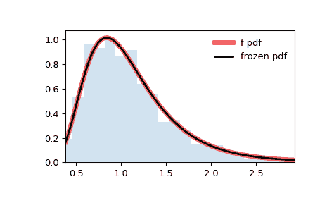

# `scipy.stats.f`

> 原文链接：[`docs.scipy.org/doc/scipy-1.12.0/reference/generated/scipy.stats.f.html#scipy.stats.f`](https://docs.scipy.org/doc/scipy-1.12.0/reference/generated/scipy.stats.f.html#scipy.stats.f)

```py
scipy.stats.f = <scipy.stats._continuous_distns.f_gen object>
```

一个连续 F 随机变量。

非中心 F 分布，请参见 `ncf`。

作为 `rv_continuous` 类的一个实例，`f` 对象从该类继承了一系列通用方法（详见下文的完整列表），并以特定于该特定分布的细节完成它们。

另请参阅

`ncf`

注意

具有\(df_1 > 0\) 和 \(df_2 > 0\) 自由度的 F 分布是两个独立的卡方分布（自由度分别为 \(df_1\) 和 \(df_2\)）比值的分布，通过 \(df_2 / df_1\) 重新缩放后得到。

`f` 的概率密度函数为：

\[f(x, df_1, df_2) = \frac{df_2^{df_2/2} df_1^{df_1/2} x^{df_1 / 2-1}} {(df_2+df_1 x)^{(df_1+df_2)/2} B(df_1/2, df_2/2)}\]

对于 \(x > 0\)。

`f` 接受形状参数 `dfn` 和 `dfd` 作为 \(df_1\)，分子中的卡方分布自由度，以及 \(df_2\)，分母中的卡方分布自由度。

上述的概率密度在“标准化”形式中定义。要改变分布的位置和/或比例，请使用 `loc` 和 `scale` 参数。具体而言，`f.pdf(x, dfn, dfd, loc, scale)` 在 `y = (x - loc) / scale` 时等价于 `f.pdf(y, dfn, dfd) / scale`。请注意，将分布的位置偏移并不使其成为“非中心”分布；某些分布的非中心推广可在单独的类中找到。

示例

```py
>>> import numpy as np
>>> from scipy.stats import f
>>> import matplotlib.pyplot as plt
>>> fig, ax = plt.subplots(1, 1) 
```

计算前四个矩：

```py
>>> dfn, dfd = 29, 18
>>> mean, var, skew, kurt = f.stats(dfn, dfd, moments='mvsk') 
```

显示概率密度函数(`pdf`):

```py
>>> x = np.linspace(f.ppf(0.01, dfn, dfd),
...                 f.ppf(0.99, dfn, dfd), 100)
>>> ax.plot(x, f.pdf(x, dfn, dfd),
...        'r-', lw=5, alpha=0.6, label='f pdf') 
```

或者，可以调用分布对象（作为函数）来固定形状、位置和比例参数。这将返回一个“冻结”的 RV 对象，保持给定参数不变。

冻结分布并显示冻结的 `pdf`：

```py
>>> rv = f(dfn, dfd)
>>> ax.plot(x, rv.pdf(x), 'k-', lw=2, label='frozen pdf') 
```

检查`cdf` 和 `ppf` 的准确性：

```py
>>> vals = f.ppf([0.001, 0.5, 0.999], dfn, dfd)
>>> np.allclose([0.001, 0.5, 0.999], f.cdf(vals, dfn, dfd))
True 
```

生成随机数：

```py
>>> r = f.rvs(dfn, dfd, size=1000) 
```

并比较直方图：

```py
>>> ax.hist(r, density=True, bins='auto', histtype='stepfilled', alpha=0.2)
>>> ax.set_xlim([x[0], x[-1]])
>>> ax.legend(loc='best', frameon=False)
>>> plt.show() 
```



方法

| **rvs(dfn, dfd, loc=0, scale=1, size=1, random_state=None)** | 随机变量。 |
| --- | --- |
| **pdf(x, dfn, dfd, loc=0, scale=1)** | 概率密度函数。 |
| **logpdf(x, dfn, dfd, loc=0, scale=1)** | 概率密度函数的对数。 |
| **cdf(x, dfn, dfd, loc=0, scale=1)** | 累积分布函数。 |
| **logcdf(x, dfn, dfd, loc=0, scale=1)** | 累积分布函数的对数。 |
| **sf(x, dfn, dfd, loc=0, scale=1)** | 生存函数（也被定义为`1 - cdf`，但*sf*有时更准确）。 |
| **logsf(x, dfn, dfd, loc=0, scale=1)** | 生存函数的对数。 |
| **ppf(q, dfn, dfd, loc=0, scale=1)** | 百分点函数（`cdf`的反函数 — 百分位数）。 |
| **isf(q, dfn, dfd, loc=0, scale=1)** | 逆生存函数（`sf`的反函数）。 |
| **moment(order, dfn, dfd, loc=0, scale=1)** | 指定阶数的非中心矩。 |
| **stats(dfn, dfd, loc=0, scale=1, moments=’mv’)** | 均值（‘m’）、方差（‘v’）、偏度（‘s’）、以及/或峰度（‘k’）。 |
| **entropy(dfn, dfd, loc=0, scale=1)** | 随机变量的（微分）熵。 |
| **fit(data)** | 适用于通用数据的参数估计。详细文档请参阅[scipy.stats.rv_continuous.fit](https://docs.scipy.org/doc/scipy/reference/generated/scipy.stats.rv_continuous.fit.html#scipy.stats.rv_continuous.fit)。 |
| **expect(func, args=(dfn, dfd), loc=0, scale=1, lb=None, ub=None, conditional=False, **kwds)** | 关于分布的函数期望值（一个参数的函数）。 |
| **median(dfn, dfd, loc=0, scale=1)** | 分布的中位数。 |
| **mean(dfn, dfd, loc=0, scale=1)** | 分布的均值。 |
| **var(dfn, dfd, loc=0, scale=1)** | 分布的方差。 |
| **std(dfn, dfd, loc=0, scale=1)** | 分布的标准差。 |
| **interval(confidence, dfn, dfd, loc=0, scale=1)** | 中位数周围面积相等的置信区间。 |
