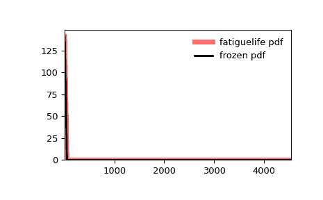

# `scipy.stats.fatiguelife`

> 原始文本：[`docs.scipy.org/doc/scipy-1.12.0/reference/generated/scipy.stats.fatiguelife.html#scipy.stats.fatiguelife`](https://docs.scipy.org/doc/scipy-1.12.0/reference/generated/scipy.stats.fatiguelife.html#scipy.stats.fatiguelife)

```py
scipy.stats.fatiguelife = <scipy.stats._continuous_distns.fatiguelife_gen object>
```

一个疲劳寿命（Birnbaum-Saunders）连续随机变量。

作为 `rv_continuous` 类的一个实例，`fatiguelife` 对象继承了一组通用方法（下面列出了完整列表），并使用特定于该特定分布的细节来完成它们。

注意事项

对于 `fatiguelife` 的概率密度函数如下：

\[f(x, c) = \frac{x+1}{2c\sqrt{2\pi x³}} \exp(-\frac{(x-1)²}{2x c²})\]

对于 \(x \geq 0\) 和 \(c > 0\)。

`fatiguelife` 将 `c` 作为形状参数\(c\)。

上述概率密度在“标准化”形式中定义。要移动和/或缩放分布，请使用 `loc` 和 `scale` 参数。具体而言，`fatiguelife.pdf(x, c, loc, scale)` 与 `fatiguelife.pdf(y, c) / scale` 是等价的，其中 `y = (x - loc) / scale`。请注意，移动分布的位置并不使其成为“非中心”分布；某些分布的非中心泛化在单独的类中可用。

参考文献

[1]

“Birnbaum-Saunders 分布”，[`en.wikipedia.org/wiki/Birnbaum-Saunders_distribution`](https://en.wikipedia.org/wiki/Birnbaum-Saunders_distribution)

示例

```py
>>> import numpy as np
>>> from scipy.stats import fatiguelife
>>> import matplotlib.pyplot as plt
>>> fig, ax = plt.subplots(1, 1) 
```

计算前四个矩：

```py
>>> c = 29
>>> mean, var, skew, kurt = fatiguelife.stats(c, moments='mvsk') 
```

显示概率密度函数 (`pdf`)：

```py
>>> x = np.linspace(fatiguelife.ppf(0.01, c),
...                 fatiguelife.ppf(0.99, c), 100)
>>> ax.plot(x, fatiguelife.pdf(x, c),
...        'r-', lw=5, alpha=0.6, label='fatiguelife pdf') 
```

或者，可以通过调用分布对象（作为函数）来固定形状、位置和比例参数。这会返回一个“冻结”的随机变量对象，保持给定的参数不变。

冻结分布并显示冻结的 `pdf`：

```py
>>> rv = fatiguelife(c)
>>> ax.plot(x, rv.pdf(x), 'k-', lw=2, label='frozen pdf') 
```

检查`cdf`和`ppf`的准确性：

```py
>>> vals = fatiguelife.ppf([0.001, 0.5, 0.999], c)
>>> np.allclose([0.001, 0.5, 0.999], fatiguelife.cdf(vals, c))
True 
```

生成随机数：

```py
>>> r = fatiguelife.rvs(c, size=1000) 
```

然后比较直方图：

```py
>>> ax.hist(r, density=True, bins='auto', histtype='stepfilled', alpha=0.2)
>>> ax.set_xlim([x[0], x[-1]])
>>> ax.legend(loc='best', frameon=False)
>>> plt.show() 
```



方法

| **rvs(c, loc=0, scale=1, size=1, random_state=None)** | 随机变量。 |
| --- | --- |
| **pdf(x, c, loc=0, scale=1)** | 概率密度函数。 |
| **logpdf(x, c, loc=0, scale=1)** | 概率密度函数的对数。 |
| **cdf(x, c, loc=0, scale=1)** | 累积分布函数。 |
| **logcdf(x, c, loc=0, scale=1)** | 累积分布函数的对数。 |
| **sf(x, c, loc=0, scale=1)** | 生存函数（也定义为 `1 - cdf`，但 *sf* 有时更精确）。 |
| **logsf(x, c, loc=0, scale=1)** | 生存函数的对数。 |
| **ppf(q, c, loc=0, scale=1)** | 百分位点函数（`cdf` 的反函数 — 百分位数）。 |
| **isf(q, c, loc=0, scale=1)** | 逆生存函数（`sf`的逆）。 |
| **moment(order, c, loc=0, scale=1)** | 指定阶数的非中心矩。 |
| **stats(c, loc=0, scale=1, moments=’mv’)** | 均值（‘m’）、方差（‘v’）、偏度（‘s’）、以及/或峰度（‘k’）。 |
| **entropy(c, loc=0, scale=1)** | 随机变量的（微分）熵。 |
| **fit(data)** | 通用数据的参数估计。详细文档请参见 [scipy.stats.rv_continuous.fit](https://docs.scipy.org/doc/scipy/reference/generated/scipy.stats.rv_continuous.fit.html#scipy.stats.rv_continuous.fit)。 |
| **expect(func, args=(c,), loc=0, scale=1, lb=None, ub=None, conditional=False, **kwds)** | 关于分布的函数（单个参数）的期望值。 |
| **median(c, loc=0, scale=1)** | 分布的中位数。 |
| **mean(c, loc=0, scale=1)** | 分布的均值。 |
| **var(c, loc=0, scale=1)** | 分布的方差。 |
| **std(c, loc=0, scale=1)** | 分布的标准差。 |
| **interval(confidence, c, loc=0, scale=1)** | 置信区间，围绕中位数具有相等的区域。 |
