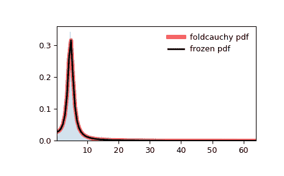

# `scipy.stats.foldcauchy`

> 原文链接：[`docs.scipy.org/doc/scipy-1.12.0/reference/generated/scipy.stats.foldcauchy.html#scipy.stats.foldcauchy`](https://docs.scipy.org/doc/scipy-1.12.0/reference/generated/scipy.stats.foldcauchy.html#scipy.stats.foldcauchy)

```py
scipy.stats.foldcauchy = <scipy.stats._continuous_distns.foldcauchy_gen object>
```

一个折叠的柯西连续随机变量。

作为`rv_continuous`类的实例，`foldcauchy`对象继承了一组通用方法（详见下文的完整列表），并通过特定于此特定分布的细节来补充它们。

注意

`foldcauchy`的概率密度函数为：

\[f(x, c) = \frac{1}{\pi (1+(x-c)²)} + \frac{1}{\pi (1+(x+c)²)}\]

对于 \(x \ge 0\) 和 \(c \ge 0\)。

`foldcauchy`将 `c` 作为 \(c\) 的形状参数。

示例

```py
>>> import numpy as np
>>> from scipy.stats import foldcauchy
>>> import matplotlib.pyplot as plt
>>> fig, ax = plt.subplots(1, 1) 
```

计算前四个时刻：

```py
>>> c = 4.72
>>> mean, var, skew, kurt = foldcauchy.stats(c, moments='mvsk') 
```

显示概率密度函数（`pdf`）：

```py
>>> x = np.linspace(foldcauchy.ppf(0.01, c),
...                 foldcauchy.ppf(0.99, c), 100)
>>> ax.plot(x, foldcauchy.pdf(x, c),
...        'r-', lw=5, alpha=0.6, label='foldcauchy pdf') 
```

或者，可以调用分布对象（作为函数），以固定形状、位置和比例参数。这将返回一个“冻结”的随机变量对象，保持给定参数不变。

冻结分布并显示冻结的 `pdf`：

```py
>>> rv = foldcauchy(c)
>>> ax.plot(x, rv.pdf(x), 'k-', lw=2, label='frozen pdf') 
```

检查 `cdf` 和 `ppf` 的准确性：

```py
>>> vals = foldcauchy.ppf([0.001, 0.5, 0.999], c)
>>> np.allclose([0.001, 0.5, 0.999], foldcauchy.cdf(vals, c))
True 
```

生成随机数：

```py
>>> r = foldcauchy.rvs(c, size=1000) 
```

并比较直方图：

```py
>>> ax.hist(r, density=True, bins='auto', histtype='stepfilled', alpha=0.2)
>>> ax.set_xlim([x[0], x[-1]])
>>> ax.legend(loc='best', frameon=False)
>>> plt.show() 
```



方法

| **rvs(c, loc=0, scale=1, size=1, random_state=None)** | 随机变量。 |
| --- | --- |
| **pdf(x, c, loc=0, scale=1)** | 概率密度函数。 |
| **logpdf(x, c, loc=0, scale=1)** | 概率密度函数的对数。 |
| **cdf(x, c, loc=0, scale=1)** | 累积分布函数。 |
| **logcdf(x, c, loc=0, scale=1)** | 累积分布函数的对数。 |
| **sf(x, c, loc=0, scale=1)** | 生存函数（也定义为 `1 - cdf`，但有时*sf*更准确）。 |
| **logsf(x, c, loc=0, scale=1)** | 生存函数的对数。 |
| **ppf(q, c, loc=0, scale=1)** | 百分位点函数（`cdf` 的反函数 — 百分位数）。 |
| **isf(q, c, loc=0, scale=1)** | 生存函数的逆函数（`sf` 的逆函数）。 |
| **moment(order, c, loc=0, scale=1)** | 指定顺序的非中心矩。 |
| **stats(c, loc=0, scale=1, moments=’mv’)** | 均值（‘m’）、方差（‘v’）、偏度（‘s’）和/或峰度（‘k’）。 |
| **entropy(c, loc=0, scale=1)** | 随机变量的（微分）熵。 |
| **fit(data)** | 对通用数据的参数估计。有关关键字参数的详细文档，请参见[scipy.stats.rv_continuous.fit](https://docs.scipy.org/doc/scipy/reference/generated/scipy.stats.rv_continuous.fit.html#scipy.stats.rv_continuous.fit)。 |
| **expect(func, args=(c,), loc=0, scale=1, lb=None, ub=None, conditional=False, **kwds)** | 对分布的函数（一个参数的函数）的期望值。 |
| **median(c, loc=0, scale=1)** | 分布的中位数。 |
| **mean(c, loc=0, scale=1)** | 分布的均值。 |
| **var(c, loc=0, scale=1)** | 分布的方差。 |
| **std(c, loc=0, scale=1)** | 分布的标准差。 |
| **interval(confidence, c, loc=0, scale=1)** | 中位数周围面积相等的置信区间。 |
