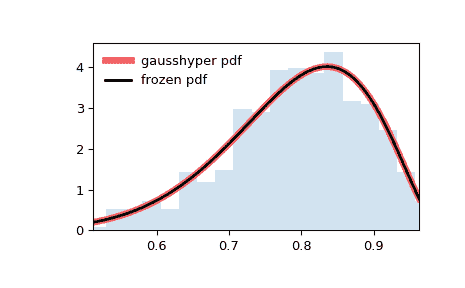

# `scipy.stats.gausshyper`

> 原文链接：[`docs.scipy.org/doc/scipy-1.12.0/reference/generated/scipy.stats.gausshyper.html#scipy.stats.gausshyper`](https://docs.scipy.org/doc/scipy-1.12.0/reference/generated/scipy.stats.gausshyper.html#scipy.stats.gausshyper)

```py
scipy.stats.gausshyper = <scipy.stats._continuous_distns.gausshyper_gen object>
```

高斯超几何连续随机变量。

作为 `rv_continuous` 类的一个实例，`gausshyper` 对象继承了一组通用方法（请参见下面的完整列表），并为此特定分布提供了详细信息。

注释

`gausshyper` 的概率密度函数是：

\[f(x, a, b, c, z) = C x^{a-1} (1-x)^{b-1} (1+zx)^{-c}\]

对于 \(0 \le x \le 1\), \(a,b > 0\), \(c\) 是实数, \(z > -1\), 且 \(C = \frac{1}{B(a, b) F2, 1}\). \(F[2, 1]\) 是高斯超几何函数 `scipy.special.hyp2f1`。

`gausshyper` 使用 \(a\), \(b\), \(c\) 和 \(z\) 作为形状参数。

上述概率密度在“标准化”形式下定义。要移动和/或缩放分布，请使用 `loc` 和 `scale` 参数。具体来说，`gausshyper.pdf(x, a, b, c, z, loc, scale)` 等同于 `gausshyper.pdf(y, a, b, c, z) / scale`，其中 `y = (x - loc) / scale`。请注意，移动分布的位置不会使其成为“非中心”分布；某些分布的非中心推广在单独的类中可用。

参考文献

[1]

Armero, C., and M. J. Bayarri. “Prior Assessments for Prediction in Queues.” *Journal of the Royal Statistical Society*. Series D (The Statistician) 43, no. 1 (1994): 139-53\. doi:10.2307/2348939

示例

```py
>>> import numpy as np
>>> from scipy.stats import gausshyper
>>> import matplotlib.pyplot as plt
>>> fig, ax = plt.subplots(1, 1) 
```

计算前四个矩：

```py
>>> a, b, c, z = 13.8, 3.12, 2.51, 5.18
>>> mean, var, skew, kurt = gausshyper.stats(a, b, c, z, moments='mvsk') 
```

显示概率密度函数 (`pdf`)：

```py
>>> x = np.linspace(gausshyper.ppf(0.01, a, b, c, z),
...                 gausshyper.ppf(0.99, a, b, c, z), 100)
>>> ax.plot(x, gausshyper.pdf(x, a, b, c, z),
...        'r-', lw=5, alpha=0.6, label='gausshyper pdf') 
```

或者，分布对象可以被调用（作为一个函数）以固定形状、位置和比例参数。这将返回一个固定给定参数的“冻结”随机变量对象。

冻结分布并显示冻结的 `pdf`：

```py
>>> rv = gausshyper(a, b, c, z)
>>> ax.plot(x, rv.pdf(x), 'k-', lw=2, label='frozen pdf') 
```

检查 `cdf` 和 `ppf` 的准确性：

```py
>>> vals = gausshyper.ppf([0.001, 0.5, 0.999], a, b, c, z)
>>> np.allclose([0.001, 0.5, 0.999], gausshyper.cdf(vals, a, b, c, z))
True 
```

生成随机数：

```py
>>> r = gausshyper.rvs(a, b, c, z, size=1000) 
```

并比较直方图：

```py
>>> ax.hist(r, density=True, bins='auto', histtype='stepfilled', alpha=0.2)
>>> ax.set_xlim([x[0], x[-1]])
>>> ax.legend(loc='best', frameon=False)
>>> plt.show() 
```



方法

| **rvs(a, b, c, z, loc=0, scale=1, size=1, random_state=None)** | 随机变量。 |
| --- | --- |
| **pdf(x, a, b, c, z, loc=0, scale=1)** | 概率密度函数。 |
| **logpdf(x, a, b, c, z, loc=0, scale=1)** | 概率密度函数的对数。 |
| **cdf(x, a, b, c, z, loc=0, scale=1)** | 累积分布函数。 |
| **logcdf(x, a, b, c, z, loc=0, scale=1)** | 累积分布函数的对数。 |
| **sf(x, a, b, c, z, loc=0, scale=1)** | 生存函数（也定义为 `1 - cdf`，但 *sf* 有时更准确）。 |
| **logsf(x, a, b, c, z, loc=0, scale=1)** | 生存函数的对数。 |
| **ppf(q, a, b, c, z, loc=0, scale=1)** | 百分点函数（`cdf` 的反函数 — 百分位数）。 |
| **isf(q, a, b, c, z, loc=0, scale=1)** | 逆生存函数（`sf` 的反函数）。 |
| **moment(order, a, b, c, z, loc=0, scale=1)** | 指定阶数的非中心矩。 |
| **stats(a, b, c, z, loc=0, scale=1, moments=’mv’)** | 均值（‘m’）、方差（‘v’）、偏度（‘s’）、及/或峰度（‘k’）。 |
| **entropy(a, b, c, z, loc=0, scale=1)** | 随机变量的（微分）熵。 |
| **fit(data)** | 通用数据的参数估计。详细文档参见 [scipy.stats.rv_continuous.fit](https://docs.scipy.org/doc/scipy/reference/generated/scipy.stats.rv_continuous.fit.html#scipy.stats.rv_continuous.fit)。 |
| **expect(func, args=(a, b, c, z), loc=0, scale=1, lb=None, ub=None, conditional=False, **kwds)** | 关于分布的函数（一元函数）的期望值。 |
| **median(a, b, c, z, loc=0, scale=1)** | 分布的中位数。 |
| **mean(a, b, c, z, loc=0, scale=1)** | 分布的均值。 |
| **var(a, b, c, z, loc=0, scale=1)** | 分布的方差。 |
| **std(a, b, c, z, loc=0, scale=1)** | 分布的标准差。 |
| **interval(confidence, a, b, c, z, loc=0, scale=1)** | 围绕中位数的等面积置信区间。 |
