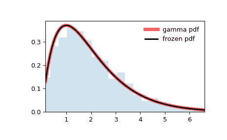

# `scipy.stats.gamma`

> 原文链接：[`docs.scipy.org/doc/scipy-1.12.0/reference/generated/scipy.stats.gamma.html#scipy.stats.gamma`](https://docs.scipy.org/doc/scipy-1.12.0/reference/generated/scipy.stats.gamma.html#scipy.stats.gamma)

```py
scipy.stats.gamma = <scipy.stats._continuous_distns.gamma_gen object>
```

一个伽玛连续随机变量。

作为[`rv_continuous`](https://docs.scipy.org/doc/scipy-1.12.0/reference/generated/scipy.stats.rv_continuous.html#scipy.stats.rv_continuous)类的一个实例，[`gamma`](https://docs.scipy.org/doc/scipy-1.12.0/reference/generated/scipy.stats.gamma.html#scipy.stats.gamma)对象继承了一系列通用方法（下面有完整列表），并根据这个特定分布补充了细节。

另见

[`erlang`](https://docs.scipy.org/doc/scipy-1.12.0/reference/generated/scipy.stats.erlang.html#scipy.stats.erlang), [`expon`](https://docs.scipy.org/doc/scipy-1.12.0/reference/generated/scipy.stats.expon.html#scipy.stats.expon)

注释

[`gamma`](https://docs.scipy.org/doc/scipy-1.12.0/reference/generated/scipy.stats.gamma.html#scipy.stats.gamma) 的概率密度函数为：

\[f(x, a) = \frac{x^{a-1} e^{-x}}{\Gamma(a)}\]

对于 \(x \ge 0\), \(a > 0\)。这里 \(\Gamma(a)\) 是伽玛函数。

[`gamma`](https://docs.scipy.org/doc/scipy-1.12.0/reference/generated/scipy.stats.gamma.html#scipy.stats.gamma) 将 `a` 作为形状参数。

当 \(a\) 是整数时，[`gamma`](https://docs.scipy.org/doc/scipy-1.12.0/reference/generated/scipy.stats.gamma.html#scipy.stats.gamma) 缩减为 Erlang 分布；当 \(a=1\) 时，缩减为指数分布。

有时用两个变量来参数化伽玛分布，其概率密度函数为：

\[f(x, \alpha, \beta) = \frac{\beta^\alpha x^{\alpha - 1} e^{-\beta x }}{\Gamma(\alpha)}\]

注意，此参数化与上述等价，其中`scale = 1 / beta`。

上述概率密度定义为“标准化”形式。要移动和/或缩放分布，请使用 `loc` 和 `scale` 参数。具体而言，`gamma.pdf(x, a, loc, scale)` 与 `gamma.pdf(y, a) / scale` 等效，其中 `y = (x - loc) / scale`。请注意，移动分布的位置并不使其成为“非中心”分布；某些分布的非中心推广可在单独的类中找到。

示例

```py
>>> import numpy as np
>>> from scipy.stats import gamma
>>> import matplotlib.pyplot as plt
>>> fig, ax = plt.subplots(1, 1) 
```

计算前四个矩：

```py
>>> a = 1.99
>>> mean, var, skew, kurt = gamma.stats(a, moments='mvsk') 
```

显示概率密度函数（`pdf`）：

```py
>>> x = np.linspace(gamma.ppf(0.01, a),
...                 gamma.ppf(0.99, a), 100)
>>> ax.plot(x, gamma.pdf(x, a),
...        'r-', lw=5, alpha=0.6, label='gamma pdf') 
```

或者，可以通过调用分布对象（作为函数）来固定形状、位置和比例参数。这将返回一个固定给定参数的“冻结”随机变量对象。

冻结分布并显示冻结的`pdf`：

```py
>>> rv = gamma(a)
>>> ax.plot(x, rv.pdf(x), 'k-', lw=2, label='frozen pdf') 
```

检查 `cdf` 和 `ppf` 的准确性：

```py
>>> vals = gamma.ppf([0.001, 0.5, 0.999], a)
>>> np.allclose([0.001, 0.5, 0.999], gamma.cdf(vals, a))
True 
```

生成随机数：

```py
>>> r = gamma.rvs(a, size=1000) 
```

并比较直方图：

```py
>>> ax.hist(r, density=True, bins='auto', histtype='stepfilled', alpha=0.2)
>>> ax.set_xlim([x[0], x[-1]])
>>> ax.legend(loc='best', frameon=False)
>>> plt.show() 
```



方法

| **rvs(a, loc=0, scale=1, size=1, random_state=None)** | 随机变量。 |
| --- | --- |
| **pdf(x, a, loc=0, scale=1)** | 概率密度函数。 |
| **logpdf(x, a, loc=0, scale=1)** | 概率密度函数的对数。 |
| **cdf(x, a, loc=0, scale=1)** | 累积分布函数。 |
| **logcdf(x, a, loc=0, scale=1)** | 累积分布函数的对数。 |
| **sf(x, a, loc=0, scale=1)** | 生存函数（有时比 *cdf* 更准确）。 |
| **logsf(x, a, loc=0, scale=1)** | 生存函数的对数。 |
| **ppf(q, a, loc=0, scale=1)** | 百分点函数（`cdf`的逆函数，用于计算百分位数）。 |
| **isf(q, a, loc=0, scale=1)** | 逆生存函数（`sf`的逆函数）。 |
| **moment(order, a, loc=0, scale=1)** | 指定阶数的非中心矩。 |
| **stats(a, loc=0, scale=1, moments=’mv’)** | 均值（‘m’）、方差（‘v’）、偏度（‘s’）、峰度（‘k’）等统计量。 |
| **entropy(a, loc=0, scale=1)** | 随机变量的（微分）熵。 |
| **fit(data)** | 一般数据的参数估计。详细文档请参见 [scipy.stats.rv_continuous.fit](https://docs.scipy.org/doc/scipy/reference/generated/scipy.stats.rv_continuous.fit.html#scipy.stats.rv_continuous.fit)。 |
| **expect(func, args=(a,), loc=0, scale=1, lb=None, ub=None, conditional=False, **kwds)** | 对分布的函数（一个参数）的期望值。 |
| **median(a, loc=0, scale=1)** | 分布的中位数。 |
| **mean(a, loc=0, scale=1)** | 分布的均值。 |
| **var(a, loc=0, scale=1)** | 分布的方差。 |
| **std(a, loc=0, scale=1)** | 分布的标准差。 |
| **interval(confidence, a, loc=0, scale=1)** | 中位数周围面积相等的置信区间。 |
