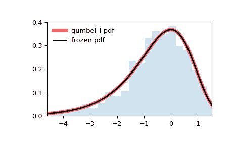

# `scipy.stats.gumbel_l`

> 原文链接：[`docs.scipy.org/doc/scipy-1.12.0/reference/generated/scipy.stats.gumbel_l.html#scipy.stats.gumbel_l`](https://docs.scipy.org/doc/scipy-1.12.0/reference/generated/scipy.stats.gumbel_l.html#scipy.stats.gumbel_l)

```py
scipy.stats.gumbel_l = <scipy.stats._continuous_distns.gumbel_l_gen object>
```

一个左偏的 Gumbel 连续随机变量。

作为 [`rv_continuous`](https://docs.scipy.org/doc/scipy-1.12.0/reference/generated/scipy.stats.rv_continuous.html#scipy.stats.rv_continuous "scipy.stats.rv_continuous") 类的实例，`gumbel_l` 对象继承了一系列通用方法（下文详见），并为此特定分布添加了具体细节。

另请参阅

[`gumbel_r`](https://docs.scipy.org/doc/scipy-1.12.0/reference/generated/scipy.stats.gumbel_r.html#scipy.stats.gumbel_r "scipy.stats.gumbel_r"), [`gompertz`](https://docs.scipy.org/doc/scipy-1.12.0/reference/generated/scipy.stats.gompertz.html#scipy.stats.gompertz "scipy.stats.gompertz"), [`genextreme`](https://docs.scipy.org/doc/scipy-1.12.0/reference/generated/scipy.stats.genextreme.html#scipy.stats.genextreme "scipy.stats.genextreme")

注意事项

`gumbel_l` 的概率密度函数为：

\[f(x) = \exp(x - e^x)\]

Gumbel 分布有时被称为一型 Fisher-Tippett 分布。它也与极值分布、对数威布尔分布和 Gompertz 分布有关。

上述概率密度定义为“标准化”形式。要移动和/或缩放分布，请使用 `loc` 和 `scale` 参数。具体而言，`gumbel_l.pdf(x, loc, scale)` 与 `gumbel_l.pdf(y) / scale` 等价，其中 `y = (x - loc) / scale`。请注意，移动分布的位置并不使其成为“非中心”分布；某些分布的非中心推广可在单独的类中找到。

示例

```py
>>> import numpy as np
>>> from scipy.stats import gumbel_l
>>> import matplotlib.pyplot as plt
>>> fig, ax = plt.subplots(1, 1) 
```

计算前四阶矩：

```py
>>> mean, var, skew, kurt = gumbel_l.stats(moments='mvsk') 
```

显示概率密度函数 (`pdf`)：

```py
>>> x = np.linspace(gumbel_l.ppf(0.01),
...                 gumbel_l.ppf(0.99), 100)
>>> ax.plot(x, gumbel_l.pdf(x),
...        'r-', lw=5, alpha=0.6, label='gumbel_l pdf') 
```

或者，分布对象可以被调用（作为函数）来固定形状、位置和比例参数。这将返回一个“冻结”的随机变量对象，保持给定参数不变。

冻结分布并显示冻结的 `pdf`：

```py
>>> rv = gumbel_l()
>>> ax.plot(x, rv.pdf(x), 'k-', lw=2, label='frozen pdf') 
```

检查 `cdf` 和 `ppf` 的准确性：

```py
>>> vals = gumbel_l.ppf([0.001, 0.5, 0.999])
>>> np.allclose([0.001, 0.5, 0.999], gumbel_l.cdf(vals))
True 
```

生成随机数：

```py
>>> r = gumbel_l.rvs(size=1000) 
```

并比较直方图：

```py
>>> ax.hist(r, density=True, bins='auto', histtype='stepfilled', alpha=0.2)
>>> ax.set_xlim([x[0], x[-1]])
>>> ax.legend(loc='best', frameon=False)
>>> plt.show() 
```



方法

| **rvs(loc=0, scale=1, size=1, random_state=None)** | 随机变量。 |
| --- | --- |
| **pdf(x, loc=0, scale=1)** | 概率密度函数。 |
| **logpdf(x, loc=0, scale=1)** | 概率密度函数的对数。 |
| **cdf(x, loc=0, scale=1)** | 累积分布函数。 |
| **logcdf(x, loc=0, scale=1)** | 累积分布函数的对数。 |
| **sf(x, loc=0, scale=1)** | 生存函数（也定义为 `1 - cdf`，但 *sf* 有时更准确）。 |
| **logsf(x, loc=0, scale=1)** | 生存函数的对数。 |
| **ppf(q, loc=0, scale=1)** | 百分位点函数（`cdf` 的逆 — 百分位数）。 |
| **isf(q, loc=0, scale=1)** | 逆生存函数（`sf` 的逆）。 |
| **moment(order, loc=0, scale=1)** | 指定阶数的非中心矩。 |
| **stats(loc=0, scale=1, moments=’mv’)** | 平均值（‘m’）、方差（‘v’）、偏度（‘s’）、及/或峰度（‘k’）。 |
| **entropy(loc=0, scale=1)** | 随机变量的（微分）熵。 |
| **fit(data)** | 通用数据的参数估计。详细文档请参阅 [scipy.stats.rv_continuous.fit](https://docs.scipy.org/doc/scipy/reference/generated/scipy.stats.rv_continuous.fit.html#scipy.stats.rv_continuous.fit)。 |
| **expect(func, args=(), loc=0, scale=1, lb=None, ub=None, conditional=False, **kwds)** | 关于分布的一个参数的函数（一个参数）的期望值。 |
| **median(loc=0, scale=1)** | 分布的中位数。 |
| **mean(loc=0, scale=1)** | 分布的均值。 |
| **var(loc=0, scale=1)** | 分布的方差。 |
| **std(loc=0, scale=1)** | 分布的标准差。 |
| **interval(confidence, loc=0, scale=1)** | 中位数周围具有相等面积的置信区间。 |
