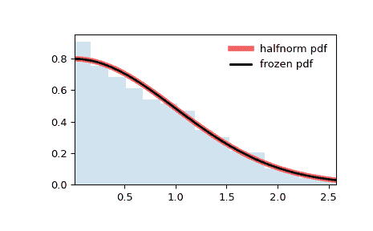

# `scipy.stats.halfnorm`

> 原文：[`docs.scipy.org/doc/scipy-1.12.0/reference/generated/scipy.stats.halfnorm.html#scipy.stats.halfnorm`](https://docs.scipy.org/doc/scipy-1.12.0/reference/generated/scipy.stats.halfnorm.html#scipy.stats.halfnorm)

```py
scipy.stats.halfnorm = <scipy.stats._continuous_distns.halfnorm_gen object>
```

半正态连续随机变量。

作为`rv_continuous`类的一个实例，`halfnorm`对象继承了一组通用方法（下面列出了完整列表），并且针对这个特定分布提供了具体的细节。

注意

`halfnorm`的概率密度函数为：

\[ f(x) = \sqrt{2/\pi} \exp(-x² / 2) \]

对于\( x \geq 0 \)。

`halfnorm`是带有`df=1`的`chi`的特例。

上述概率密度在“标准化”形式中定义。要移动和/或缩放分布，请使用`loc`和`scale`参数。具体地，`halfnorm.pdf(x, loc, scale)`等价于`halfnorm.pdf(y) / scale`，其中`y = (x - loc) / scale`。请注意，移动分布的位置不会使其成为“非中心”分布；某些分布的非中心泛化可在单独的类中找到。

示例

```py
>>> import numpy as np
>>> from scipy.stats import halfnorm
>>> import matplotlib.pyplot as plt
>>> fig, ax = plt.subplots(1, 1) 
```

计算前四个时刻：

```py
>>> mean, var, skew, kurt = halfnorm.stats(moments='mvsk') 
```

显示概率密度函数（`pdf`）：

```py
>>> x = np.linspace(halfnorm.ppf(0.01),
...                 halfnorm.ppf(0.99), 100)
>>> ax.plot(x, halfnorm.pdf(x),
...        'r-', lw=5, alpha=0.6, label='halfnorm pdf') 
```

或者，可以调用分布对象（作为函数）以固定形状、位置和缩放参数。这将返回一个“冻结”的 RV 对象，保持给定参数不变。

冻结分布并显示冻结的`pdf`：

```py
>>> rv = halfnorm()
>>> ax.plot(x, rv.pdf(x), 'k-', lw=2, label='frozen pdf') 
```

检查`cdf`和`ppf`的准确性：

```py
>>> vals = halfnorm.ppf([0.001, 0.5, 0.999])
>>> np.allclose([0.001, 0.5, 0.999], halfnorm.cdf(vals))
True 
```

生成随机数：

```py
>>> r = halfnorm.rvs(size=1000) 
```

并比较直方图：

```py
>>> ax.hist(r, density=True, bins='auto', histtype='stepfilled', alpha=0.2)
>>> ax.set_xlim([x[0], x[-1]])
>>> ax.legend(loc='best', frameon=False)
>>> plt.show() 
```



方法

| **rvs(loc=0, scale=1, size=1, random_state=None)** | 随机变量。 |
| --- | --- |
| **pdf(x, loc=0, scale=1)** | 概率密度函数。 |
| **logpdf(x, loc=0, scale=1)** | 概率密度函数的对数。 |
| **cdf(x, loc=0, scale=1)** | 累积分布函数。 |
| **logcdf(x, loc=0, scale=1)** | 累积分布函数的对数。 |
| **sf(x, loc=0, scale=1)** | 存活函数（也定义为`1 - cdf`，但*sf*有时更精确）。 |
| **logsf(x, loc=0, scale=1)** | 生存函数的对数。 |
| **ppf(q, loc=0, scale=1)** | 百分位点函数（`cdf`的逆 - 百分位数）。 |
| **isf(q, loc=0, scale=1)** | 逆存活函数（`sf`的逆）。 |
| **moment(order, loc=0, scale=1)** | 指定阶数的非中心矩。 |
| **stats(loc=0, scale=1, moments=’mv’)** | 均值（‘m’）、方差（‘v’）、偏度（‘s’）、峰度（‘k’）。 |
| **entropy(loc=0, scale=1)** | RV 的（微分）熵。 |
| **fit(data)** | 适用于一般数据的参数估计。详细文档请参阅[scipy.stats.rv_continuous.fit](https://docs.scipy.org/doc/scipy/reference/generated/scipy.stats.rv_continuous.fit.html#scipy.stats.rv_continuous.fit)。 |
| **expect(func, args=(), loc=0, scale=1, lb=None, ub=None, conditional=False, **kwds)** | 相对于分布的函数期望值（一参数函数）。 |
| **median(loc=0, scale=1)** | 分布的中位数。 |
| **mean(loc=0, scale=1)** | 分布的均值。 |
| **var(loc=0, scale=1)** | 分布的方差。 |
| **std(loc=0, scale=1)** | 分布的标准偏差。 |
| **interval(confidence, loc=0, scale=1)** | 均匀覆盖中位数的置信区间。 |
