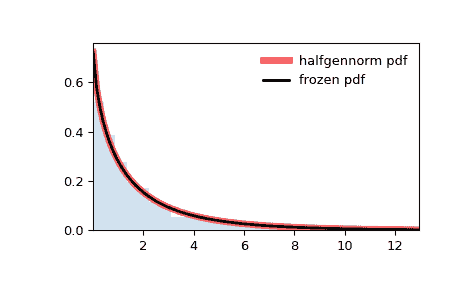

# `scipy.stats.halfgennorm`

> 原文链接：[`docs.scipy.org/doc/scipy-1.12.0/reference/generated/scipy.stats.halfgennorm.html#scipy.stats.halfgennorm`](https://docs.scipy.org/doc/scipy-1.12.0/reference/generated/scipy.stats.halfgennorm.html#scipy.stats.halfgennorm)

```py
scipy.stats.halfgennorm = <scipy.stats._continuous_distns.halfgennorm_gen object>
```

广义正态连续随机变量的上半部分。

作为 `rv_continuous` 类的一个实例，`halfgennorm` 对象从中继承了一组通用方法（下面列出完整列表），并且通过特定于这个特定分布的细节进行了补充。

另请参阅

`gennorm`

广义正态分布

`expon`

指数分布

`halfnorm`

半正态分布

注意事项

`halfgennorm` 的概率密度函数为：

\[f(x, \beta) = \frac{\beta}{\Gamma(1/\beta)} \exp(-|x|^\beta)\]

对于 \(x, \beta > 0\)。\(\Gamma\) 是伽玛函数 (`scipy.special.gamma`).

`halfgennorm` 将 `beta` 作为形状参数 \(\beta\)。当 \(\beta = 1\) 时，它与指数分布相同。当 \(\beta = 2\) 时，它与半正态分布相同（`scale=1/sqrt(2)`）。

参考文献

[1]

“广义正态分布，版本 1”，[`zh.wikipedia.org/wiki/%E5%B9%BF%E4%B9%89%E6%AD%A3%E6%80%81%E5%88%86%E5%B8%83#%E7%89%88%E6%9C%AC_1`](https://zh.wikipedia.org/wiki/%E5%B9%BF%E4%B9%89%E6%AD%A3%E6%80%81%E5%88%86%E5%B8%83#%E7%89%88%E6%9C%AC_1)

示例

```py
>>> import numpy as np
>>> from scipy.stats import halfgennorm
>>> import matplotlib.pyplot as plt
>>> fig, ax = plt.subplots(1, 1) 
```

计算前四个时刻：

```py
>>> beta = 0.675
>>> mean, var, skew, kurt = halfgennorm.stats(beta, moments='mvsk') 
```

显示概率密度函数 (`pdf`)：

```py
>>> x = np.linspace(halfgennorm.ppf(0.01, beta),
...                 halfgennorm.ppf(0.99, beta), 100)
>>> ax.plot(x, halfgennorm.pdf(x, beta),
...        'r-', lw=5, alpha=0.6, label='halfgennorm pdf') 
```

或者，可以调用分布对象（作为函数）以固定形状、位置和比例参数。这将返回一个固定给定参数的“冻结”随机变量对象。

冻结分布并显示冻结的 `pdf`:

```py
>>> rv = halfgennorm(beta)
>>> ax.plot(x, rv.pdf(x), 'k-', lw=2, label='frozen pdf') 
```

检查 `cdf` 和 `ppf` 的准确性：

```py
>>> vals = halfgennorm.ppf([0.001, 0.5, 0.999], beta)
>>> np.allclose([0.001, 0.5, 0.999], halfgennorm.cdf(vals, beta))
True 
```

生成随机数：

```py
>>> r = halfgennorm.rvs(beta, size=1000) 
```

并比较直方图：

```py
>>> ax.hist(r, density=True, bins='auto', histtype='stepfilled', alpha=0.2)
>>> ax.set_xlim([x[0], x[-1]])
>>> ax.legend(loc='best', frameon=False)
>>> plt.show() 
```



方法

| **rvs(beta, loc=0, scale=1, size=1, random_state=None)** | 随机变量。 |
| --- | --- |
| **pdf(x, beta, loc=0, scale=1)** | 概率密度函数。 |
| **logpdf(x, beta, loc=0, scale=1)** | 概率密度函数的对数。 |
| **cdf(x, beta, loc=0, scale=1)** | 累积分布函数。 |
| **logcdf(x, beta, loc=0, scale=1)** | 累积分布函数的对数。 |
| **sf(x, beta, loc=0, scale=1)** | 生存函数（也定义为 `1 - cdf`，但 *sf* 有时更精确）。 |
| **logsf(x, beta, loc=0, scale=1)** | 生存函数的对数。 |
| **ppf(q, beta, loc=0, scale=1)** | 百分位点函数（`cdf`的逆 — 百分位数）。 |
| **isf(q, beta, loc=0, scale=1)** | 逆生存函数（`sf`的逆）。 |
| **moment(order, beta, loc=0, scale=1)** | 指定阶数的非中心矩。 |
| **stats(beta, loc=0, scale=1, moments=’mv’)** | 均值（‘m’）、方差（‘v’）、偏度（‘s’）和/或峰度（‘k’）。 |
| **entropy(beta, loc=0, scale=1)** | 随机变量的（微分）熵。 |
| **fit(data)** | 通用数据的参数估计。详见 [scipy.stats.rv_continuous.fit](https://docs.scipy.org/doc/scipy/reference/generated/scipy.stats.rv_continuous.fit.html#scipy.stats.rv_continuous.fit) 获取关键字参数的详细文档。 |
| **expect(func, args=(beta,), loc=0, scale=1, lb=None, ub=None, conditional=False, **kwds)** | 相对于分布的一个参数的函数的期望值。 |
| **median(beta, loc=0, scale=1)** | 分布的中位数。 |
| **mean(beta, loc=0, scale=1)** | 分布的均值。 |
| **var(beta, loc=0, scale=1)** | 分布的方差。 |
| **std(beta, loc=0, scale=1)** | 分布的标准差。 |
| **interval(confidence, beta, loc=0, scale=1)** | 等面积置信区间，围绕中位数。 |
