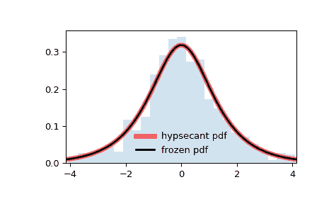

# `scipy.stats.hypsecant`

> 原文链接：[`docs.scipy.org/doc/scipy-1.12.0/reference/generated/scipy.stats.hypsecant.html#scipy.stats.hypsecant`](https://docs.scipy.org/doc/scipy-1.12.0/reference/generated/scipy.stats.hypsecant.html#scipy.stats.hypsecant)

```py
scipy.stats.hypsecant = <scipy.stats._continuous_distns.hypsecant_gen object>
```

一个双曲正割连续随机变量。

作为 `rv_continuous` 类的实例，`hypsecant` 对象继承了一些通用方法（请参见下文的完整列表），并通过特定于此特定分布的细节来完成它们。

注意事项

`hypsecant` 的概率密度函数为：

\[f(x) = \frac{1}{\pi} \text{sech}(x)\]

对于实数 \(x\)。

上述概率密度函数定义为“标准化”形式。使用 `loc` 和 `scale` 参数进行分布的移位和/或缩放。具体而言，`hypsecant.pdf(x, loc, scale)` 等同于 `hypsecant.pdf(y) / scale`，其中 `y = (x - loc) / scale`。请注意，调整分布的位置并不会使其成为“非中心”分布；某些分布的非中心推广可在单独的类中找到。

示例

```py
>>> import numpy as np
>>> from scipy.stats import hypsecant
>>> import matplotlib.pyplot as plt
>>> fig, ax = plt.subplots(1, 1) 
```

计算前四个时刻：

```py
>>> mean, var, skew, kurt = hypsecant.stats(moments='mvsk') 
```

显示概率密度函数（`pdf`）：

```py
>>> x = np.linspace(hypsecant.ppf(0.01),
...                 hypsecant.ppf(0.99), 100)
>>> ax.plot(x, hypsecant.pdf(x),
...        'r-', lw=5, alpha=0.6, label='hypsecant pdf') 
```

或者，可以调用（作为函数）分布对象来固定形状、位置和比例参数。这会返回一个“冻结的”RV 对象，其中给定的参数被固定。

冻结分布并显示冻结的 `pdf`：

```py
>>> rv = hypsecant()
>>> ax.plot(x, rv.pdf(x), 'k-', lw=2, label='frozen pdf') 
```

检查 `cdf` 和 `ppf` 的准确性：

```py
>>> vals = hypsecant.ppf([0.001, 0.5, 0.999])
>>> np.allclose([0.001, 0.5, 0.999], hypsecant.cdf(vals))
True 
```

生成随机数：

```py
>>> r = hypsecant.rvs(size=1000) 
```

并比较直方图：

```py
>>> ax.hist(r, density=True, bins='auto', histtype='stepfilled', alpha=0.2)
>>> ax.set_xlim([x[0], x[-1]])
>>> ax.legend(loc='best', frameon=False)
>>> plt.show() 
```



方法

| **rvs(loc=0, scale=1, size=1, random_state=None)** | 随机变量。 |
| --- | --- |
| **pdf(x, loc=0, scale=1)** | 概率密度函数。 |
| **logpdf(x, loc=0, scale=1)** | 概率密度函数的对数。 |
| **cdf(x, loc=0, scale=1)** | 累积分布函数。 |
| **logcdf(x, loc=0, scale=1)** | 累积分布函数的对数。 |
| **sf(x, loc=0, scale=1)** | 生存函数（也定义为 `1 - cdf`，但 *sf* 有时更准确）。 |
| **logsf(x, loc=0, scale=1)** | 生存函数的对数。 |
| **ppf(q, loc=0, scale=1)** | 百分点函数（`cdf` 的逆函数 — 百分位数）。 |
| **isf(q, loc=0, scale=1)** | 逆生存函数（`sf` 的逆函数）。 |
| **moment(order, loc=0, scale=1)** | 指定顺序的非中心时刻。 |
| **stats(loc=0, scale=1, moments=’mv’)** | 均值（‘m’）、方差（‘v’）、偏度（‘s’）和/或峰度（‘k’）。 |
| **entropy(loc=0, scale=1)** | RV 的（微分）熵。 |
| **fit(data)** | 适用于通用数据的参数估计。参见[scipy.stats.rv_continuous.fit](https://docs.scipy.org/doc/scipy/reference/generated/scipy.stats.rv_continuous.fit.html#scipy.stats.rv_continuous.fit)以获取关键字参数的详细文档。 |
| **expect(func, args=(), loc=0, scale=1, lb=None, ub=None, conditional=False, **kwds)** | 对分布中的函数（一个参数的）的期望值。 |
| **median(loc=0, scale=1)** | 分布的中位数。 |
| **mean(loc=0, scale=1)** | 分布的均值。 |
| **var(loc=0, scale=1)** | 分布的方差。 |
| **std(loc=0, scale=1)** | 分布的标准差。 |
| **interval(confidence, loc=0, scale=1)** | 中位数周围具有相等面积的置信区间。 |
