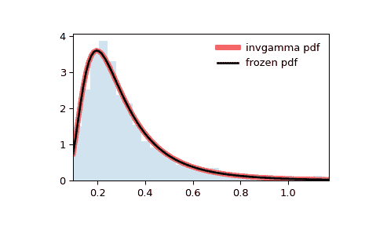

# `scipy.stats.invgamma`

> 原文：[`docs.scipy.org/doc/scipy-1.12.0/reference/generated/scipy.stats.invgamma.html#scipy.stats.invgamma`](https://docs.scipy.org/doc/scipy-1.12.0/reference/generated/scipy.stats.invgamma.html#scipy.stats.invgamma)

```py
scipy.stats.invgamma = <scipy.stats._continuous_distns.invgamma_gen object>
```

一个反向的 gamma 连续随机变量。

作为 `rv_continuous` 类的一个实例，`invgamma` 对象继承了一组通用方法（请参阅下面的完整列表），并以特定于这种特定分布的细节完成了它们。

注意事项

`invgamma` 的概率密度函数为：

\[f(x, a) = \frac{x^{-a-1}}{\Gamma(a)} \exp(-\frac{1}{x})\]

对于 \(x \geq 0\), \(a > 0\)。 \(\Gamma\) 是 gamma 函数（`scipy.special.gamma`）。

`invgamma` 以 `a` 作为形状参数对 \(a\) 进行参数化。

`invgamma` 是 `gengamma` 的一个特例，当 `c=-1` 时，它是缩放的逆卡方分布的不同参数化。具体而言，如果缩放的逆卡方分布用自由度 \(\nu\) 和缩放参数 \(\tau²\) 参数化，则可以使用 `invgamma` 表示为 `a=` \(\nu/2\) 和 `scale=` \(\nu \tau²/2\)。

上述概率密度函数是以“标准化”形式定义的。要移动和/或缩放分布，请使用 `loc` 和 `scale` 参数。具体而言，`invgamma.pdf(x, a, loc, scale)` 与 `invgamma.pdf(y, a) / scale` 是完全等价的，其中 `y = (x - loc) / scale`。请注意，移动分布的位置不会使其成为“非中心”分布；某些分布的非中心推广可以在单独的类中找到。

示例

```py
>>> import numpy as np
>>> from scipy.stats import invgamma
>>> import matplotlib.pyplot as plt
>>> fig, ax = plt.subplots(1, 1) 
```

计算前四个时刻：

```py
>>> a = 4.07
>>> mean, var, skew, kurt = invgamma.stats(a, moments='mvsk') 
```

显示概率密度函数 (`pdf`)：

```py
>>> x = np.linspace(invgamma.ppf(0.01, a),
...                 invgamma.ppf(0.99, a), 100)
>>> ax.plot(x, invgamma.pdf(x, a),
...        'r-', lw=5, alpha=0.6, label='invgamma pdf') 
```

或者，可以调用（作为函数）分布对象来固定形状、位置和比例参数。这将返回一个固定给定参数的“冻结”随机变量对象。

冻结分布并显示冻结的 `pdf`：

```py
>>> rv = invgamma(a)
>>> ax.plot(x, rv.pdf(x), 'k-', lw=2, label='frozen pdf') 
```

检查 `cdf` 和 `ppf` 的准确性：

```py
>>> vals = invgamma.ppf([0.001, 0.5, 0.999], a)
>>> np.allclose([0.001, 0.5, 0.999], invgamma.cdf(vals, a))
True 
```

生成随机数：

```py
>>> r = invgamma.rvs(a, size=1000) 
```

并比较直方图：

```py
>>> ax.hist(r, density=True, bins='auto', histtype='stepfilled', alpha=0.2)
>>> ax.set_xlim([x[0], x[-1]])
>>> ax.legend(loc='best', frameon=False)
>>> plt.show() 
```



方法

| **rvs(a, loc=0, scale=1, size=1, random_state=None)** | 随机变量。 |
| --- | --- |
| **pdf(x, a, loc=0, scale=1)** | 概率密度函数。 |
| **logpdf(x, a, loc=0, scale=1)** | 概率密度函数的对数。 |
| **cdf(x, a, loc=0, scale=1)** | 累积分布函数。 |
| **logcdf(x, a, loc=0, scale=1)** | 累积分布函数的对数。 |
| **sf(x, a, loc=0, scale=1)** | 生存函数（也定义为`1 - cdf`，但*sf*有时更精确）。 |
| **logsf(x, a, loc=0, scale=1)** | 生存函数的对数。 |
| **ppf(q, a, loc=0, scale=1)** | 百分位点函数（`cdf`的逆函数 — 百分位数）。 |
| **isf(q, a, loc=0, scale=1)** | 逆生存函数（`sf`的逆函数）。 |
| **moment(order, a, loc=0, scale=1)** | 指定阶数的非中心矩。 |
| **stats(a, loc=0, scale=1, moments=’mv’)** | 均值（‘m’）、方差（‘v’）、偏度（‘s’）、峰度（‘k’）。 |
| **entropy(a, loc=0, scale=1)** | 随机变量的（微分）熵。 |
| **fit(data)** | 通用数据的参数估计。详细文档请参阅[scipy.stats.rv_continuous.fit](https://docs.scipy.org/doc/scipy/reference/generated/scipy.stats.rv_continuous.fit.html#scipy.stats.rv_continuous.fit)。 |
| **expect(func, args=(a,), loc=0, scale=1, lb=None, ub=None, conditional=False, **kwds)** | 与分布相关的函数（一参数）的期望值。 |
| **median(a, loc=0, scale=1)** | 分布的中位数。 |
| **mean(a, loc=0, scale=1)** | 分布的均值。 |
| **var(a, loc=0, scale=1)** | 分布的方差。 |
| **std(a, loc=0, scale=1)** | 分布的标准差。 |
| **interval(confidence, a, loc=0, scale=1)** | 中位数周围等面积的置信区间。 |
