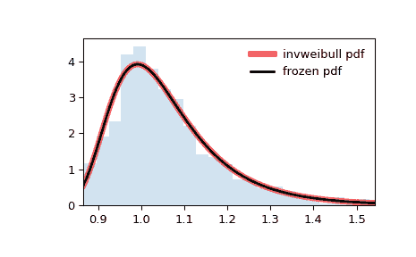

# `scipy.stats.invweibull`

> 原文：[`docs.scipy.org/doc/scipy-1.12.0/reference/generated/scipy.stats.invweibull.html#scipy.stats.invweibull`](https://docs.scipy.org/doc/scipy-1.12.0/reference/generated/scipy.stats.invweibull.html#scipy.stats.invweibull)

```py
scipy.stats.invweibull = <scipy.stats._continuous_distns.invweibull_gen object>
```

一个反向韦伯连续随机变量。

此分布也称为 Fréchet 分布或 II 型极值分布。

作为 `rv_continuous` 类的一个实例，`invweibull` 对象继承了一系列通用方法（下面列出了完整列表），并为此特定分布添加了特定的细节。

注意事项

`invweibull` 的概率密度函数为：

\[f(x, c) = c x^{-c-1} \exp(-x^{-c})\]

对于 \(x > 0\)，\(c > 0\)。

`invweibull` 以 `c` 作为形状参数\(c\)。

上述概率密度在“标准化”形式中定义。使用 `loc` 和 `scale` 参数进行偏移和/或缩放分布。具体地说，`invweibull.pdf(x, c, loc, scale)` 等同于 `invweibull.pdf(y, c) / scale`，其中 `y = (x - loc) / scale`。请注意，偏移分布的位置并不使其成为“非中心”分布；某些分布的非中心泛化可在单独的类中找到。

参考文献

F.R.S. de Gusmao, E.M.M Ortega 和 G.M. Cordeiro，“广义逆韦伯分布”，Stat. Papers, vol. 52, pp. 591-619, 2011.

示例

```py
>>> import numpy as np
>>> from scipy.stats import invweibull
>>> import matplotlib.pyplot as plt
>>> fig, ax = plt.subplots(1, 1) 
```

计算前四个时刻：

```py
>>> c = 10.6
>>> mean, var, skew, kurt = invweibull.stats(c, moments='mvsk') 
```

显示概率密度函数 (`pdf`)：

```py
>>> x = np.linspace(invweibull.ppf(0.01, c),
...                 invweibull.ppf(0.99, c), 100)
>>> ax.plot(x, invweibull.pdf(x, c),
...        'r-', lw=5, alpha=0.6, label='invweibull pdf') 
```

或者，可以调用分布对象（作为函数）来固定形状、位置和比例参数。这将返回一个“冻结”的 RV 对象，保存给定的参数。

冻结分布并显示冻结的 `pdf`：

```py
>>> rv = invweibull(c)
>>> ax.plot(x, rv.pdf(x), 'k-', lw=2, label='frozen pdf') 
```

检查 `cdf` 和 `ppf` 的准确性：

```py
>>> vals = invweibull.ppf([0.001, 0.5, 0.999], c)
>>> np.allclose([0.001, 0.5, 0.999], invweibull.cdf(vals, c))
True 
```

生成随机数：

```py
>>> r = invweibull.rvs(c, size=1000) 
```

并比较直方图：

```py
>>> ax.hist(r, density=True, bins='auto', histtype='stepfilled', alpha=0.2)
>>> ax.set_xlim([x[0], x[-1]])
>>> ax.legend(loc='best', frameon=False)
>>> plt.show() 
```



方法

| **rvs(c, loc=0, scale=1, size=1, random_state=None)** | 随机变量。 |
| --- | --- |
| **pdf(x, c, loc=0, scale=1)** | 概率密度函数。 |
| **logpdf(x, c, loc=0, scale=1)** | 概率密度函数的对数。 |
| **cdf(x, c, loc=0, scale=1)** | 累积分布函数。 |
| **logcdf(x, c, loc=0, scale=1)** | 累积分布函数的对数。 |
| **sf(x, c, loc=0, scale=1)** | 生存函数（也定义为 `1 - cdf`，但 *sf* 有时更准确）。 |
| **logsf(x, c, loc=0, scale=1)** | 生存函数的对数。 |
| **ppf(q, c, loc=0, scale=1)** | 百分位点函数（`cdf` 的逆函数 —— 百分位数）。 |
| **isf(q, c, loc=0, scale=1)** | 逆存活函数（`sf`的逆函数）。 |
| **moment(order, c, loc=0, scale=1)** | 指定阶数的非中心矩。 |
| **stats(c, loc=0, scale=1, moments=’mv’)** | 均值（‘m’）、方差（‘v’）、偏度（‘s’）和/或峰度（‘k’）。 |
| **entropy(c, loc=0, scale=1)** | 随机变量的（微分）熵。 |
| **fit(data)** | 一般数据的参数估计。详见[scipy.stats.rv_continuous.fit](https://docs.scipy.org/doc/scipy/reference/generated/scipy.stats.rv_continuous.fit.html#scipy.stats.rv_continuous.fit)获取关键字参数的详细文档。 |
| **expect(func, args=(c,), loc=0, scale=1, lb=None, ub=None, conditional=False, **kwds)** | 函数（一个参数）关于分布的期望值。 |
| **median(c, loc=0, scale=1)** | 分布的中位数。 |
| **mean(c, loc=0, scale=1)** | 分布的均值。 |
| **var(c, loc=0, scale=1)** | 分布的方差。 |
| **std(c, loc=0, scale=1)** | 分布的标准差。 |
| **interval(confidence, c, loc=0, scale=1)** | 中位数周围具有相等面积的置信区间。 |
