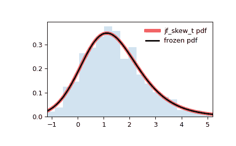

# `scipy.stats.jf_skew_t`

> 原始文本：[`docs.scipy.org/doc/scipy-1.12.0/reference/generated/scipy.stats.jf_skew_t.html#scipy.stats.jf_skew_t`](https://docs.scipy.org/doc/scipy-1.12.0/reference/generated/scipy.stats.jf_skew_t.html#scipy.stats.jf_skew_t)

```py
scipy.stats.jf_skew_t = <scipy.stats._continuous_distns.jf_skew_t_gen object>
```

琼斯和法迪偏 t 分布。

作为`rv_continuous`类的一个实例，`jf_skew_t`对象继承了一组通用方法（下文列出完整清单），并使用特定于该特定分布的细节来完善它们。

注：

`jf_skew_t`的概率密度函数为：

\[f(x; a, b) = C_{a,b}^{-1} \left(1+\frac{x}{\left(a+b+x²\right)^{1/2}}\right)^{a+1/2} \left(1-\frac{x}{\left(a+b+x²\right)^{1/2}}\right)^{b+1/2}\]

对于实数 \(a>0\) 和 \(b>0\)，其中 \(C_{a,b} = 2^{a+b-1}B(a,b)(a+b)^{1/2}\)，而 \(B\) 表示贝塔函数（`scipy.special.beta`）。

当 \(a<b\) 时，分布为负偏斜；当 \(a>b\) 时，分布为正偏斜。 若 \(a=b\)，则恢复为自由度为 \(2a\) 的`t`分布。

`jf_skew_t`采用\(a\)和\(b\)作为形状参数。

上述概率密度函数定义在“标准化”形式中。 若要改变或缩放分布，请使用`loc`和`scale`参数。 具体来说，`jf_skew_t.pdf(x, a, b, loc, scale)`与`jf_skew_t.pdf(y, a, b) / scale`完全等价，其中`y = (x - loc) / scale`。 请注意，改变分布的位置不会使其成为“非中心”分布； 一些分布的非中心推广可在独立的类中找到。

参考文献

[1]

M.C. Jones 和 M.J. Faddy。“t 分布的偏斜扩展及其应用” *皇家统计学会杂志*。 B 系列（统计方法学）65，第 1 号（2003 年）：159-174。 [DOI:10.1111/1467-9868.00378](https://doi.org/10.1111/1467-9868.00378)

示例

```py
>>> import numpy as np
>>> from scipy.stats import jf_skew_t
>>> import matplotlib.pyplot as plt
>>> fig, ax = plt.subplots(1, 1) 
```

计算前四个矩：

```py
>>> a, b = 8, 4
>>> mean, var, skew, kurt = jf_skew_t.stats(a, b, moments='mvsk') 
```

显示概率密度函数（`pdf`）：

```py
>>> x = np.linspace(jf_skew_t.ppf(0.01, a, b),
...                 jf_skew_t.ppf(0.99, a, b), 100)
>>> ax.plot(x, jf_skew_t.pdf(x, a, b),
...        'r-', lw=5, alpha=0.6, label='jf_skew_t pdf') 
```

或者，可以调用分布对象（作为函数），以固定形状、位置和比例参数。 这会返回一个“冻结”RV 对象，保持给定参数不变。

冻结分布并显示冻结的`pdf`：

```py
>>> rv = jf_skew_t(a, b)
>>> ax.plot(x, rv.pdf(x), 'k-', lw=2, label='frozen pdf') 
```

检查`cdf`和`ppf`的准确性：

```py
>>> vals = jf_skew_t.ppf([0.001, 0.5, 0.999], a, b)
>>> np.allclose([0.001, 0.5, 0.999], jf_skew_t.cdf(vals, a, b))
True 
```

生成随机数：

```py
>>> r = jf_skew_t.rvs(a, b, size=1000) 
```

并比较直方图：

```py
>>> ax.hist(r, density=True, bins='auto', histtype='stepfilled', alpha=0.2)
>>> ax.set_xlim([x[0], x[-1]])
>>> ax.legend(loc='best', frameon=False)
>>> plt.show() 
```



方法

| **rvs(a, b, loc=0, scale=1, size=1, random_state=None)** | 随机变量。 |
| --- | --- |
| **pdf(x, a, b, loc=0, scale=1)** | 概率密度函数。 |
| **logpdf(x, a, b, loc=0, scale=1)** | 概率密度函数的对数。 |
| **cdf(x, a, b, loc=0, scale=1)** | 累积分布函数。 |
| **logcdf(x, a, b, loc=0, scale=1)** | 累积分布函数的对数。 |
| **sf(x, a, b, loc=0, scale=1)** | 生存函数（也定义为 `1 - cdf`，但 *sf* 有时更准确）。 |
| **logsf(x, a, b, loc=0, scale=1)** | 生存函数的对数。 |
| **ppf(q, a, b, loc=0, scale=1)** | 百分位点函数（*cdf* 的逆函数 — 百分位数）。 |
| **isf(q, a, b, loc=0, scale=1)** | 生存函数的逆函数（*sf* 的逆函数）。 |
| **moment(order, a, b, loc=0, scale=1)** | 指定阶数的非中心矩。 |
| **stats(a, b, loc=0, scale=1, moments=’mv’)** | 平均值（‘m’）、方差（‘v’）、偏度（‘s’）、以及/或峰度（‘k’）。 |
| **entropy(a, b, loc=0, scale=1)** | 随机变量的（微分）熵。 |
| **fit(data)** | 通用数据的参数估计。详见 [scipy.stats.rv_continuous.fit](https://docs.scipy.org/doc/scipy/reference/generated/scipy.stats.rv_continuous.fit.html#scipy.stats.rv_continuous.fit) 的关键字参数详细文档。 |
| **expect(func, args=(a, b), loc=0, scale=1, lb=None, ub=None, conditional=False, **kwds)** | 关于分布的函数（一维）的期望值。 |
| **median(a, b, loc=0, scale=1)** | 分布的中位数。 |
| **mean(a, b, loc=0, scale=1)** | 分布的均值。 |
| **var(a, b, loc=0, scale=1)** | 分布的方差。 |
| **std(a, b, loc=0, scale=1)** | 分布的标准差。 |
| **interval(confidence, a, b, loc=0, scale=1)** | 等面积置信区间的中位数。 |
