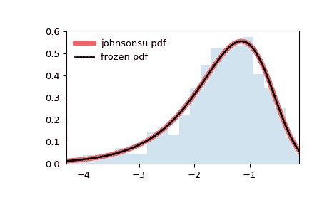

# `scipy.stats.johnsonsu`

> 原文链接：[`docs.scipy.org/doc/scipy-1.12.0/reference/generated/scipy.stats.johnsonsu.html#scipy.stats.johnsonsu`](https://docs.scipy.org/doc/scipy-1.12.0/reference/generated/scipy.stats.johnsonsu.html#scipy.stats.johnsonsu)

```py
scipy.stats.johnsonsu = <scipy.stats._continuous_distns.johnsonsu_gen object>
```

一个 Johnson SU 连续随机变量。

作为`rv_continuous`类的一个实例，`johnsonsu`对象从中继承了一组通用方法（详见下文），并使用特定于这种特定分布的详细信息来补充它们。

亦参见

`johnsonsb`

注意事项

对于`johnsonsu`的概率密度函数是：

\[f(x, a, b) = \frac{b}{\sqrt{x² + 1}} \phi(a + b \log(x + \sqrt{x² + 1}))\]

其中\(x\), \(a\), 和 \(b\) 是实数标量；\(b > 0\). \(\phi\) 是正态分布的概率密度函数。

`johnsonsu`以\(a\)和\(b\)作为形状参数。

根据[[1]](#rdd9f64a3838c-1)中的公式计算前四个中心时刻。

上述概率密度在“标准化”形式中定义。要移动和/或缩放分布，请使用`loc`和`scale`参数。具体来说，`johnsonsu.pdf(x, a, b, loc, scale)`与`johnsonsu.pdf(y, a, b) / scale`等同，其中`y = (x - loc) / scale`。请注意，移动分布的位置并不使其成为“非中心”分布；某些分布的非中心推广在单独的类中可用。

参考文献

[1]

Taylor Enterprises. “Johnson Family of Distributions”. [`variation.com/wp-content/distribution_analyzer_help/hs126.htm`](https://variation.com/wp-content/distribution_analyzer_help/hs126.htm)

示例

```py
>>> import numpy as np
>>> from scipy.stats import johnsonsu
>>> import matplotlib.pyplot as plt
>>> fig, ax = plt.subplots(1, 1) 
```

计算前四个时刻：

```py
>>> a, b = 2.55, 2.25
>>> mean, var, skew, kurt = johnsonsu.stats(a, b, moments='mvsk') 
```

显示概率密度函数（`pdf`）：

```py
>>> x = np.linspace(johnsonsu.ppf(0.01, a, b),
...                 johnsonsu.ppf(0.99, a, b), 100)
>>> ax.plot(x, johnsonsu.pdf(x, a, b),
...        'r-', lw=5, alpha=0.6, label='johnsonsu pdf') 
```

或者，可以调用分布对象（作为函数）来固定形状、位置和尺度参数。这将返回一个“冻结”的随机变量对象，其中给定的参数是固定的。

冻结分布并显示冻结的`pdf`：

```py
>>> rv = johnsonsu(a, b)
>>> ax.plot(x, rv.pdf(x), 'k-', lw=2, label='frozen pdf') 
```

检查`cdf`和`ppf`的准确性：

```py
>>> vals = johnsonsu.ppf([0.001, 0.5, 0.999], a, b)
>>> np.allclose([0.001, 0.5, 0.999], johnsonsu.cdf(vals, a, b))
True 
```

生成随机数：

```py
>>> r = johnsonsu.rvs(a, b, size=1000) 
```

比较直方图：

```py
>>> ax.hist(r, density=True, bins='auto', histtype='stepfilled', alpha=0.2)
>>> ax.set_xlim([x[0], x[-1]])
>>> ax.legend(loc='best', frameon=False)
>>> plt.show() 
```



方法

| **rvs(a, b, loc=0, scale=1, size=1, random_state=None)** | 随机变量。 |
| --- | --- |
| **pdf(x, a, b, loc=0, scale=1)** | 概率密度函数。 |
| **logpdf(x, a, b, loc=0, scale=1)** | 概率密度函数的对数。 |
| **cdf(x, a, b, loc=0, scale=1)** | 累积分布函数。 |
| **logcdf(x, a, b, loc=0, scale=1)** | 累积分布函数的对数。 |
| **sf(x, a, b, loc=0, scale=1)** | 生存函数（也定义为`1 - cdf`，但*sf*有时更精确）。 |
| **logsf(x, a, b, loc=0, scale=1)** | 生存函数的对数。 |
| **ppf(q, a, b, loc=0, scale=1)** | 百分位点函数（`cdf` 的逆 — 百分位数）。 |
| **isf(q, a, b, loc=0, scale=1)** | 逆生存函数（`sf` 的逆）。 |
| **moment(order, a, b, loc=0, scale=1)** | 指定阶数的非中心矩。 |
| **stats(a, b, loc=0, scale=1, moments=’mv’)** | 均值（‘m’），方差（‘v’），偏度（‘s’），以及/或峰度（‘k’）。 |
| **entropy(a, b, loc=0, scale=1)** | 随机变量的（微分）熵。 |
| **fit(data)** | 适合于通用数据的参数估计。详见 [scipy.stats.rv_continuous.fit](https://docs.scipy.org/doc/scipy/reference/generated/scipy.stats.rv_continuous.fit.html#scipy.stats.rv_continuous.fit) 获取关键字参数的详细文档。 |
| **expect(func, args=(a, b), loc=0, scale=1, lb=None, ub=None, conditional=False, **kwds)** | 期望值函数（一个参数）关于分布的。 |
| **median(a, b, loc=0, scale=1)** | 分布的中位数。 |
| **mean(a, b, loc=0, scale=1)** | 分布的均值。 |
| **var(a, b, loc=0, scale=1)** | 分布的方差。 |
| **std(a, b, loc=0, scale=1)** | 分布的标准差。 |
| **interval(confidence, a, b, loc=0, scale=1)** | 等面积置信区间围绕中位数。 |
