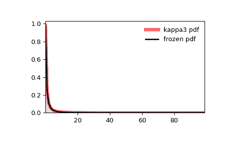

# `scipy.stats.kappa3`

> 原文链接：[`docs.scipy.org/doc/scipy-1.12.0/reference/generated/scipy.stats.kappa3.html#scipy.stats.kappa3`](https://docs.scipy.org/doc/scipy-1.12.0/reference/generated/scipy.stats.kappa3.html#scipy.stats.kappa3)

```py
scipy.stats.kappa3 = <scipy.stats._continuous_distns.kappa3_gen object>
```

Kappa 3 参数分布。

作为`rv_continuous`类的一个实例，`kappa3`对象继承了一组通用方法（下面列出完整列表），并针对该特定分布完成了细节。

注意事项

`kappa3`的概率密度函数为：

\[f(x, a) = a (a + x^a)^{-(a + 1)/a}\]

对于\(x > 0\)和\(a > 0\)。

`kappa3`将`a`作为形状参数\(a\)。

参考文献

P.W. Mielke 和 E.S. Johnson，“三参数 Kappa 分布的最大似然估计和似然比检验”，《天气研究方法》，701-707 页（1973 年 9 月），[DOI:10.1175/1520-0493(1973)101<0701:TKDMLE>2.3.CO;2](https://doi.org/10.1175/1520-0493(1973)101<0701:TKDMLE>2.3.CO;2)

B. Kumphon，“三参数 Kappa 分布的最大熵和最大似然估计”，《开放统计学杂志》，第 2 卷，415-419 页（2012 年），[DOI:10.4236/ojs.2012.24050](https://doi.org/10.4236/ojs.2012.24050)

上述概率密度在“标准化”形式中定义。要移动和/或缩放分布，请使用`loc`和`scale`参数。具体来说，`kappa3.pdf(x, a, loc, scale)`与`kappa3.pdf(y, a) / scale`是完全等效的，其中`y = (x - loc) / scale`。请注意，移动分布的位置并不会使其成为“非中心”分布；某些分布的非中心推广可在单独的类中找到。

示例

```py
>>> import numpy as np
>>> from scipy.stats import kappa3
>>> import matplotlib.pyplot as plt
>>> fig, ax = plt.subplots(1, 1) 
```

计算前四个时刻：

```py
>>> a = 1
>>> mean, var, skew, kurt = kappa3.stats(a, moments='mvsk') 
```

显示概率密度函数（`pdf`）：

```py
>>> x = np.linspace(kappa3.ppf(0.01, a),
...                 kappa3.ppf(0.99, a), 100)
>>> ax.plot(x, kappa3.pdf(x, a),
...        'r-', lw=5, alpha=0.6, label='kappa3 pdf') 
```

或者，可以调用分布对象（作为函数）来固定形状、位置和尺度参数。这将返回一个“冻结”的 RV 对象，保持给定的参数不变。

冻结分布并显示冻结的`pdf`：

```py
>>> rv = kappa3(a)
>>> ax.plot(x, rv.pdf(x), 'k-', lw=2, label='frozen pdf') 
```

检查`cdf`和`ppf`的准确性：

```py
>>> vals = kappa3.ppf([0.001, 0.5, 0.999], a)
>>> np.allclose([0.001, 0.5, 0.999], kappa3.cdf(vals, a))
True 
```

生成随机数：

```py
>>> r = kappa3.rvs(a, size=1000) 
```

并比较直方图：

```py
>>> ax.hist(r, density=True, bins='auto', histtype='stepfilled', alpha=0.2)
>>> ax.set_xlim([x[0], x[-1]])
>>> ax.legend(loc='best', frameon=False)
>>> plt.show() 
```



方法

| **rvs(a, loc=0, scale=1, size=1, random_state=None)** | 随机变量。 |
| --- | --- |
| **pdf(x, a, loc=0, scale=1)** | 概率密度函数。 |
| **logpdf(x, a, loc=0, scale=1)** | 概率密度函数的对数。 |
| **cdf(x, a, loc=0, scale=1)** | 累积分布函数。 |
| **logcdf(x, a, loc=0, scale=1)** | 累积分布函数的对数。 |
| **sf(x, a, loc=0, scale=1)** | 生存函数（也被定义为`1 - cdf`，但*sf*有时更精确）。 |
| **logsf(x, a, loc=0, scale=1)** | 生存函数的对数。 |
| **ppf(q, a, loc=0, scale=1)** | 百分位点函数（`cdf`的逆函数——百分位数）。 |
| **isf(q, a, loc=0, scale=1)** | 逆存活函数（`sf`的逆函数）。 |
| **moment(order, a, loc=0, scale=1)** | 指定阶数的非中心矩。 |
| **stats(a, loc=0, scale=1, moments=’mv’)** | 均值（‘m’）、方差（‘v’）、偏度（‘s’）和/或峰度（‘k’）。 |
| **entropy(a, loc=0, scale=1)** | 随机变量的（微分）熵。 |
| **fit(data)** | 用于通用数据的参数估计。详细文档参见[scipy.stats.rv_continuous.fit](https://docs.scipy.org/doc/scipy/reference/generated/scipy.stats.rv_continuous.fit.html#scipy.stats.rv_continuous.fit)。 |
| **expect(func, args=(a,), loc=0, scale=1, lb=None, ub=None, conditional=False, **kwds)** | 相对于分布的一个参数的函数的期望值。 |
| **median(a, loc=0, scale=1)** | 分布的中位数。 |
| **mean(a, loc=0, scale=1)** | 分布的均值。 |
| **var(a, loc=0, scale=1)** | 分布的方差。 |
| **std(a, loc=0, scale=1)** | 分布的标准偏差。 |
| **interval(confidence, a, loc=0, scale=1)** | 置信区间，围绕中位数具有相等的面积。 |
