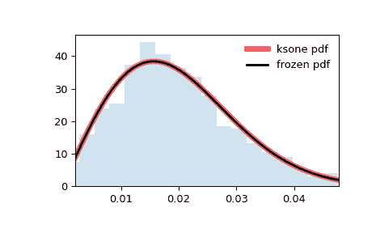

# `scipy.stats.ksone`

> 原始文本：[`docs.scipy.org/doc/scipy-1.12.0/reference/generated/scipy.stats.ksone.html#scipy.stats.ksone`](https://docs.scipy.org/doc/scipy-1.12.0/reference/generated/scipy.stats.ksone.html#scipy.stats.ksone)

```py
scipy.stats.ksone = <scipy.stats._continuous_distns.ksone_gen object>
```

Kolmogorov-Smirnov 单侧检验统计量分布。

这是有限样本大小`n >= 1`（形状参数）的单侧 Kolmogorov-Smirnov（KS）统计量 \(D_n^+\) 和 \(D_n^-\) 的分布。

作为[`rv_continuous`](https://docs.scipy.org/doc/scipy-1.12.0/reference/generated/scipy.stats.rv_continuous.html#scipy.stats.rv_continuous "scipy.stats.rv_continuous")类的一个实例，[`ksone`](https://docs.scipy.org/doc/scipy-1.12.0/reference/generated/scipy.stats.ksone.html#scipy.stats.ksone "scipy.stats.ksone")对象继承了一组通用方法（下面列出完整列表），并且以特定于此特定分布的细节完成了它们。

另请参阅

[`kstwobign`](https://docs.scipy.org/doc/scipy-1.12.0/reference/generated/scipy.stats.kstwobign.html#scipy.stats.kstwobign "scipy.stats.kstwobign"), [`kstwo`](https://docs.scipy.org/doc/scipy-1.12.0/reference/generated/scipy.stats.kstwo.html#scipy.stats.kstwo "scipy.stats.kstwo"), [`kstest`](https://docs.scipy.org/doc/scipy-1.12.0/reference/generated/scipy.stats.kstest.html#scipy.stats.kstest "scipy.stats.kstest")

笔记

\(D_n^+\) 和 \(D_n^-\) 的表达式为

\[\begin{split}D_n^+ &= \text{sup}_x (F_n(x) - F(x)),\\ D_n^- &= \text{sup}_x (F(x) - F_n(x)),\\\end{split}\]

其中 \(F\) 是连续的累积分布函数（CDF），\(F_n\) 是经验累积分布函数（ECDF）。[`ksone`](https://docs.scipy.org/doc/scipy-1.12.0/reference/generated/scipy.stats.ksone.html#scipy.stats.ksone "scipy.stats.ksone")描述了 KS 检验的零假设下的分布，即经验 CDF 对应于具有 CDF \(F\)的 \(n\) 个独立同分布（i.i.d.）随机变量。

上述概率密度函数定义为“标准化”形式。要移动和/或缩放分布，请使用 `loc` 和 `scale` 参数。具体而言，`ksone.pdf(x, n, loc, scale)` 与 `ksone.pdf(y, n) / scale` 在 `y = (x - loc) / scale` 时是完全等价的。请注意，移动分布的位置并不使其成为“非中心”分布；某些分布的非中心推广在单独的类中可用。

参考文献

[1]

Birnbaum, Z. W. 和 Tingey, F.H. 的文章“概率分布函数的单侧置信轮廓”，《数理统计学年刊》，22(4), pp 592-596 (1951).

例子

```py
>>> import numpy as np
>>> from scipy.stats import ksone
>>> import matplotlib.pyplot as plt
>>> fig, ax = plt.subplots(1, 1) 
```

计算前四个矩：

```py
>>> n = 1e+03
>>> mean, var, skew, kurt = ksone.stats(n, moments='mvsk') 
```

显示概率密度函数（`pdf`）：

```py
>>> x = np.linspace(ksone.ppf(0.01, n),
...                 ksone.ppf(0.99, n), 100)
>>> ax.plot(x, ksone.pdf(x, n),
...        'r-', lw=5, alpha=0.6, label='ksone pdf') 
```

或者，可以调用（作为函数）分布对象来固定形状、位置和比例参数。这将返回一个“冻结”的 RV 对象，其中给定的参数被固定。

冻结分布并显示冻结的 `pdf`：

```py
>>> rv = ksone(n)
>>> ax.plot(x, rv.pdf(x), 'k-', lw=2, label='frozen pdf') 
```

检查 `cdf` 和 `ppf` 的准确性：

```py
>>> vals = ksone.ppf([0.001, 0.5, 0.999], n)
>>> np.allclose([0.001, 0.5, 0.999], ksone.cdf(vals, n))
True 
```

生成随机数：

```py
>>> r = ksone.rvs(n, size=1000) 
```

并比较直方图：

```py
>>> ax.hist(r, density=True, bins='auto', histtype='stepfilled', alpha=0.2)
>>> ax.set_xlim([x[0], x[-1]])
>>> ax.legend(loc='best', frameon=False)
>>> plt.show() 
```



方法

| **rvs(n, loc=0, scale=1, size=1, random_state=None)** | 随机变量。 |
| --- | --- |
| **pdf(x, n, loc=0, scale=1)** | 概率密度函数。 |
| **logpdf(x, n, loc=0, scale=1)** | 概率密度函数的对数。 |
| **cdf(x, n, loc=0, scale=1)** | 累积分布函数。 |
| **logcdf(x, n, loc=0, scale=1)** | 累积分布函数的对数。 |
| **sf(x, n, loc=0, scale=1)** | 生存函数（也定义为`1 - cdf`，但*sf*有时更准确）。 |
| **logsf(x, n, loc=0, scale=1)** | 生存函数的对数。 |
| **ppf(q, n, loc=0, scale=1)** | 百分点函数（`cdf`的反函数 — 百分位数）。 |
| **isf(q, n, loc=0, scale=1)** | 逆生存函数（`sf`的反函数）。 |
| **moment(order, n, loc=0, scale=1)** | 指定阶数的非中心矩。 |
| **stats(n, loc=0, scale=1, moments=’mv’)** | 均值（‘m’）、方差（‘v’）、偏度（‘s’）、峰度（‘k’）。 |
| **entropy(n, loc=0, scale=1)** | 随机变量的（微分）熵。 |
| **fit(data)** | 适用于通用数据的参数估计。参见[scipy.stats.rv_continuous.fit](https://docs.scipy.org/doc/scipy/reference/generated/scipy.stats.rv_continuous.fit.html#scipy.stats.rv_continuous.fit)以获取关键字参数的详细文档。 |
| **expect(func, args=(n,), loc=0, scale=1, lb=None, ub=None, conditional=False, **kwds)** | 关于分布的函数（一个参数）的期望值。 |
| **median(n, loc=0, scale=1)** | 分布的中位数。 |
| **mean(n, loc=0, scale=1)** | 分布的均值。 |
| **var(n, loc=0, scale=1)** | 分布的方差。 |
| **std(n, loc=0, scale=1)** | 分布的标准差。 |
| **interval(confidence, n, loc=0, scale=1)** | 在中位数周围具有相等区域的置信区间。 |
