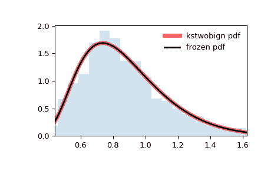

# `scipy.stats.kstwobign`

> 原文链接：[`docs.scipy.org/doc/scipy-1.12.0/reference/generated/scipy.stats.kstwobign.html#scipy.stats.kstwobign`](https://docs.scipy.org/doc/scipy-1.12.0/reference/generated/scipy.stats.kstwobign.html#scipy.stats.kstwobign)

```py
scipy.stats.kstwobign = <scipy.stats._continuous_distns.kstwobign_gen object>
```

缩放 Kolmogorov-Smirnov 两侧检验统计量的极限分布。

这是两侧 Kolmogorov-Smirnov 统计量 \(\sqrt{n} D_n\) 的渐近分布，它衡量理论（连续）CDF 与经验 CDF 之间的最大绝对距离。（参见 [`kstest`](https://docs.scipy.org/doc/scipy-1.12.0/reference/generated/scipy.stats.kstest.html#scipy.stats.kstest)）。

作为 [`rv_continuous`](https://docs.scipy.org/doc/scipy-1.12.0/reference/generated/scipy.stats.rv_continuous.html#scipy.stats.rv_continuous) 类的一个实例，[`kstwobign`](https://docs.scipy.org/doc/scipy-1.12.0/reference/generated/scipy.stats.kstwobign.html#scipy.stats.kstwobign) 对象从中继承了一组通用方法（请参阅下面的完整列表），并用特定于此特定分布的细节完善它们。

另请参阅

[`ksone`](https://docs.scipy.org/doc/scipy-1.12.0/reference/generated/scipy.stats.ksone.html#scipy.stats.ksone), [`kstwo`](https://docs.scipy.org/doc/scipy-1.12.0/reference/generated/scipy.stats.kstwo.html#scipy.stats.kstwo), [`kstest`](https://docs.scipy.org/doc/scipy-1.12.0/reference/generated/scipy.stats.kstest.html#scipy.stats.kstest)

注意

\(\sqrt{n} D_n\) 由下式给出

\[D_n = \text{sup}_x |F_n(x) - F(x)|\]

其中 \(F\) 是一个连续的 CDF，\(F_n\) 是一个经验 CDF。[`kstwobign`](https://docs.scipy.org/doc/scipy-1.12.0/reference/generated/scipy.stats.kstwobign.html#scipy.stats.kstwobign) 描述了在 KS 检验的零假设下（即经验 CDF 对应于具有 CDF \(F\) 的 i.i.d. 随机变量）的渐近分布（即 \(\sqrt{n} D_n\) 的极限）。

上述概率密度在“标准化”形式中定义。使用 `loc` 和 `scale` 参数来进行偏移和/或缩放分布。具体来说，`kstwobign.pdf(x, loc, scale)` 在恒等等价于 `kstwobign.pdf(y) / scale`，其中 `y = (x - loc) / scale`。请注意，移动分布的位置并不会使其成为“非中心”分布；某些分布的非中心广义化在单独的类中可用。

参考

[1]

Feller, W. “On the Kolmogorov-Smirnov Limit Theorems for Empirical Distributions”, Ann. Math. Statist. Vol 19, 177-189 (1948).

示例

```py
>>> import numpy as np
>>> from scipy.stats import kstwobign
>>> import matplotlib.pyplot as plt
>>> fig, ax = plt.subplots(1, 1) 
```

计算前四个时刻：

```py
>>> mean, var, skew, kurt = kstwobign.stats(moments='mvsk') 
```

显示概率密度函数 (`pdf`)：

```py
>>> x = np.linspace(kstwobign.ppf(0.01),
...                 kstwobign.ppf(0.99), 100)
>>> ax.plot(x, kstwobign.pdf(x),
...        'r-', lw=5, alpha=0.6, label='kstwobign pdf') 
```

或者，可以调用分布对象（作为函数）来固定形状、位置和比例参数。这将返回一个“冻结”的 RV 对象，保持给定的参数不变。

冻结分布并显示冻结的 `pdf`：

```py
>>> rv = kstwobign()
>>> ax.plot(x, rv.pdf(x), 'k-', lw=2, label='frozen pdf') 
```

检查 `cdf` 和 `ppf` 的准确性：

```py
>>> vals = kstwobign.ppf([0.001, 0.5, 0.999])
>>> np.allclose([0.001, 0.5, 0.999], kstwobign.cdf(vals))
True 
```

生成随机数：

```py
>>> r = kstwobign.rvs(size=1000) 
```

并比较直方图：

```py
>>> ax.hist(r, density=True, bins='auto', histtype='stepfilled', alpha=0.2)
>>> ax.set_xlim([x[0], x[-1]])
>>> ax.legend(loc='best', frameon=False)
>>> plt.show() 
```



方法

| **rvs(loc=0, scale=1, size=1, random_state=None)** | 随机变量。 |
| --- | --- |
| **pdf(x, loc=0, scale=1)** | 概率密度函数。 |
| **logpdf(x, loc=0, scale=1)** | 概率密度函数的对数。 |
| **cdf(x, loc=0, scale=1)** | 累积分布函数。 |
| **logcdf(x, loc=0, scale=1)** | 累积分布函数的对数。 |
| **sf(x, loc=0, scale=1)** | 生存函数（也定义为 `1 - cdf`，但 *sf* 有时更精确）。 |
| **logsf(x, loc=0, scale=1)** | 生存函数的对数。 |
| **ppf(q, loc=0, scale=1)** | 百分位点函数（`cdf` 的逆函数 — 百分位数）。 |
| **isf(q, loc=0, scale=1)** | 逆生存函数（`sf` 的逆函数）。 |
| **moment(order, loc=0, scale=1)** | 指定阶数的非中心矩。 |
| **stats(loc=0, scale=1, moments=’mv’)** | 均值（‘m’）、方差（‘v’）、偏度（‘s’）、峰度（‘k’）。 |
| **entropy(loc=0, scale=1)** | 随机变量的（微分）熵。 |
| **fit(data)** | 用于一般数据的参数估计。详见 [scipy.stats.rv_continuous.fit](https://docs.scipy.org/doc/scipy/reference/generated/scipy.stats.rv_continuous.fit.html#scipy.stats.rv_continuous.fit) 获取关键字参数的详细文档。 |
| **expect(func, args=(), loc=0, scale=1, lb=None, ub=None, conditional=False, **kwds)** | 对分布的一个函数（一个参数的函数）的期望值。 |
| **median(loc=0, scale=1)** | 分布的中位数。 |
| **mean(loc=0, scale=1)** | 分布的均值。 |
| **var(loc=0, scale=1)** | 分布的方差。 |
| **std(loc=0, scale=1)** | 分布的标准差。 |
| **interval(confidence, loc=0, scale=1)** | 置信区间，围绕中位数有相等面积的区间。 |
