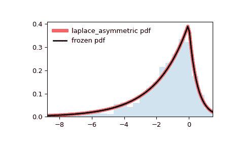

# `scipy.stats.laplace_asymmetric`

> 原文链接：[`docs.scipy.org/doc/scipy-1.12.0/reference/generated/scipy.stats.laplace_asymmetric.html#scipy.stats.laplace_asymmetric`](https://docs.scipy.org/doc/scipy-1.12.0/reference/generated/scipy.stats.laplace_asymmetric.html#scipy.stats.laplace_asymmetric)

```py
scipy.stats.laplace_asymmetric = <scipy.stats._continuous_distns.laplace_asymmetric_gen object>
```

一个非对称拉普拉斯连续随机变量。

作为`rv_continuous`类的一个实例，`laplace_asymmetric`对象从中继承了一系列通用方法（完整列表见下文），并且以特定于此特定分布的详细信息来补充它们。

另请参见

`laplace`

拉普拉斯分布

注意

`laplace_asymmetric`的概率密度函数为

\[\begin{split}f(x, \kappa) &= \frac{1}{\kappa+\kappa^{-1}}\exp(-x\kappa),\quad x\ge0\\ &= \frac{1}{\kappa+\kappa^{-1}}\exp(x/\kappa),\quad x<0\\\end{split}\]

对于\(-\infty < x < \infty\)，\(\kappa > 0\)。

`laplace_asymmetric`以 `kappa` 作为形状参数对\(\kappa\)进行参数化。对于\(\kappa = 1\)，它与拉普拉斯分布相同。

上述概率密度在“标准化”形式中定义。要移动和/或缩放分布，请使用`loc`和`scale`参数。具体而言，`laplace_asymmetric.pdf(x, kappa, loc, scale)`与`laplace_asymmetric.pdf(y, kappa) / scale`完全等价，其中`y = (x - loc) / scale`。请注意，移动分布的位置并不会使其成为“非中心”分布；某些分布的非中心推广可以在单独的类中找到。

注意一些参考文献的比例参数是 SciPy 的`scale`的倒数。例如，参数化中的\(\lambda = 1/2\)相当于使用`laplace_asymmetric`中的`scale = 2`。

参考文献

[1]

“非对称拉普拉斯分布”，维基百科 [`en.wikipedia.org/wiki/Asymmetric_Laplace_distribution`](https://en.wikipedia.org/wiki/Asymmetric_Laplace_distribution)

[2]

Kozubowski TJ 和 Podgórski K. 拉普拉斯分布的多变量和非对称推广，计算统计学 15, 531–540 (2000)。[DOI:10.1007/PL00022717](https://doi.org/10.1007/PL00022717)

示例

```py
>>> import numpy as np
>>> from scipy.stats import laplace_asymmetric
>>> import matplotlib.pyplot as plt
>>> fig, ax = plt.subplots(1, 1) 
```

计算前四个矩：

```py
>>> kappa = 2
>>> mean, var, skew, kurt = laplace_asymmetric.stats(kappa, moments='mvsk') 
```

显示概率密度函数（`pdf`）

```py
>>> x = np.linspace(laplace_asymmetric.ppf(0.01, kappa),
...                 laplace_asymmetric.ppf(0.99, kappa), 100)
>>> ax.plot(x, laplace_asymmetric.pdf(x, kappa),
...        'r-', lw=5, alpha=0.6, label='laplace_asymmetric pdf') 
```

或者，可以通过调用分布对象（作为函数）来固定形状、位置和比例参数。这将返回一个“冻结”的 RV 对象，其中给定的参数被固定。

冻结分布并显示冻结的`pdf`：

```py
>>> rv = laplace_asymmetric(kappa)
>>> ax.plot(x, rv.pdf(x), 'k-', lw=2, label='frozen pdf') 
```

检查`cdf`和`ppf`的准确性：

```py
>>> vals = laplace_asymmetric.ppf([0.001, 0.5, 0.999], kappa)
>>> np.allclose([0.001, 0.5, 0.999], laplace_asymmetric.cdf(vals, kappa))
True 
```

生成随机数：

```py
>>> r = laplace_asymmetric.rvs(kappa, size=1000) 
```

并比较直方图：

```py
>>> ax.hist(r, density=True, bins='auto', histtype='stepfilled', alpha=0.2)
>>> ax.set_xlim([x[0], x[-1]])
>>> ax.legend(loc='best', frameon=False)
>>> plt.show() 
```



Methods

| **rvs(kappa, loc=0, scale=1, size=1, random_state=None)** | 随机变量。 |
| --- | --- |
| **pdf(x, kappa, loc=0, scale=1)** | 概率密度函数。 |
| **logpdf(x, kappa, loc=0, scale=1)** | 概率密度函数的对数。 |
| **cdf(x, kappa, loc=0, scale=1)** | 累积分布函数。 |
| **logcdf(x, kappa, loc=0, scale=1)** | 累积分布函数的对数。 |
| **sf(x, kappa, loc=0, scale=1)** | 生存函数（也定义为 `1 - cdf`，但有时 *sf* 更准确）。 |
| **logsf(x, kappa, loc=0, scale=1)** | 生存函数的对数。 |
| **ppf(q, kappa, loc=0, scale=1)** | 百分位点函数（`cdf` 的反函数 — 百分位数）。 |
| **isf(q, kappa, loc=0, scale=1)** | 逆生存函数（`sf` 的反函数）。 |
| **moment(order, kappa, loc=0, scale=1)** | 指定阶数的非中心矩。 |
| **stats(kappa, loc=0, scale=1, moments=’mv’)** | 均值（‘m’）、方差（‘v’）、偏度（‘s’）和/或峰度（‘k’）。 |
| **entropy(kappa, loc=0, scale=1)** | 随机变量的（微分）熵。 |
| **fit(data)** | 通用数据的参数估计。详细文档请参见 [scipy.stats.rv_continuous.fit](https://docs.scipy.org/doc/scipy/reference/generated/scipy.stats.rv_continuous.fit.html#scipy.stats.rv_continuous.fit)。 |
| **expect(func, args=(kappa,), loc=0, scale=1, lb=None, ub=None, conditional=False, **kwds)** | 关于分布的函数（单参数）的期望值。 |
| **median(kappa, loc=0, scale=1)** | 分布的中位数。 |
| **mean(kappa, loc=0, scale=1)** | 分布的均值。 |
| **var(kappa, loc=0, scale=1)** | 分布的方差。 |
| **std(kappa, loc=0, scale=1)** | 分布的标准差。 |
| **interval(confidence, kappa, loc=0, scale=1)** | 中位数周围具有相等面积的置信区间。 |
