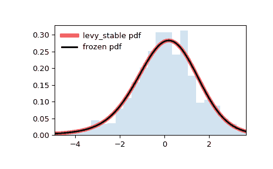

# `scipy.stats.levy_stable`

> 原始文本：[`docs.scipy.org/doc/scipy-1.12.0/reference/generated/scipy.stats.levy_stable.html#scipy.stats.levy_stable`](https://docs.scipy.org/doc/scipy-1.12.0/reference/generated/scipy.stats.levy_stable.html#scipy.stats.levy_stable)

```py
scipy.stats.levy_stable = <scipy.stats._levy_stable.levy_stable_gen object>
```

一个 Levy 稳定连续随机变量。

作为 [`rv_continuous`](https://docs.scipy.org/doc/scipy-1.12.0/reference/generated/scipy.stats.rv_continuous.html#scipy.stats.rv_continuous "scipy.stats.rv_continuous") 类的一个实例，[`levy_stable`](https://docs.scipy.org/doc/scipy-1.12.0/reference/generated/scipy.stats.levy_stable.html#scipy.stats.levy_stable "scipy.stats.levy_stable") 对象继承了一系列通用方法（完整列表请参见下文），并补充了特定于这个特定分布的细节。

另见

[`levy`](https://docs.scipy.org/doc/scipy-1.12.0/reference/generated/scipy.stats.levy.html#scipy.stats.levy "scipy.stats.levy"), [`levy_l`](https://docs.scipy.org/doc/scipy-1.12.0/reference/generated/scipy.stats.levy_l.html#scipy.stats.levy_l "scipy.stats.levy_l"), [`cauchy`](https://docs.scipy.org/doc/scipy-1.12.0/reference/generated/scipy.stats.cauchy.html#scipy.stats.cauchy "scipy.stats.cauchy"), [`norm`](https://docs.scipy.org/doc/scipy-1.12.0/reference/generated/scipy.stats.norm.html#scipy.stats.norm "scipy.stats.norm")

注意

[`levy_stable`](https://docs.scipy.org/doc/scipy-1.12.0/reference/generated/scipy.stats.levy_stable.html#scipy.stats.levy_stable "scipy.stats.levy_stable") 的分布具有特征函数：

\[\varphi(t, \alpha, \beta, c, \mu) = e^{it\mu -|ct|^{\alpha}(1-i\beta\operatorname{sign}(t)\Phi(\alpha, t))}\]

支持两种不同的参数化方式。第一个 \(S_1\)：

\[\begin{split}\Phi = \begin{cases} \tan \left({\frac {\pi \alpha }{2}}\right)&\alpha \neq 1\\ -{\frac {2}{\pi }}\log |t|&\alpha =1 \end{cases}\end{split}\]

第二个 \(S_0\)：

\[\begin{split}\Phi = \begin{cases} -\tan \left({\frac {\pi \alpha }{2}}\right)(|ct|^{1-\alpha}-1) &\alpha \neq 1\\ -{\frac {2}{\pi }}\log |ct|&\alpha =1 \end{cases}\end{split}\]

[`levy_stable`](https://docs.scipy.org/doc/scipy-1.12.0/reference/generated/scipy.stats.levy_stable.html#scipy.stats.levy_stable "scipy.stats.levy_stable") 的概率密度函数为：

\[f(x) = \frac{1}{2\pi}\int_{-\infty}^\infty \varphi(t)e^{-ixt}\,dt\]

其中 \(-\infty < t < \infty\)。这个积分没有已知的闭式形式。

[`levy_stable`](https://docs.scipy.org/doc/scipy-1.12.0/reference/generated/scipy.stats.levy_stable.html#scipy.stats.levy_stable "scipy.stats.levy_stable") 泛化了几个分布。在可能的情况下，应使用它们。特别是当形状参数在下表中的值时，应使用相应的等效分布。

| `alpha` | `beta` | 等效 |
| --- | --- | --- |
| 1/2 | -1 | [`levy_l`](https://docs.scipy.org/doc/scipy-1.12.0/reference/generated/scipy.stats.levy_l.html#scipy.stats.levy_l "scipy.stats.levy_l") |
| 1/2 | 1 | [`levy`](https://docs.scipy.org/doc/scipy-1.12.0/reference/generated/scipy.stats.levy.html#scipy.stats.levy "scipy.stats.levy") |
| 1 | 0 | [`cauchy`](https://docs.scipy.org/doc/scipy-1.12.0/reference/generated/scipy.stats.cauchy.html#scipy.stats.cauchy "scipy.stats.cauchy") |
| 2 | any | [`norm`](https://docs.scipy.org/doc/scipy-1.12.0/reference/generated/scipy.stats.norm.html#scipy.stats.norm "scipy.stats.norm") (with `scale=sqrt(2)`) |

对 pdf 的评估使用了 Nolan 的分段积分方法，默认使用 Zolotarev 的 \(M\) 参数化。还可以选择直接数值积分标准参数化的特征函数，或者通过特征函数的 FFT 进行评估。

可以通过将类变量`levy_stable.pdf_default_method`设置为‘piecewise’（Nolan 方法的默认选择）、‘dni’（直接数值积分）或‘fft-simpson’（基于 FFT 的方法）来更改默认方法。出于向后兼容性考虑，方法‘best’和‘zolotarev’相当于‘piecewise’，而方法‘quadrature’相当于‘dni’。

可以通过将类变量`levy_stable.parameterization`设置为‘S0’或‘S1’来更改参数化。默认为‘S1’。

要提高分段和直接数值积分的性能，可以指定`levy_stable.quad_eps`（默认为 1.2e-14）。这既用作直接数值积分的绝对和相对积分容差，也用作分段方法的相对积分容差。还可以指定`levy_stable.piecewise_x_tol_near_zeta`（默认为 0.005），用于确定 x 与 zeta 接近多少时被视为相同[NO]。确切的检查是`abs(x0 - zeta) < piecewise_x_tol_near_zeta*alpha**(1/alpha)`。还可以指定`levy_stable.piecewise_alpha_tol_near_one`（默认为 0.005），用于确定 alpha 接近 1 时被视为相等。

要提高 FFT 计算的精度，可以指定`levy_stable.pdf_fft_grid_spacing`（默认为 0.001）和`pdf_fft_n_points_two_power`（默认为 None，意味着会计算一个足够覆盖输入范围的值）。

可通过设置`pdf_fft_interpolation_degree`（默认为 3）来进一步控制 FFT 计算，用于样条插值的阶数，以及通过设置`pdf_fft_interpolation_level`来确定在近似特征函数时使用的 Newton-Cotes 公式中的点数（视为实验性）。

cdf 的评估默认使用 Nolan 的分段积分方法，并采用 Zolatarev 的参数化方法（通过 S_0 参数）。还有通过 FFT 方法计算 pdf 的插值样条积分来评估的选项。影响 FFT 计算的设置与 pdf 计算相同。可以通过将`levy_stable.cdf_default_method`设置为‘piecewise’或‘fft-simpson’来更改默认的 cdf 方法。对于 cdf 计算，Zolatarev 方法在精度上更为优越，因此默认情况下禁用 FFT。

拟合估计使用[MC]中的分位数估计方法。在拟合方法中使用 MLE 估计参数时，首先使用此分位数估计值。注意，如果使用 FFT 进行 pdf 计算，MLE 不总是收敛；当 alpha <= 1 时，FFT 方法不能提供良好的近似。

对于属性`levy_stable.pdf_fft_min_points_threshold`的任何非缺失值，如果未另行设置有效的默认方法，则会将`levy_stable.pdf_default_method`设置为‘fft-simpson’。

警告

对于概率密度函数（pdf）的计算，FFT 计算被视为实验性质。

对于累积分布函数（cdf）的计算，FFT 计算被视为实验性质。请改用 Zolatarev 的方法（默认）。

上述的概率密度在“标准化”形式中定义。要进行分布的平移和/或缩放，请使用`loc`和`scale`参数。通常情况下，`levy_stable.pdf(x, alpha, beta, loc, scale)`等同于`levy_stable.pdf(y, alpha, beta) / scale`，其中`y = (x - loc) / scale`，除了在`alpha == 1`的情况下，使用`S1`参数化。在这种情况下，`levy_stable.pdf(x, alpha, beta, loc, scale)`等同于`levy_stable.pdf(y, alpha, beta) / scale`，其中`y = (x - loc - 2 * beta * scale * np.log(scale) / np.pi) / scale`。更多信息请参见[[NO2]](#ra1ccd135b5f7-no2) 定义 1.8。请注意，移动分布的位置不会使其成为“非中心”分布。

References

[MC]

McCulloch, J., 1986\. Simple consistent estimators of stable distribution parameters. Communications in Statistics - Simulation and Computation 15, 11091136.

[WZ]

Wang, Li and Zhang, Ji-Hong, 2008\. Simpson’s rule based FFT method to compute densities of stable distribution.

[NO]

Nolan, J., 1997\. Numerical Calculation of Stable Densities and distributions Functions.

[NO2]

Nolan, J., 2018\. Stable Distributions: Models for Heavy Tailed Data.

[HO]

Hopcraft, K. I., Jakeman, E., Tanner, R. M. J., 1999\. Lévy random walks with fluctuating step number and multiscale behavior.

Examples

```py
>>> import numpy as np
>>> from scipy.stats import levy_stable
>>> import matplotlib.pyplot as plt
>>> fig, ax = plt.subplots(1, 1) 
```

Calculate the first four moments:

```py
>>> alpha, beta = 1.8, -0.5
>>> mean, var, skew, kurt = levy_stable.stats(alpha, beta, moments='mvsk') 
```

Display the probability density function (`pdf`):

```py
>>> x = np.linspace(levy_stable.ppf(0.01, alpha, beta),
...                 levy_stable.ppf(0.99, alpha, beta), 100)
>>> ax.plot(x, levy_stable.pdf(x, alpha, beta),
...        'r-', lw=5, alpha=0.6, label='levy_stable pdf') 
```

Alternatively, the distribution object can be called (as a function) to fix the shape, location and scale parameters. This returns a “frozen” RV object holding the given parameters fixed.

Freeze the distribution and display the frozen `pdf`:

```py
>>> rv = levy_stable(alpha, beta)
>>> ax.plot(x, rv.pdf(x), 'k-', lw=2, label='frozen pdf') 
```

Check accuracy of `cdf` and `ppf`:

```py
>>> vals = levy_stable.ppf([0.001, 0.5, 0.999], alpha, beta)
>>> np.allclose([0.001, 0.5, 0.999], levy_stable.cdf(vals, alpha, beta))
True 
```

Generate random numbers:

```py
>>> r = levy_stable.rvs(alpha, beta, size=1000) 
```

And compare the histogram:

```py
>>> ax.hist(r, density=True, bins='auto', histtype='stepfilled', alpha=0.2)
>>> ax.set_xlim([x[0], x[-1]])
>>> ax.legend(loc='best', frameon=False)
>>> plt.show() 
```



Methods

| **rvs(alpha, beta, loc=0, scale=1, size=1, random_state=None)** | 随机变量。 |
| --- | --- |
| **pdf(x, alpha, beta, loc=0, scale=1)** | 概率密度函数。 |
| **logpdf(x, alpha, beta, loc=0, scale=1)** | 概率密度函数的对数。 |
| **cdf(x, alpha, beta, loc=0, scale=1)** | 累积分布函数。 |
| **logcdf(x, alpha, beta, loc=0, scale=1)** | 概率累积分布函数的对数。 |
| **sf(x, alpha, beta, loc=0, scale=1)** | 生存函数（也定义为 `1 - cdf`，但 *sf* 有时更准确）。 |
| **logsf(x, alpha, beta, loc=0, scale=1)** | 概率生存函数的对数。 |
| **ppf(q, alpha, beta, loc=0, scale=1)** | 百分点函数（`cdf` 的反函数 —— 百分位数）。 |
| **isf(q, alpha, beta, loc=0, scale=1)** | 逆生存函数（`sf` 的反函数）。 |
| **moment(order, alpha, beta, loc=0, scale=1)** | 指定阶数的非中心矩。 |
| **stats(alpha, beta, loc=0, scale=1, moments=’mv’)** | 均值（‘m’），方差（‘v’），偏度（‘s’），以及/或峰度（‘k’）。 |
| **entropy(alpha, beta, loc=0, scale=1)** | 随机变量的（微分）熵。 |
| **fit(data)** | 通用数据的参数估计。参见 [scipy.stats.rv_continuous.fit](https://docs.scipy.org/doc/scipy/reference/generated/scipy.stats.rv_continuous.fit.html#scipy.stats.rv_continuous.fit) 获取关键字参数的详细文档。 |
| **expect(func, args=(alpha, beta), loc=0, scale=1, lb=None, ub=None, conditional=False, **kwds)** | 关于分布的函数（一个参数）的期望值。 |
| **median(alpha, beta, loc=0, scale=1)** | 分布的中位数。 |
| **mean(alpha, beta, loc=0, scale=1)** | 分布的均值。 |
| **var(alpha, beta, loc=0, scale=1)** | 分布的方差。 |
| **std(alpha, beta, loc=0, scale=1)** | 分布的标准差。 |
| **interval(confidence, alpha, beta, loc=0, scale=1)** | 置信区间，围绕中位数具有相等的面积。 |
