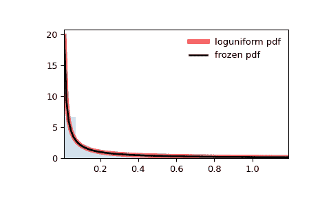
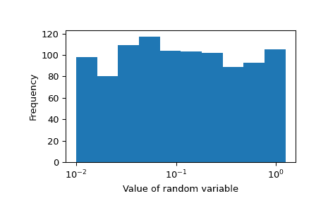
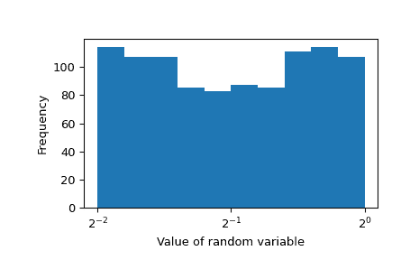

# `scipy.stats.loguniform`

> 原文链接：[`docs.scipy.org/doc/scipy-1.12.0/reference/generated/scipy.stats.loguniform.html#scipy.stats.loguniform`](https://docs.scipy.org/doc/scipy-1.12.0/reference/generated/scipy.stats.loguniform.html#scipy.stats.loguniform)

```py
scipy.stats.loguniform = <scipy.stats._continuous_distns.reciprocal_gen object>
```

一个对数均匀分布或倒数连续随机变量。

作为`rv_continuous`类的一个实例，`loguniform`对象继承了一系列通用方法（下面列出了完整列表），并针对这种特定分布增加了细节。

注意

此类的概率密度函数为：

\[f(x, a, b) = \frac{1}{x \log(b/a)}\]

对于\(a \le x \le b\)，\(b > a > 0\)。此类使用\(a\)和\(b\)作为形状参数。

上面的概率密度在“标准化”形式中定义。要移动和/或缩放分布，请使用`loc`和`scale`参数。具体来说，`loguniform.pdf(x, a, b, loc, scale)`与`loguniform.pdf(y, a, b) / scale`完全等价，其中`y = (x - loc) / scale`。注意，移动分布的位置并不使其成为“非中心”分布；某些分布的非中心推广可在单独的类中使用。

示例

```py
>>> import numpy as np
>>> from scipy.stats import loguniform
>>> import matplotlib.pyplot as plt
>>> fig, ax = plt.subplots(1, 1) 
```

计算前四个时刻：

```py
>>> a, b = 0.01, 1.25
>>> mean, var, skew, kurt = loguniform.stats(a, b, moments='mvsk') 
```

显示概率密度函数（`pdf`）：

```py
>>> x = np.linspace(loguniform.ppf(0.01, a, b),
...                 loguniform.ppf(0.99, a, b), 100)
>>> ax.plot(x, loguniform.pdf(x, a, b),
...        'r-', lw=5, alpha=0.6, label='loguniform pdf') 
```

或者，可以调用分布对象（作为函数）来固定形状、位置和比例参数。这将返回一个“冻结”的 RV 对象，保持给定的参数不变。

冻结分布并显示冻结的`pdf`：

```py
>>> rv = loguniform(a, b)
>>> ax.plot(x, rv.pdf(x), 'k-', lw=2, label='frozen pdf') 
```

检查`cdf`和`ppf`的准确性：

```py
>>> vals = loguniform.ppf([0.001, 0.5, 0.999], a, b)
>>> np.allclose([0.001, 0.5, 0.999], loguniform.cdf(vals, a, b))
True 
```

生成随机数：

```py
>>> r = loguniform.rvs(a, b, size=1000) 
```

并比较直方图：

```py
>>> ax.hist(r, density=True, bins='auto', histtype='stepfilled', alpha=0.2)
>>> ax.set_xlim([x[0], x[-1]])
>>> ax.legend(loc='best', frameon=False)
>>> plt.show() 
```



这并不显示`0.01`、`0.1`和`1`的相等概率。当 x 轴对数缩放时效果最佳：

```py
>>> import numpy as np
>>> import matplotlib.pyplot as plt
>>> fig, ax = plt.subplots(1, 1)
>>> ax.hist(np.log10(r))
>>> ax.set_ylabel("Frequency")
>>> ax.set_xlabel("Value of random variable")
>>> ax.xaxis.set_major_locator(plt.FixedLocator([-2, -1, 0]))
>>> ticks = ["$10^{{ {} }}$".format(i) for i in [-2, -1, 0]]
>>> ax.set_xticklabels(ticks)  
>>> plt.show() 
```



不论选择了哪个基数，此随机变量都将是对数均匀分布。让我们改为使用基数`2`：

```py
>>> rvs = loguniform(2**-2, 2**0).rvs(size=1000) 
```

`1/4`、`1/2`和`1`的值在这个随机变量中是等可能的。这是直方图：

```py
>>> fig, ax = plt.subplots(1, 1)
>>> ax.hist(np.log2(rvs))
>>> ax.set_ylabel("Frequency")
>>> ax.set_xlabel("Value of random variable")
>>> ax.xaxis.set_major_locator(plt.FixedLocator([-2, -1, 0]))
>>> ticks = ["$2^{{ {} }}$".format(i) for i in [-2, -1, 0]]
>>> ax.set_xticklabels(ticks)  
>>> plt.show() 
```



方法

| **rvs(a, b, loc=0, scale=1, size=1, random_state=None)** | 随机变量。 |
| --- | --- |
| **pdf(x, a, b, loc=0, scale=1)** | 概率密度函数。 |
| **logpdf(x, a, b, loc=0, scale=1)** | 概率密度函数的对数。 |
| **cdf(x, a, b, loc=0, scale=1)** | 累积分布函数。 |
| **logcdf(x, a, b, loc=0, scale=1)** | 累积分布函数的对数。 |
| **sf(x, a, b, loc=0, scale=1)** | 生存函数（也定义为`1 - cdf`，但*sf*有时更准确）。 |
| **logsf(x, a, b, loc=0, scale=1)** | 生存函数的对数。 |
| **ppf(q, a, b, loc=0, scale=1)** | 百分位点函数（`cdf` 的反函数 — 百分位数）。 |
| **isf(q, a, b, loc=0, scale=1)** | 逆生存函数（`sf` 的反函数）。 |
| **moment(order, a, b, loc=0, scale=1)** | 指定阶数的非中心矩。 |
| **stats(a, b, loc=0, scale=1, moments=’mv’)** | 均值（‘m’）、方差（‘v’）、偏度（‘s’）、及/或峰度（‘k’）。 |
| **entropy(a, b, loc=0, scale=1)** | 随机变量的（微分）熵。 |
| **fit(data)** | 适用于一般数据的参数估计。详见[scipy.stats.rv_continuous.fit](https://docs.scipy.org/doc/scipy/reference/generated/scipy.stats.rv_continuous.fit.html#scipy.stats.rv_continuous.fit)以获取关键字参数的详细文档。 |
| **expect(func, args=(a, b), loc=0, scale=1, lb=None, ub=None, conditional=False, **kwds)** | 对于分布，函数（一个参数）的期望值。 |
| **median(a, b, loc=0, scale=1)** | 分布的中位数。 |
| **mean(a, b, loc=0, scale=1)** | 分布的均值。 |
| **var(a, b, loc=0, scale=1)** | 分布的方差。 |
| **std(a, b, loc=0, scale=1)** | 分布的标准差。 |
| **interval(confidence, a, b, loc=0, scale=1)** | 等概率中位数周围的置信区间。 |
