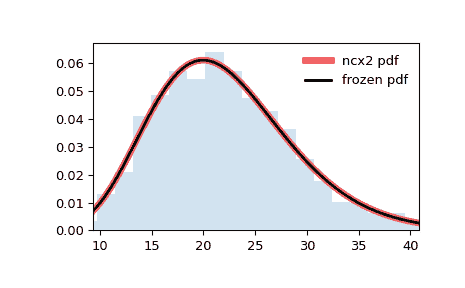

# `scipy.stats.ncx2`

> 原文：[`docs.scipy.org/doc/scipy-1.12.0/reference/generated/scipy.stats.ncx2.html#scipy.stats.ncx2`](https://docs.scipy.org/doc/scipy-1.12.0/reference/generated/scipy.stats.ncx2.html#scipy.stats.ncx2)

```py
scipy.stats.ncx2 = <scipy.stats._continuous_distns.ncx2_gen object>
```

非中心卡方连续随机变量。

作为 `rv_continuous` 类的实例，`ncx2` 对象继承了一组通用方法（下面列出了完整列表），并使用特定于此特定分布的详细信息来完成它们。

注意

`ncx2` 的概率密度函数为：

\[f(x, k, \lambda) = \frac{1}{2} \exp(-(\lambda+x)/2) (x/\lambda)^{(k-2)/4} I_{(k-2)/2}(\sqrt{\lambda x})\]

对于 \(x \geq 0\), \(k > 0\) 和 \(\lambda \geq 0\)。 \(k\) 指定自由度（在实现中称为 `df`），\(\lambda\) 是非中心参数（在实现中称为 `nc`）。 \(I_\nu\) 表示一阶修正贝塞尔函数的阶数为 \(\nu\)（`scipy.special.iv`）。

`ncx2` 接受 `df` 和 `nc` 作为形状参数。

上述概率密度定义为“标准化”形式。要移动和/或缩放分布，请使用 `loc` 和 `scale` 参数。具体来说，`ncx2.pdf(x, df, nc, loc, scale)` 与 `ncx2.pdf(y, df, nc) / scale` 等效，其中 `y = (x - loc) / scale`。请注意，移动分布的位置不会使其成为“非中心”分布；某些分布的非中心泛化是在单独的类中提供的。

示例

```py
>>> import numpy as np
>>> from scipy.stats import ncx2
>>> import matplotlib.pyplot as plt
>>> fig, ax = plt.subplots(1, 1) 
```

计算前四个矩：

```py
>>> df, nc = 21, 1.06
>>> mean, var, skew, kurt = ncx2.stats(df, nc, moments='mvsk') 
```

显示概率密度函数（`pdf`）：

```py
>>> x = np.linspace(ncx2.ppf(0.01, df, nc),
...                 ncx2.ppf(0.99, df, nc), 100)
>>> ax.plot(x, ncx2.pdf(x, df, nc),
...        'r-', lw=5, alpha=0.6, label='ncx2 pdf') 
```

或者，可以调用分布对象（作为函数）来固定形状、位置和比例参数。这将返回一个“冻结”的 RV 对象，其中给定参数被固定。

冻结分布并显示冻结的 `pdf`：

```py
>>> rv = ncx2(df, nc)
>>> ax.plot(x, rv.pdf(x), 'k-', lw=2, label='frozen pdf') 
```

检查 `cdf` 和 `ppf` 的准确性：

```py
>>> vals = ncx2.ppf([0.001, 0.5, 0.999], df, nc)
>>> np.allclose([0.001, 0.5, 0.999], ncx2.cdf(vals, df, nc))
True 
```

生成随机数：

```py
>>> r = ncx2.rvs(df, nc, size=1000) 
```

然后比较直方图：

```py
>>> ax.hist(r, density=True, bins='auto', histtype='stepfilled', alpha=0.2)
>>> ax.set_xlim([x[0], x[-1]])
>>> ax.legend(loc='best', frameon=False)
>>> plt.show() 
```



方法

| **rvs(df, nc, loc=0, scale=1, size=1, random_state=None)** | 随机变量。 |
| --- | --- |
| **pdf(x, df, nc, loc=0, scale=1)** | 概率密度函数。 |
| **logpdf(x, df, nc, loc=0, scale=1)** | 概率密度函数的对数。 |
| **cdf(x, df, nc, loc=0, scale=1)** | 累积分布函数。 |
| **logcdf(x, df, nc, loc=0, scale=1)** | 累积分布函数的对数。 |
| **sf(x, df, nc, loc=0, scale=1)** | 生存函数（也定义为 `1 - cdf`，但 *sf* 有时更准确）。 |
| **logsf(x, df, nc, loc=0, scale=1)** | 生存函数的对数。 |
| **ppf(q, df, nc, loc=0, scale=1)** | 百分位点函数（`cdf` 的反函数 — 百分位数）。 |
| **isf(q, df, nc, loc=0, scale=1)** | 逆生存函数（`sf`的逆函数）。 |
| **moment(order, df, nc, loc=0, scale=1)** | 指定阶数的非中心矩。 |
| **stats(df, nc, loc=0, scale=1, moments=’mv’)** | 均值（‘m’）、方差（‘v’）、偏度（‘s’）、以及/或者峰度（‘k’）。 |
| **entropy(df, nc, loc=0, scale=1)** | 随机变量的（微分）熵。 |
| **fit(data)** | 通用数据的参数估计。详细文档请参阅[scipy.stats.rv_continuous.fit](https://docs.scipy.org/doc/scipy/reference/generated/scipy.stats.rv_continuous.fit.html#scipy.stats.rv_continuous.fit)。 |
| **expect(func, args=(df, nc), loc=0, scale=1, lb=None, ub=None, conditional=False, **kwds)** | 相对于分布的函数（一维参数）的期望值。 |
| **median(df, nc, loc=0, scale=1)** | 分布的中位数。 |
| **mean(df, nc, loc=0, scale=1)** | 分布的均值。 |
| **var(df, nc, loc=0, scale=1)** | 分布的方差。 |
| **std(df, nc, loc=0, scale=1)** | 分布的标准差。 |
| **interval(confidence, df, nc, loc=0, scale=1)** | 置信区间，围绕中位数具有相等的面积。 |
