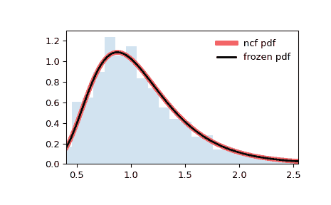

# `scipy.stats.ncf`

> 原文链接：[`docs.scipy.org/doc/scipy-1.12.0/reference/generated/scipy.stats.ncf.html#scipy.stats.ncf`](https://docs.scipy.org/doc/scipy-1.12.0/reference/generated/scipy.stats.ncf.html#scipy.stats.ncf)

```py
scipy.stats.ncf = <scipy.stats._continuous_distns.ncf_gen object>
```

非中心 F 分布连续随机变量。

作为`rv_continuous`类的一个实例，`ncf` 对象继承了一系列通用方法（下面列出完整列表），并以特定于这个特定分布的细节完善了它们。

另请参阅

`scipy.stats.f`

Fisher 分布

注释

`ncf` 的概率密度函数为：

\[\begin{split}f(x, n_1, n_2, \lambda) = \exp\left(\frac{\lambda}{2} + \lambda n_1 \frac{x}{2(n_1 x + n_2)} \right) n_1^{n_1/2} n_2^{n_2/2} x^{n_1/2 - 1} \\ (n_2 + n_1 x)^{-(n_1 + n_2)/2} \gamma(n_1/2) \gamma(1 + n_2/2) \\ \frac{L^{\frac{n_1}{2}-1}_{n_2/2} \left(-\lambda n_1 \frac{x}{2(n_1 x + n_2)}\right)} {B(n_1/2, n_2/2) \gamma\left(\frac{n_1 + n_2}{2}\right)}\end{split}\]

对于\(n_1, n_2 > 0\), \(\lambda \ge 0\). 这里\(n_1\)是分子自由度，\(n_2\)是分母自由度，\(\lambda\)是非心参数，\(\gamma\)是伽玛函数的对数，\(L_n^k\)是广义拉盖尔多项式，\(B\)是贝塔函数。

`ncf` 接受`df1`、`df2`和`nc`作为形状参数。如果`nc=0`，分布将等同于 Fisher 分布。

上述概率密度在“标准化”形式下定义。要移动和/或缩放分布，请使用`loc`和`scale`参数。具体而言，`ncf.pdf(x, dfn, dfd, nc, loc, scale)`与`ncf.pdf(y, dfn, dfd, nc) / scale`等价，其中`y = (x - loc) / scale`。请注意，移动分布的位置并不使其成为“非中心”分布；某些分布的非中心推广在单独的类中可用。

示例

```py
>>> import numpy as np
>>> from scipy.stats import ncf
>>> import matplotlib.pyplot as plt
>>> fig, ax = plt.subplots(1, 1) 
```

计算前四个矩：

```py
>>> dfn, dfd, nc = 27, 27, 0.416
>>> mean, var, skew, kurt = ncf.stats(dfn, dfd, nc, moments='mvsk') 
```

显示概率密度函数(`pdf`)：

```py
>>> x = np.linspace(ncf.ppf(0.01, dfn, dfd, nc),
...                 ncf.ppf(0.99, dfn, dfd, nc), 100)
>>> ax.plot(x, ncf.pdf(x, dfn, dfd, nc),
...        'r-', lw=5, alpha=0.6, label='ncf pdf') 
```

或者，可以调用分布对象（作为函数）以固定形状、位置和比例参数。这将返回一个“冻结”的 RV 对象，其中给定的参数被固定。

冻结分布并显示冻结的`pdf`：

```py
>>> rv = ncf(dfn, dfd, nc)
>>> ax.plot(x, rv.pdf(x), 'k-', lw=2, label='frozen pdf') 
```

检查`cdf`和`ppf`的准确性：

```py
>>> vals = ncf.ppf([0.001, 0.5, 0.999], dfn, dfd, nc)
>>> np.allclose([0.001, 0.5, 0.999], ncf.cdf(vals, dfn, dfd, nc))
True 
```

生成随机数：

```py
>>> r = ncf.rvs(dfn, dfd, nc, size=1000) 
```

并且比较直方图：

```py
>>> ax.hist(r, density=True, bins='auto', histtype='stepfilled', alpha=0.2)
>>> ax.set_xlim([x[0], x[-1]])
>>> ax.legend(loc='best', frameon=False)
>>> plt.show() 
```



方法

| **rvs(dfn, dfd, nc, loc=0, scale=1, size=1, random_state=None)** | 随机变量。 |
| --- | --- |
| **pdf(x, dfn, dfd, nc, loc=0, scale=1)** | 概率密度函数。 |
| **logpdf(x, dfn, dfd, nc, loc=0, scale=1)** | 概率密度函数的对数。 |
| **cdf(x, dfn, dfd, nc, loc=0, scale=1)** | 累积分布函数。 |
| **logcdf(x, dfn, dfd, nc, loc=0, scale=1)** | 累积分布函数的对数。 |
| **sf(x, dfn, dfd, nc, loc=0, scale=1)** | 生存函数（也定义为 `1 - cdf`，但*sf*有时更准确）。 |
| **logsf(x, dfn, dfd, nc, loc=0, scale=1)** | 生存函数的对数。 |
| **ppf(q, dfn, dfd, nc, loc=0, scale=1)** | 百分点函数（`cdf`的逆 — 百分位数）。 |
| **isf(q, dfn, dfd, nc, loc=0, scale=1)** | 逆生存函数（`sf`的逆）。 |
| **moment(order, dfn, dfd, nc, loc=0, scale=1)** | 指定阶数的非中心矩。 |
| **stats(dfn, dfd, nc, loc=0, scale=1, moments=’mv’)** | 均值（‘m’）、方差（‘v’）、偏度（‘s’）、峰度（‘k’）。 |
| **entropy(dfn, dfd, nc, loc=0, scale=1)** | 随机变量的（微分）熵。 |
| **fit(data)** | 通用数据的参数估计。详细文档请参见 [scipy.stats.rv_continuous.fit](https://docs.scipy.org/doc/scipy/reference/generated/scipy.stats.rv_continuous.fit.html#scipy.stats.rv_continuous.fit)。 |
| **expect(func, args=(dfn, dfd, nc), loc=0, scale=1, lb=None, ub=None, conditional=False, **kwds)** | 对分布的函数（一个参数）的期望值。 |
| **median(dfn, dfd, nc, loc=0, scale=1)** | 分布的中位数。 |
| **mean(dfn, dfd, nc, loc=0, scale=1)** | 分布的均值。 |
| **var(dfn, dfd, nc, loc=0, scale=1)** | 分布的方差。 |
| **std(dfn, dfd, nc, loc=0, scale=1)** | 分布的标准差。 |
| **interval(confidence, dfn, dfd, nc, loc=0, scale=1)** | 等面积围绕中位数的置信区间。 |
