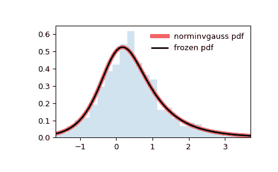

# `scipy.stats.norminvgauss`

> 原文链接：[`docs.scipy.org/doc/scipy-1.12.0/reference/generated/scipy.stats.norminvgauss.html#scipy.stats.norminvgauss`](https://docs.scipy.org/doc/scipy-1.12.0/reference/generated/scipy.stats.norminvgauss.html#scipy.stats.norminvgauss)

```py
scipy.stats.norminvgauss = <scipy.stats._continuous_distns.norminvgauss_gen object>
```

一种正态反高斯连续随机变量。

作为 `rv_continuous` 类的一个实例，`norminvgauss` 对象从中继承了一组通用方法（详见下文完整列表），并针对这种特定分布提供了具体的细节。

注意事项

`norminvgauss` 的概率密度函数为：

\[f(x, a, b) = \frac{a \, K_1(a \sqrt{1 + x²})}{\pi \sqrt{1 + x²}} \, \exp(\sqrt{a² - b²} + b x)\]

其中 \(x\) 是实数，参数 \(a\) 是尾部重的程度，\(b\) 是满足 \(a > 0\) 和 \(|b| <= a\) 的不对称参数。\(K_1\) 是第二类修正贝塞尔函数（`scipy.special.k1`）。

上述概率密度函数定义为“标准化”形式。要移动和/或缩放分布，请使用 `loc` 和 `scale` 参数。具体来说，`norminvgauss.pdf(x, a, b, loc, scale)` 等同于 `norminvgauss.pdf(y, a, b) / scale`，其中 `y = (x - loc) / scale`。请注意，移动分布的位置并不使其成为“非中心”分布；某些分布的非中心推广可以在单独的类中找到。

一个具有参数 *a* 和 *b* 的正态反高斯随机变量 *Y* 可以表达为正态均值方差混合：*Y = b * V + sqrt(V) * X*，其中 *X* 是 *norm(0,1)*，*V* 是 *invgauss(mu=1/sqrt(a**2 - b**2))*。此表示用于生成随机变量。

分布的另一个常见参数化（参见[[2]](#r96a688736eb9-2)中的方程 2.1）可以通过以下概率密度函数表达式给出：

\[g(x, \alpha, \beta, \delta, \mu) = \frac{\alpha\delta K_1\left(\alpha\sqrt{\delta² + (x - \mu)²}\right)} {\pi \sqrt{\delta² + (x - \mu)²}} \, e^{\delta \sqrt{\alpha² - \beta²} + \beta (x - \mu)}\]

在 SciPy 中，这对应于 *a = alpha * delta, b = beta * delta, loc = mu, scale=delta*。

参考文献

[1]

O. Barndorff-Nielsen，《双曲分布和双曲线上的分布》，《斯堪的纳维亚统计学杂志》，第 5 卷（第 3 期），第 151-157 页，1978 年。

[2]

O. Barndorff-Nielsen，《正态反高斯分布和随机波动率建模》，《斯堪的纳维亚统计学杂志》，第 24 卷，第 1-13 页，1997 年。

示例

```py
>>> import numpy as np
>>> from scipy.stats import norminvgauss
>>> import matplotlib.pyplot as plt
>>> fig, ax = plt.subplots(1, 1) 
```

计算前四个矩：

```py
>>> a, b = 1.25, 0.5
>>> mean, var, skew, kurt = norminvgauss.stats(a, b, moments='mvsk') 
```

显示概率密度函数（`pdf`）：

```py
>>> x = np.linspace(norminvgauss.ppf(0.01, a, b),
...                 norminvgauss.ppf(0.99, a, b), 100)
>>> ax.plot(x, norminvgauss.pdf(x, a, b),
...        'r-', lw=5, alpha=0.6, label='norminvgauss pdf') 
```

或者，可以调用分布对象（作为函数）来固定形状、位置和比例参数。这将返回一个“冻结”的 RV 对象，保持给定的参数不变。

冻结分布并显示冻结的`pdf`：

```py
>>> rv = norminvgauss(a, b)
>>> ax.plot(x, rv.pdf(x), 'k-', lw=2, label='frozen pdf') 
```

检查`cdf`和`ppf`的准确性：

```py
>>> vals = norminvgauss.ppf([0.001, 0.5, 0.999], a, b)
>>> np.allclose([0.001, 0.5, 0.999], norminvgauss.cdf(vals, a, b))
True 
```

生成随机数：

```py
>>> r = norminvgauss.rvs(a, b, size=1000) 
```

并比较直方图：

```py
>>> ax.hist(r, density=True, bins='auto', histtype='stepfilled', alpha=0.2)
>>> ax.set_xlim([x[0], x[-1]])
>>> ax.legend(loc='best', frameon=False)
>>> plt.show() 
```



方法

| **rvs(a, b, loc=0, scale=1, size=1, random_state=None)** | 随机变量。 |
| --- | --- |
| **pdf(x, a, b, loc=0, scale=1)** | 概率密度函数。 |
| **logpdf(x, a, b, loc=0, scale=1)** | 概率密度函数的对数。 |
| **cdf(x, a, b, loc=0, scale=1)** | 累积分布函数。 |
| **logcdf(x, a, b, loc=0, scale=1)** | 累积分布函数的对数。 |
| **sf(x, a, b, loc=0, scale=1)** | 生存函数（也定义为`1 - cdf`，但*sf*有时更准确）。 |
| **logsf(x, a, b, loc=0, scale=1)** | 生存函数的对数。 |
| **ppf(q, a, b, loc=0, scale=1)** | 百分点函数（`cdf`的逆 — 百分位数）。 |
| **isf(q, a, b, loc=0, scale=1)** | 逆生存函数（`sf`的逆）。 |
| **moment(order, a, b, loc=0, scale=1)** | 指定阶数的非中心矩。 |
| **stats(a, b, loc=0, scale=1, moments=’mv’)** | 均值（‘m’）、方差（‘v’）、偏度（‘s’）和/或峰度（‘k’）。 |
| **entropy(a, b, loc=0, scale=1)** | 随机变量的（微分）熵。 |
| **fit(data)** | 用于通用数据的参数估计。详细文档请参阅 [scipy.stats.rv_continuous.fit](https://docs.scipy.org/doc/scipy/reference/generated/scipy.stats.rv_continuous.fit.html#scipy.stats.rv_continuous.fit)。 |
| **expect(func, args=(a, b), loc=0, scale=1, lb=None, ub=None, conditional=False, **kwds)** | 对分布的一个参数的函数的期望值。 |
| **median(a, b, loc=0, scale=1)** | 分布的中位数。 |
| **mean(a, b, loc=0, scale=1)** | 分布的均值。 |
| **var(a, b, loc=0, scale=1)** | 分布的方差。 |
| **std(a, b, loc=0, scale=1)** | 分布的标准差。 |
| **interval(confidence, a, b, loc=0, scale=1)** | 等面积置信区间的中位数。 |
