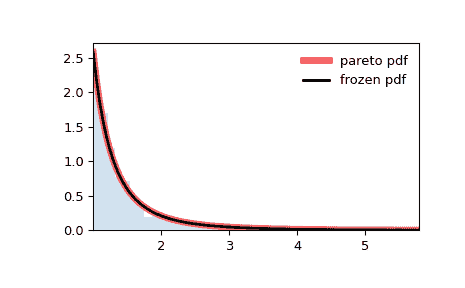

# `scipy.stats.pareto`

> 原文链接：[`docs.scipy.org/doc/scipy-1.12.0/reference/generated/scipy.stats.pareto.html#scipy.stats.pareto`](https://docs.scipy.org/doc/scipy-1.12.0/reference/generated/scipy.stats.pareto.html#scipy.stats.pareto)

```py
scipy.stats.pareto = <scipy.stats._continuous_distns.pareto_gen object>
```

一个帕累托连续随机变量。

作为 `rv_continuous` 类的一个实例，`pareto` 对象继承了一系列通用方法（下面有完整列表），并且针对这种特定分布补充了细节。

注意事项

`pareto` 的概率密度函数为：

\[f(x, b) = \frac{b}{x^{b+1}}\]

对于 \(x \ge 1\), \(b > 0\)。

`pareto` 将 `b` 作为形状参数 \(b\)。

上述概率密度在“标准化”形式下定义。要移动和/或缩放分布，请使用 `loc` 和 `scale` 参数。具体而言，`pareto.pdf(x, b, loc, scale)` 等同于 `pareto.pdf(y, b) / scale`，其中 `y = (x - loc) / scale`。请注意，移动分布的位置并不使其成为“非中心”分布；某些分布的非中心推广在单独的类中可用。

示例

```py
>>> import numpy as np
>>> from scipy.stats import pareto
>>> import matplotlib.pyplot as plt
>>> fig, ax = plt.subplots(1, 1) 
```

计算前四个矩：

```py
>>> b = 2.62
>>> mean, var, skew, kurt = pareto.stats(b, moments='mvsk') 
```

显示概率密度函数 (`pdf`)：

```py
>>> x = np.linspace(pareto.ppf(0.01, b),
...                 pareto.ppf(0.99, b), 100)
>>> ax.plot(x, pareto.pdf(x, b),
...        'r-', lw=5, alpha=0.6, label='pareto pdf') 
```

或者，可以调用分布对象（作为函数），以固定形状、位置和比例参数。这将返回一个“冻结”的 RV 对象，保持给定参数不变。

冻结分布并显示冻结的 `pdf`：

```py
>>> rv = pareto(b)
>>> ax.plot(x, rv.pdf(x), 'k-', lw=2, label='frozen pdf') 
```

检查 `cdf` 和 `ppf` 的准确性：

```py
>>> vals = pareto.ppf([0.001, 0.5, 0.999], b)
>>> np.allclose([0.001, 0.5, 0.999], pareto.cdf(vals, b))
True 
```

生成随机数：

```py
>>> r = pareto.rvs(b, size=1000) 
```

并比较直方图：

```py
>>> ax.hist(r, density=True, bins='auto', histtype='stepfilled', alpha=0.2)
>>> ax.set_xlim([x[0], x[-1]])
>>> ax.legend(loc='best', frameon=False)
>>> plt.show() 
```



方法

| **rvs(b, loc=0, scale=1, size=1, random_state=None)** | 随机变量。 |
| --- | --- |
| **pdf(x, b, loc=0, scale=1)** | 概率密度函数。 |
| **logpdf(x, b, loc=0, scale=1)** | 概率密度函数的对数。 |
| **cdf(x, b, loc=0, scale=1)** | 累积分布函数。 |
| **logcdf(x, b, loc=0, scale=1)** | 累积分布函数的对数。 |
| **sf(x, b, loc=0, scale=1)** | 生存函数（也定义为 `1 - cdf`，但 *sf* 有时更精确）。 |
| **logsf(x, b, loc=0, scale=1)** | 生存函数的对数。 |
| **ppf(q, b, loc=0, scale=1)** | 百分位点函数（`cdf` 的反函数 — 百分位数）。 |
| **isf(q, b, loc=0, scale=1)** | 逆生存函数（`sf` 的逆）。 |
| **moment(order, b, loc=0, scale=1)** | 指定阶数的非中心矩。 |
| **stats(b, loc=0, scale=1, moments=’mv’)** | 均值（‘m’）、方差（‘v’）、偏度（‘s’）和/或峰度（‘k’）。 |
| **entropy(b, loc=0, scale=1)** | 随机变量的（微分）熵。 |
| **fit(data)** | 适用于一般数据的参数估计。详见[scipy.stats.rv_continuous.fit](https://docs.scipy.org/doc/scipy/reference/generated/scipy.stats.rv_continuous.fit.html#scipy.stats.rv_continuous.fit)以获取关键字参数的详细文档。 |
| **expect(func, args=(b,), loc=0, scale=1, lb=None, ub=None, conditional=False, **kwds)** | 对分布的一个函数（一个参数的函数）的期望值。 |
| **median(b, loc=0, scale=1)** | 分布的中位数。 |
| **mean(b, loc=0, scale=1)** | 分布的均值。 |
| **var(b, loc=0, scale=1)** | 分布的方差。 |
| **std(b, loc=0, scale=1)** | 分布的标准差。 |
| **interval(confidence, b, loc=0, scale=1)** | 置信区间，围绕中位数具有相等面积。 |
