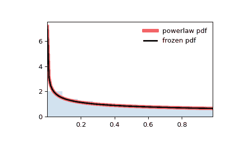

# `scipy.stats.powerlaw`

> 原文链接：[`docs.scipy.org/doc/scipy-1.12.0/reference/generated/scipy.stats.powerlaw.html#scipy.stats.powerlaw`](https://docs.scipy.org/doc/scipy-1.12.0/reference/generated/scipy.stats.powerlaw.html#scipy.stats.powerlaw)

```py
scipy.stats.powerlaw = <scipy.stats._continuous_distns.powerlaw_gen object>
```

一个幂函数连续随机变量。

作为 `rv_continuous` 类的一个实例，`powerlaw` 对象从中继承了一组通用方法（下面详细列出），并针对这种特定分布补充了具体细节。

另请参阅

`pareto`

注意

`powerlaw` 的概率密度函数为：

\[f(x, a) = a x^{a-1}\]

对于 \(0 \le x \le 1\), \(a > 0\)。

`powerlaw` 以 `a` 作为形状参数。

上述概率密度在“标准化”形式中定义。要移动和/或缩放分布，请使用 `loc` 和 `scale` 参数。具体而言，`powerlaw.pdf(x, a, loc, scale)` 与 `powerlaw.pdf(y, a) / scale` 是等价的，其中 `y = (x - loc) / scale`。请注意，移动分布的位置不会使其成为“非中心”分布；某些分布的非中心推广可以在单独的类中找到。

例如，`powerlaw` 的支持可以通过设置 `loc=c` 和 `scale=d` 将默认区间 `[0, 1]` 调整为区间 `[c, c+d]`。对于具有无限支持的幂律分布，请参见 `pareto`。

`powerlaw` 是带有 `b=1` 的 `beta` 的特殊情况。

示例

```py
>>> import numpy as np
>>> from scipy.stats import powerlaw
>>> import matplotlib.pyplot as plt
>>> fig, ax = plt.subplots(1, 1) 
```

计算前四个时刻：

```py
>>> a = 0.659
>>> mean, var, skew, kurt = powerlaw.stats(a, moments='mvsk') 
```

显示概率密度函数 (`pdf`)：

```py
>>> x = np.linspace(powerlaw.ppf(0.01, a),
...                 powerlaw.ppf(0.99, a), 100)
>>> ax.plot(x, powerlaw.pdf(x, a),
...        'r-', lw=5, alpha=0.6, label='powerlaw pdf') 
```

或者，可以调用分布对象（作为函数），以固定形状、位置和比例参数。这将返回一个“冻结”的随机变量对象，其中包含给定的固定参数。

冻结分布并显示冻结的 `pdf`：

```py
>>> rv = powerlaw(a)
>>> ax.plot(x, rv.pdf(x), 'k-', lw=2, label='frozen pdf') 
```

检查 `cdf` 和 `ppf` 的准确性：

```py
>>> vals = powerlaw.ppf([0.001, 0.5, 0.999], a)
>>> np.allclose([0.001, 0.5, 0.999], powerlaw.cdf(vals, a))
True 
```

生成随机数：

```py
>>> r = powerlaw.rvs(a, size=1000) 
```

并比较直方图：

```py
>>> ax.hist(r, density=True, bins='auto', histtype='stepfilled', alpha=0.2)
>>> ax.set_xlim([x[0], x[-1]])
>>> ax.legend(loc='best', frameon=False)
>>> plt.show() 
```



方法

| **rvs(a, loc=0, scale=1, size=1, random_state=None)** | 随机变量。 |
| --- | --- |
| **pdf(x, a, loc=0, scale=1)** | 概率密度函数。 |
| **logpdf(x, a, loc=0, scale=1)** | 概率密度函数的对数。 |
| **cdf(x, a, loc=0, scale=1)** | 累积分布函数。 |
| **logcdf(x, a, loc=0, scale=1)** | 累积分布函数的对数。 |
| **sf(x, a, loc=0, scale=1)** | 生存函数（也定义为 `1 - cdf`，但 *sf* 有时更精确）。 |
| **logsf(x, a, loc=0, scale=1)** | 存活函数的对数。 |
| **ppf(q, a, loc=0, scale=1)** | 百分位点函数（`cdf` 的逆 — 百分位数）。 |
| **isf(q, a, loc=0, scale=1)** | 逆存活函数（`sf` 的逆）。 |
| **moment(order, a, loc=0, scale=1)** | 指定阶数的非中心矩。 |
| **stats(a, loc=0, scale=1, moments=’mv’)** | 均值（‘m’）、方差（‘v’）、偏度（‘s’）、峰度（‘k’）。 |
| **entropy(a, loc=0, scale=1)** | 随机变量的（微分）熵。 |
| **fit(data)** | 一般数据的参数估计。详细文档请参阅 [scipy.stats.rv_continuous.fit](https://docs.scipy.org/doc/scipy/reference/generated/scipy.stats.rv_continuous.fit.html#scipy.stats.rv_continuous.fit)。 |
| **expect(func, args=(a,), loc=0, scale=1, lb=None, ub=None, conditional=False, **kwds)** | 期望值，针对分布的一个参数的函数。 |
| **median(a, loc=0, scale=1)** | 分布的中位数。 |
| **mean(a, loc=0, scale=1)** | 分布的均值。 |
| **var(a, loc=0, scale=1)** | 分布的方差。 |
| **std(a, loc=0, scale=1)** | 分布的标准偏差。 |
| **interval(confidence, a, loc=0, scale=1)** | 置信区间，围绕中位数有相等的面积。 |
