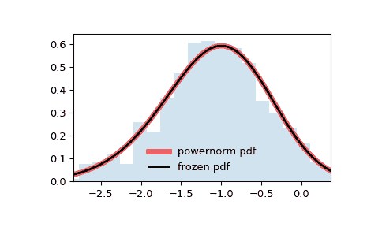

# `scipy.stats.powernorm`

> 原文：[`docs.scipy.org/doc/scipy-1.12.0/reference/generated/scipy.stats.powernorm.html#scipy.stats.powernorm`](https://docs.scipy.org/doc/scipy-1.12.0/reference/generated/scipy.stats.powernorm.html#scipy.stats.powernorm)

```py
scipy.stats.powernorm = <scipy.stats._continuous_distns.powernorm_gen object>
```

一个幂正态连续随机变量。

作为`rv_continuous`类的一个实例，`powernorm`对象继承了一系列通用方法（请参见下面的完整列表），并通过特定于此特定分布的细节来完成它们。

注意

`powernorm`的概率密度函数为：

\[f(x, c) = c \phi(x) (\Phi(-x))^{c-1}\]

其中\(\phi\)是正态概率密度函数，\(\Phi\)是正态累积分布函数，\(x\)是任意实数，\(c > 0\) [[1]](#rda88b96b8333-1)。

`powernorm`以形状参数`c`为\(c\)。

上述概率密度在“标准化”形式中定义。要移动和/或缩放分布，请使用`loc`和`scale`参数。具体而言，`powernorm.pdf(x, c, loc, scale)`等价于`powernorm.pdf(y, c) / scale`，其中`y = (x - loc) / scale`。请注意，移动分布的位置并不使其成为“非中心”分布；某些分布的非中心推广可在单独的类中找到。

参考资料

[1]

NIST 工程统计手册，第 1.3.6.6.13 节，[`www.itl.nist.gov/div898/handbook//eda/section3/eda366d.htm`](https://www.itl.nist.gov/div898/handbook//eda/section3/eda366d.htm)

示例

```py
>>> import numpy as np
>>> from scipy.stats import powernorm
>>> import matplotlib.pyplot as plt
>>> fig, ax = plt.subplots(1, 1) 
```

计算前四个时刻：

```py
>>> c = 4.45
>>> mean, var, skew, kurt = powernorm.stats(c, moments='mvsk') 
```

显示概率密度函数（`pdf`）：

```py
>>> x = np.linspace(powernorm.ppf(0.01, c),
...                 powernorm.ppf(0.99, c), 100)
>>> ax.plot(x, powernorm.pdf(x, c),
...        'r-', lw=5, alpha=0.6, label='powernorm pdf') 
```

或者，可以调用（作为函数）分布对象来固定形状、位置和缩放参数。这将返回一个“冻结”的 RV 对象，保持给定的参数不变。

冻结分布并显示冻结的`pdf`：

```py
>>> rv = powernorm(c)
>>> ax.plot(x, rv.pdf(x), 'k-', lw=2, label='frozen pdf') 
```

检查`cdf`和`ppf`的准确性：

```py
>>> vals = powernorm.ppf([0.001, 0.5, 0.999], c)
>>> np.allclose([0.001, 0.5, 0.999], powernorm.cdf(vals, c))
True 
```

生成随机数：

```py
>>> r = powernorm.rvs(c, size=1000) 
```

并比较直方图：

```py
>>> ax.hist(r, density=True, bins='auto', histtype='stepfilled', alpha=0.2)
>>> ax.set_xlim([x[0], x[-1]])
>>> ax.legend(loc='best', frameon=False)
>>> plt.show() 
```



方法

| **rvs(c, loc=0, scale=1, size=1, random_state=None)** | 随机变量。 |
| --- | --- |
| **pdf(x, c, loc=0, scale=1)** | 概率密度函数。 |
| **logpdf(x, c, loc=0, scale=1)** | 概率密度函数的对数。 |
| **cdf(x, c, loc=0, scale=1)** | 累积分布函数。 |
| **logcdf(x, c, loc=0, scale=1)** | 累积分布函数的对数。 |
| **sf(x, c, loc=0, scale=1)** | 生存函数（也定义为`1 - cdf`，但有时*sf*更精确）。 |
| **logsf(x, c, loc=0, scale=1)** | 生存函数的对数。 |
| **ppf(q, c, loc=0, scale=1)** | 百分位点函数（`cdf`的反函数 — 百分位数）。 |
| **isf(q, c, loc=0, scale=1)** | 生存函数的逆函数（`sf`的逆函数）。 |
| **moment(order, c, loc=0, scale=1)** | 指定阶数的非中心矩。 |
| **stats(c, loc=0, scale=1, moments=’mv’)** | 均值（‘m’）、方差（‘v’）、偏度（‘s’）和/或峰度（‘k’）。 |
| **entropy(c, loc=0, scale=1)** | 随机变量的（微分）熵。 |
| **fit(data)** | 适用于通用数据的参数估计。详细文档参见[scipy.stats.rv_continuous.fit](https://docs.scipy.org/doc/scipy/reference/generated/scipy.stats.rv_continuous.fit.html#scipy.stats.rv_continuous.fit)。 |
| **expect(func, args=(c,), loc=0, scale=1, lb=None, ub=None, conditional=False, **kwds)** | 对于分布的一个参数函数的期望值。 |
| **median(c, loc=0, scale=1)** | 分布的中位数。 |
| **mean(c, loc=0, scale=1)** | 分布的均值。 |
| **var(c, loc=0, scale=1)** | 分布的方差。 |
| **std(c, loc=0, scale=1)** | 分布的标准差。 |
| **interval(confidence, c, loc=0, scale=1)** | 置信区间，围绕中位数有相等的面积。 |
