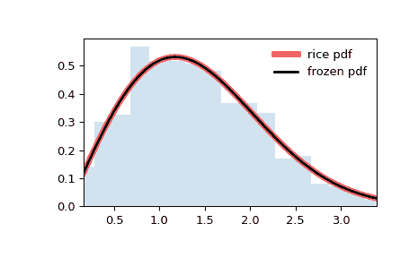

# `scipy.stats.rice`

> 原文链接：[`docs.scipy.org/doc/scipy-1.12.0/reference/generated/scipy.stats.rice.html#scipy.stats.rice`](https://docs.scipy.org/doc/scipy-1.12.0/reference/generated/scipy.stats.rice.html#scipy.stats.rice)

```py
scipy.stats.rice = <scipy.stats._continuous_distns.rice_gen object>
```

Rice 连续随机变量。

作为`rv_continuous`类的一个实例，`rice`对象继承了一组通用方法（下面详细列出），并补充了特定于该分布的细节。

注意事项

`rice`的概率密度函数为：

\[f(x, b) = x \exp(- \frac{x² + b²}{2}) I_0(x b)\]

对于\(x >= 0\)，\(b > 0\)。\(I_0\)是零阶修正贝塞尔函数（`scipy.special.i0`）。

`rice`以形状参数\(b\)为参数。

上述概率密度在“标准化”形式中定义。要移动和/或缩放分布，请使用`loc`和`scale`参数。具体而言，`rice.pdf(x, b, loc, scale)`与`rice.pdf(y, b) / scale`完全等价，其中`y = (x - loc) / scale`。请注意，将分布的位置移动并不会使其成为“非中心”分布；某些分布的非中心广义化在单独的类中可用。

Rice 分布描述了二维向量长度\(r\)，其分量为\((U+u, V+v)\)，其中\(U, V\)为常数，\(u, v\)为独立的标准差为\(s\)的高斯随机变量。设\(R = \sqrt{U² + V²}\)。那么\(r\)的概率密度函数为`rice.pdf(x, R/s, scale=s)`。

例子

```py
>>> import numpy as np
>>> from scipy.stats import rice
>>> import matplotlib.pyplot as plt
>>> fig, ax = plt.subplots(1, 1) 
```

计算前四个矩：

```py
>>> b = 0.775
>>> mean, var, skew, kurt = rice.stats(b, moments='mvsk') 
```

显示概率密度函数(`pdf`)：

```py
>>> x = np.linspace(rice.ppf(0.01, b),
...                 rice.ppf(0.99, b), 100)
>>> ax.plot(x, rice.pdf(x, b),
...        'r-', lw=5, alpha=0.6, label='rice pdf') 
```

或者，可以调用分布对象（作为函数）来固定形状、位置和比例参数。这会返回一个“冻结”的 RV 对象，其中给定的参数被固定。

冻结分布并显示冻结的`pdf`：

```py
>>> rv = rice(b)
>>> ax.plot(x, rv.pdf(x), 'k-', lw=2, label='frozen pdf') 
```

检查`cdf`和`ppf`的准确性：

```py
>>> vals = rice.ppf([0.001, 0.5, 0.999], b)
>>> np.allclose([0.001, 0.5, 0.999], rice.cdf(vals, b))
True 
```

生成随机数：

```py
>>> r = rice.rvs(b, size=1000) 
```

并比较直方图：

```py
>>> ax.hist(r, density=True, bins='auto', histtype='stepfilled', alpha=0.2)
>>> ax.set_xlim([x[0], x[-1]])
>>> ax.legend(loc='best', frameon=False)
>>> plt.show() 
```



方法

| **rvs(b, loc=0, scale=1, size=1, random_state=None)** | 随机变量。 |
| --- | --- |
| **pdf(x, b, loc=0, scale=1)** | 概率密度函数。 |
| **logpdf(x, b, loc=0, scale=1)** | 概率密度函数的对数。 |
| **cdf(x, b, loc=0, scale=1)** | 累积分布函数。 |
| **logcdf(x, b, loc=0, scale=1)** | 累积分布函数的对数。 |
| **sf(x, b, loc=0, scale=1)** | 生存函数（也定义为`1 - cdf`，但*sf*有时更精确）。 |
| **logsf(x, b, loc=0, scale=1)** | 生存函数的对数。 |
| **ppf(q, b, loc=0, scale=1)** | 百分点函数（`cdf` 的反函数 — 百分位数）。 |
| **isf(q, b, loc=0, scale=1)** | 逆生存函数（`sf` 的逆函数）。 |
| **moment(order, b, loc=0, scale=1)** | 指定阶数的非中心矩。 |
| **stats(b, loc=0, scale=1, moments=’mv’)** | 均值（‘m’）、方差（‘v’）、偏度（‘s’）、峰度（‘k’）。 |
| **entropy(b, loc=0, scale=1)** | 随机变量的（微分）熵。 |
| **fit(data)** | 一般数据的参数估计。详见[scipy.stats.rv_continuous.fit](https://docs.scipy.org/doc/scipy/reference/generated/scipy.stats.rv_continuous.fit.html#scipy.stats.rv_continuous.fit)以获取关键字参数的详细文档。 |
| **expect(func, args=(b,), loc=0, scale=1, lb=None, ub=None, conditional=False, **kwds)** | 函数（一元函数）相对于分布的期望值。 |
| **median(b, loc=0, scale=1)** | 分布的中位数。 |
| **mean(b, loc=0, scale=1)** | 分布的均值。 |
| **var(b, loc=0, scale=1)** | 分布的方差。 |
| **std(b, loc=0, scale=1)** | 分布的标准差。 |
| **interval(confidence, b, loc=0, scale=1)** | 等面积置信区间，围绕中位数。 |
