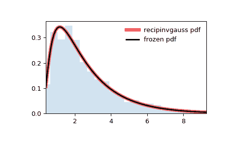

# `scipy.stats.recipinvgauss`

> 原文链接：[`docs.scipy.org/doc/scipy-1.12.0/reference/generated/scipy.stats.recipinvgauss.html#scipy.stats.recipinvgauss`](https://docs.scipy.org/doc/scipy-1.12.0/reference/generated/scipy.stats.recipinvgauss.html#scipy.stats.recipinvgauss)

```py
scipy.stats.recipinvgauss = <scipy.stats._continuous_distns.recipinvgauss_gen object>
```

一个互逆高斯连续随机变量。

作为 `rv_continuous` 类的一个实例，`recipinvgauss` 对象继承了一组通用方法（下面列出了完整列表），并根据这个特定分布的细节完成了它们。

注释

`recipinvgauss` 的概率密度函数为：

\[f(x, \mu) = \frac{1}{\sqrt{2\pi x}} \exp\left(\frac{-(1-\mu x)²}{2\mu²x}\right)\]

对于 \(x \ge 0\)。

`recipinvgauss` 将 `mu` 作为 \(\mu\) 的形状参数。

上述概率密度在“标准化”形式中定义。要移动和/或缩放分布，请使用 `loc` 和 `scale` 参数。具体而言，`recipinvgauss.pdf(x, mu, loc, scale)` 与 `recipinvgauss.pdf(y, mu) / scale` 是完全等价的，其中 `y = (x - loc) / scale`。请注意，移动分布的位置并不会使其成为“非中心”分布；某些分布的非中心推广可在单独的类中找到。

示例

```py
>>> import numpy as np
>>> from scipy.stats import recipinvgauss
>>> import matplotlib.pyplot as plt
>>> fig, ax = plt.subplots(1, 1) 
```

计算前四个矩：

```py
>>> mu = 0.63
>>> mean, var, skew, kurt = recipinvgauss.stats(mu, moments='mvsk') 
```

显示概率密度函数（`pdf`）：

```py
>>> x = np.linspace(recipinvgauss.ppf(0.01, mu),
...                 recipinvgauss.ppf(0.99, mu), 100)
>>> ax.plot(x, recipinvgauss.pdf(x, mu),
...        'r-', lw=5, alpha=0.6, label='recipinvgauss pdf') 
```

或者，可以调用分布对象（作为函数）来固定形状、位置和比例参数。这将返回一个保持给定参数固定的“冻结”RV 对象。

冻结分布并显示冻结的 `pdf`：

```py
>>> rv = recipinvgauss(mu)
>>> ax.plot(x, rv.pdf(x), 'k-', lw=2, label='frozen pdf') 
```

检查 `cdf` 和 `ppf` 的准确性：

```py
>>> vals = recipinvgauss.ppf([0.001, 0.5, 0.999], mu)
>>> np.allclose([0.001, 0.5, 0.999], recipinvgauss.cdf(vals, mu))
True 
```

生成随机数：

```py
>>> r = recipinvgauss.rvs(mu, size=1000) 
```

并比较直方图：

```py
>>> ax.hist(r, density=True, bins='auto', histtype='stepfilled', alpha=0.2)
>>> ax.set_xlim([x[0], x[-1]])
>>> ax.legend(loc='best', frameon=False)
>>> plt.show() 
```



方法

| **rvs(mu, loc=0, scale=1, size=1, random_state=None)** | 随机变量。 |
| --- | --- |
| **pdf(x, mu, loc=0, scale=1)** | 概率密度函数。 |
| **logpdf(x, mu, loc=0, scale=1)** | 概率密度函数的对数。 |
| **cdf(x, mu, loc=0, scale=1)** | 累积分布函数。 |
| **logcdf(x, mu, loc=0, scale=1)** | 累积分布函数的对数。 |
| **sf(x, mu, loc=0, scale=1)** | 生存函数（也定义为 `1 - cdf`，但 *sf* 有时更准确）。 |
| **logsf(x, mu, loc=0, scale=1)** | 生存函数的对数。 |
| **ppf(q, mu, loc=0, scale=1)** | 百分位点函数（`cdf`的逆 — 百分位数）。 |
| **isf(q, mu, loc=0, scale=1)** | 逆生存函数（`sf`的逆）。 |
| **moment(order, mu, loc=0, scale=1)** | 指定顺序的非中心矩。 |
| **stats(mu, loc=0, scale=1, moments=’mv’)** | 均值（‘m’）、方差（‘v’）、偏度（‘s’）和/或峰度（‘k’）。 |
| **entropy(mu, loc=0, scale=1)** | 随机变量的（微分）熵。 |
| **fit(data)** | 适用于通用数据的参数估计。详细文档请参见 [scipy.stats.rv_continuous.fit](https://docs.scipy.org/doc/scipy/reference/generated/scipy.stats.rv_continuous.fit.html#scipy.stats.rv_continuous.fit)。 |
| **expect(func, args=(mu,), loc=0, scale=1, lb=None, ub=None, conditional=False, **kwds)** | 对分布的函数（一元函数）的期望值。 |
| **median(mu, loc=0, scale=1)** | 分布的中位数。 |
| **mean(mu, loc=0, scale=1)** | 分布的均值。 |
| **var(mu, loc=0, scale=1)** | 分布的方差。 |
| **std(mu, loc=0, scale=1)** | 分布的标准差。 |
| **interval(confidence, mu, loc=0, scale=1)** | 等概率置信区间，围绕中位数。 |
