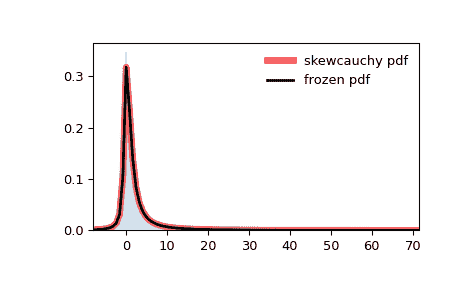

# `scipy.stats.skewcauchy`

> 原文链接：[`docs.scipy.org/doc/scipy-1.12.0/reference/generated/scipy.stats.skewcauchy.html#scipy.stats.skewcauchy`](https://docs.scipy.org/doc/scipy-1.12.0/reference/generated/scipy.stats.skewcauchy.html#scipy.stats.skewcauchy)

```py
scipy.stats.skewcauchy = <scipy.stats._continuous_distns.skewcauchy_gen object>
```

偏斜的柯西随机变量。

作为`rv_continuous`类的一个实例，`skewcauchy`对象从中继承了一系列通用方法（下面列出完整列表），并用于特定于该特定分布的详细信息完成它们。

另见

`cauchy`

柯西分布

Notes

对于`skewcauchy`的概率密度函数如下：

\[f(x) = \frac{1}{\pi \left(\frac{x²}{\left(a\, \text{sign}(x) + 1 \right)²} + 1 \right)}\]

对于实数\( x \)和偏斜参数\(-1 < a < 1\)。

当\( a=0 \)时，分布简化为通常的柯西分布。

上述概率密度以“标准化”形式定义。要进行平移和/或缩放分布，请使用`loc`和`scale`参数。具体来说，`skewcauchy.pdf(x, a, loc, scale)`与`skewcauchy.pdf(y, a) / scale`完全等效，其中`y = (x - loc) / scale`。请注意，改变分布的位置不会使其成为“非中心”分布；某些分布的非中心推广可以在单独的类中找到。

参考文献

[1]

“偏斜广义*t*分布”，维基百科 [`en.wikipedia.org/wiki/Skewed_generalized_t_distribution#Skewed_Cauchy_distribution`](https://en.wikipedia.org/wiki/Skewed_generalized_t_distribution#Skewed_Cauchy_distribution)

示例

```py
>>> import numpy as np
>>> from scipy.stats import skewcauchy
>>> import matplotlib.pyplot as plt
>>> fig, ax = plt.subplots(1, 1) 
```

计算前四阶矩：

```py
>>> a = 0.5
>>> mean, var, skew, kurt = skewcauchy.stats(a, moments='mvsk') 
```

显示概率密度函数（`pdf`）：

```py
>>> x = np.linspace(skewcauchy.ppf(0.01, a),
...                 skewcauchy.ppf(0.99, a), 100)
>>> ax.plot(x, skewcauchy.pdf(x, a),
...        'r-', lw=5, alpha=0.6, label='skewcauchy pdf') 
```

或者，可以调用分布对象（作为函数），以固定形状、位置和比例参数。这将返回一个“冻结”的随机变量对象，保持给定的参数不变。

冻结分布并显示冻结的`pdf`：

```py
>>> rv = skewcauchy(a)
>>> ax.plot(x, rv.pdf(x), 'k-', lw=2, label='frozen pdf') 
```

检查`cdf`和`ppf`的准确性：

```py
>>> vals = skewcauchy.ppf([0.001, 0.5, 0.999], a)
>>> np.allclose([0.001, 0.5, 0.999], skewcauchy.cdf(vals, a))
True 
```

生成随机数：

```py
>>> r = skewcauchy.rvs(a, size=1000) 
```

并比较直方图：

```py
>>> ax.hist(r, density=True, bins='auto', histtype='stepfilled', alpha=0.2)
>>> ax.set_xlim([x[0], x[-1]])
>>> ax.legend(loc='best', frameon=False)
>>> plt.show() 
```



方法

| **rvs(a, loc=0, scale=1, size=1, random_state=None)** | 随机变量。 |
| --- | --- |
| **pdf(x, a, loc=0, scale=1)** | 概率密度函数。 |
| **logpdf(x, a, loc=0, scale=1)** | 概率密度函数的对数。 |
| **cdf(x, a, loc=0, scale=1)** | 累积分布函数。 |
| **logcdf(x, a, loc=0, scale=1)** | 累积分布函数的对数。 |
| **sf(x, a, loc=0, scale=1)** | 生存函数（也定义为`1 - cdf`，但*sf*有时更准确）。 |
| **logsf(x, a, loc=0, scale=1)** | 生存函数的对数。 |
| **ppf(q, a, loc=0, scale=1)** | 百分位点函数（`cdf`的反函数 - 百分位数）。 |
| **isf(q, a, loc=0, scale=1)** | 逆生存函数（`sf`的反函数）。 |
| **moment(order, a, loc=0, scale=1)** | 指定阶数的非中心矩。 |
| **stats(a, loc=0, scale=1, moments=’mv’)** | 均值（‘m’）、方差（‘v’）、偏度（‘s’）、峰度（‘k’）。 |
| **entropy(a, loc=0, scale=1)** | 随机变量的（微分）熵。 |
| **fit(data)** | 一般数据的参数估计。详细文档请参见[scipy.stats.rv_continuous.fit](https://docs.scipy.org/doc/scipy/reference/generated/scipy.stats.rv_continuous.fit.html#scipy.stats.rv_continuous.fit)。 |
| **expect(func, args=(a,), loc=0, scale=1, lb=None, ub=None, conditional=False, **kwds)** | 关于分布的函数（一参数函数）的期望值。 |
| **median(a, loc=0, scale=1)** | 分布的中位数。 |
| **mean(a, loc=0, scale=1)** | 分布的均值。 |
| **var(a, loc=0, scale=1)** | 分布的方差。 |
| **std(a, loc=0, scale=1)** | 分布的标准差。 |
| **interval(confidence, a, loc=0, scale=1)** | 置信区间，以中位数为中心，面积相等。 |
