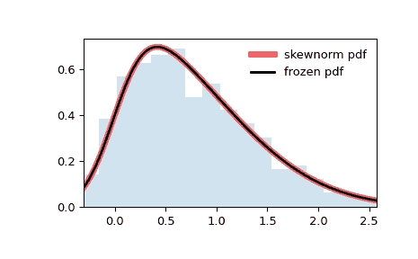

# `scipy.stats.skewnorm`

> 原文链接：[`docs.scipy.org/doc/scipy-1.12.0/reference/generated/scipy.stats.skewnorm.html#scipy.stats.skewnorm`](https://docs.scipy.org/doc/scipy-1.12.0/reference/generated/scipy.stats.skewnorm.html#scipy.stats.skewnorm)

```py
scipy.stats.skewnorm = <scipy.stats._continuous_distns.skewnorm_gen object>
```

一个偏斜正态随机变量。

作为`rv_continuous`类的一个实例，`skewnorm`对象从中继承了一组通用方法（下面有完整列表），并通过特定于这种特定分布的细节来完善它们。

注释

概率密度函数为：

```py
skewnorm.pdf(x, a) = 2 * norm.pdf(x) * norm.cdf(a*x) 
```

`skewnorm` 接受一个实数\( a \)作为偏斜参数。当`a = 0`时，该分布与正态分布相同（`norm`）。*rvs* 实现了[[1]](#r3d5c939da972-1)的方法。

上述概率密度在“标准化”形式中定义。要移动和/或缩放分布，请使用`loc`和`scale`参数。具体来说，`skewnorm.pdf(x, a, loc, scale)`与`skewnorm.pdf(y, a) / scale`等效，其中`y = (x - loc) / scale`。请注意，移动分布的位置并不使其成为“非中心”分布；某些分布的非中心推广可以在单独的类中找到。

参考文献

[1]

A. Azzalini 和 A. Capitanio（1999）。多变量偏斜正态分布的统计应用。J. Roy. Statist. Soc., B 61, 579-602。[arXiv:0911.2093](https://arxiv.org/abs/0911.2093)

示例

```py
>>> import numpy as np
>>> from scipy.stats import skewnorm
>>> import matplotlib.pyplot as plt
>>> fig, ax = plt.subplots(1, 1) 
```

计算前四个矩：

```py
>>> a = 4
>>> mean, var, skew, kurt = skewnorm.stats(a, moments='mvsk') 
```

显示概率密度函数（`pdf`）：

```py
>>> x = np.linspace(skewnorm.ppf(0.01, a),
...                 skewnorm.ppf(0.99, a), 100)
>>> ax.plot(x, skewnorm.pdf(x, a),
...        'r-', lw=5, alpha=0.6, label='skewnorm pdf') 
```

或者，可以调用分布对象（作为函数）以固定形状、位置和尺度参数。这会返回一个“冻结”的随机变量对象，保持给定的参数不变。

冻结分布并显示冻结的`pdf`：

```py
>>> rv = skewnorm(a)
>>> ax.plot(x, rv.pdf(x), 'k-', lw=2, label='frozen pdf') 
```

检查`cdf`和`ppf`的准确性：

```py
>>> vals = skewnorm.ppf([0.001, 0.5, 0.999], a)
>>> np.allclose([0.001, 0.5, 0.999], skewnorm.cdf(vals, a))
True 
```

生成随机数：

```py
>>> r = skewnorm.rvs(a, size=1000) 
```

并比较直方图：

```py
>>> ax.hist(r, density=True, bins='auto', histtype='stepfilled', alpha=0.2)
>>> ax.set_xlim([x[0], x[-1]])
>>> ax.legend(loc='best', frameon=False)
>>> plt.show() 
```



方法

| **rvs(a, loc=0, scale=1, size=1, random_state=None)** | 随机变量。 |
| --- | --- |
| **pdf(x, a, loc=0, scale=1)** | 概率密度函数。 |
| **logpdf(x, a, loc=0, scale=1)** | 概率密度函数的对数。 |
| **cdf(x, a, loc=0, scale=1)** | 累积分布函数。 |
| **logcdf(x, a, loc=0, scale=1)** | 累积分布函数的对数。 |
| **sf(x, a, loc=0, scale=1)** | 生存函数（也被定义为`1 - cdf`，但*sf*有时更精确）。 |
| **logsf(x, a, loc=0, scale=1)** | 生存函数的对数。 |
| **ppf(q, a, loc=0, scale=1)** | 百分位点函数（`cdf`的反函数 — 百分位数）。 |
| **isf(q, a, loc=0, scale=1)** | 逆生存函数（`sf`的逆函数）。 |
| **moment(order, a, loc=0, scale=1)** | 指定阶数的非中心矩。 |
| **stats(a, loc=0, scale=1, moments=’mv’)** | 均值（‘m’）、方差（‘v’）、偏度（‘s’）和/或峰度（‘k’）。 |
| **entropy(a, loc=0, scale=1)** | 随机变量的（微分）熵。 |
| **fit(data)** | 通用数据的参数估计。详细文档请参见[scipy.stats.rv_continuous.fit](https://docs.scipy.org/doc/scipy/reference/generated/scipy.stats.rv_continuous.fit.html#scipy.stats.rv_continuous.fit)。 |
| **expect(func, args=(a,), loc=0, scale=1, lb=None, ub=None, conditional=False, **kwds)** | 函数期望值（对于一个参数）相对于分布的期望值。 |
| **median(a, loc=0, scale=1)** | 分布的中位数。 |
| **mean(a, loc=0, scale=1)** | 分布的均值。 |
| **var(a, loc=0, scale=1)** | 分布的方差。 |
| **std(a, loc=0, scale=1)** | 分布的标准差。 |
| **interval(confidence, a, loc=0, scale=1)** | 置信区间，围绕中位数具有相等面积。 |
